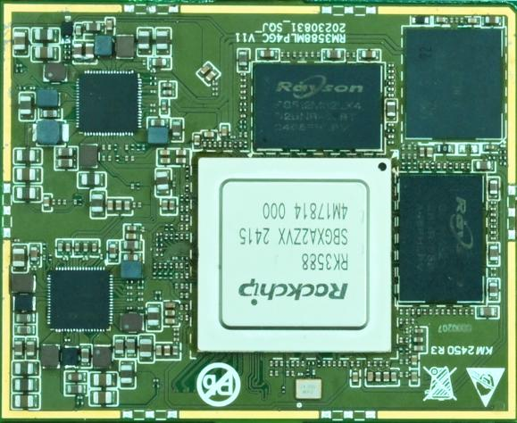

# Product Introduction

## Overview

Z3588 is a core board based on the Rockchip RK3588 processor. It is intended for embedded product development and provides a compact hardware platform with rich peripheral interfaces.

## Features

- 最佳尺寸, 保证引出全部GPIO 口的同时, 尺寸仅50mm*62mm
- 使用RK 自身的RK806 PMU, 在保证工作稳定可靠的同时, 成本足够低廉
- supports多种品牌, 多种容量的emmc
- 使用双通道LPDDR4(X)设计, 可supports2GB/4GB/8GB/16GB/32GB 容量
- supports电源休眠唤醒
- supportsandroid12.0, linux, debain, ubuntu 等操作系统
- supportsdual Gigabit Ethernet, SATA, PCIE, USB3.0 等高速总线
- 采用LGA package形式, 接触稳定可靠
- 产品稳定可靠, 经过大量高低温, 反复重启, 安卓稳定性测试, 安兔兔测试等可靠性实验, 拷机7 天7 夜不死机

## Appearance and Mechanical Structure

## Specifications

### System Configuration

| CPU | RK3588 |
|---|---|
| Frequency | 四核A76+四核A55(2.4GHz) |
| RAM / Storage | 4G&amp;16G或 8G&amp;32Goptional |
| Power IC | 使用RK806-2, supports动态调频等 |

### Interface Parameters

| LCD Interface | 同时supports MIPI, EDP, HDMI Interface输出; 最 大supports 6路同显, 4路异显 |
|---|---|
| Touch Interface | 电容触摸, 可使用USB或I2C接口触摸 |
| Audio Interface | IIS/PCM/TDM接口 |
| SPDIF Interface | 2路 8通道光纤audio output接口 |
| SD Card Interface | 2路 SDIO输出通道 |
| eMMC Interface | 板载 eMMC Interface, 管脚不另外引出 |
| Ethernet Interface | 双千兆Ethernet Interface |
| USBHOST2.0接口 | 2路HOST2.0 |
| USBHOST3.0接口 | 2路USBOTG3.0/2.0/TypeC |
| UART Interface | 10路串口, supports带流控串口 |
| PWM接口 | 16路PWM输出 |
| IIC Interface | 9路 IIC输出 |
| SPI Interface | 5路 SPI输出 |
| ADC Interface | 8路ADC输出 |
| CAN Interface | 3路CAN输出 |
| Camera Interface | 6路CSI输入 |
| HDMI Interface | 2路HDMI2.1TX, 1路HDMIRX2.0 |
| PCIE Interface | PCIe3.0(2x2,1x4,4x1) |
| SATA Interface | 2xSATA3.3/PCIe2.1 |

### Electrical Characteristics

| 4VInput Voltage | 4V/5A(推荐使用 4V/8A输入) |
|---|---|
| Output Voltage | 3.3V/2A, 1.8V/2A(can be used for底板供电) |
| Operating Temperature | 0~70°C |
| Storage Temperature | -10~50°C |

### Mechanical Parameters

| Core Board Size | 62mm*50mm*1.2mm |
|---|---|
| Number of Pins | 660PIN |
| PCB Layers | 12层 |
| Warpage | less than 0.5% |

## Related Pages

- [Pin Definition](./z3588-pin-definition)
- [Hardware Design](./z3588-hardware-design)
