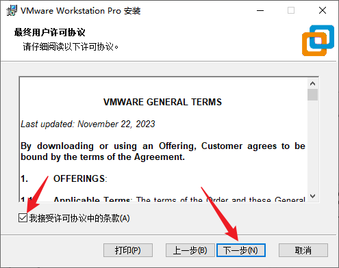
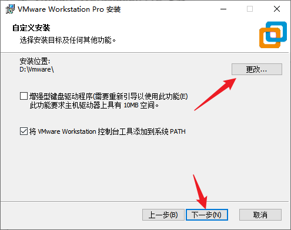
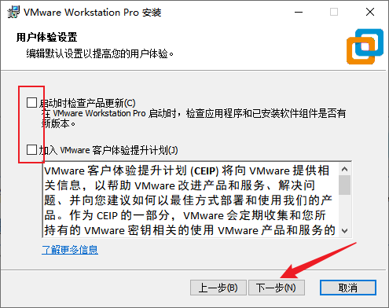
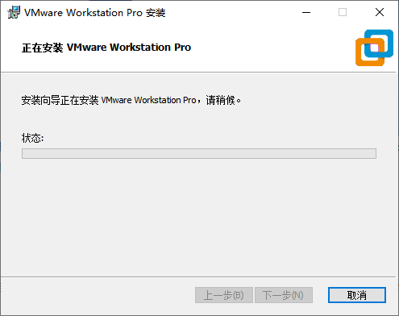
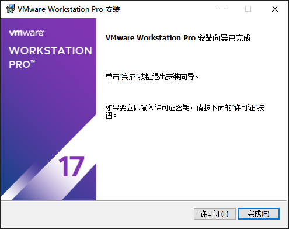
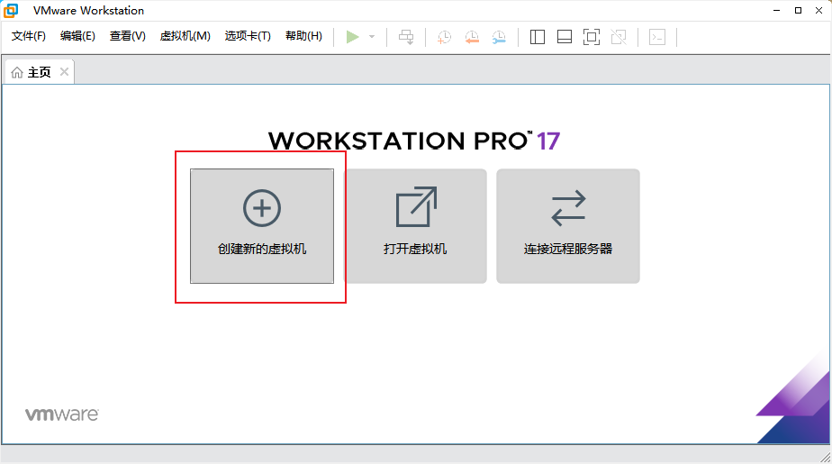

# VMware Installation

This guide uses VMware Workstation 17.5.2 to create an Ubuntu virtual machine on a Windows host. Other VMware Workstation 17.x releases use a similar installation flow.

## Obtain the Installer

### Virtual Machine Tools Download

The VMware installer, Ubuntu images, and related virtual-machine setup tools are available from the following file share:

- Package name: Virtual Machine Tools
- Download: [Baidu Netdisk](https://pan.baidu.com/s/1fBd--CaDgS18s0UzGsW7xw?pwd=m5g6)
- Access code: `m5g6`

These files are used to install VMware, create the Ubuntu virtual machine, and configure the basic development environment.

The internal file share may provide the VMware installer and Ubuntu images. When using another source, obtain the installer from a trusted channel and complete licensing in accordance with the software terms.


## Installation Procedure

Run the following installer as Administrator:

```text
VMware-workstation-full-17.5.2-23775571.exe
```

Continue from the welcome page.


Review and accept the license agreement.



Select the installation directory. The default is suitable when the system drive has enough free space.



Choose whether to enable update checks and the customer experience program.



Select the required shortcuts.


Confirm the settings and start the installation.


Wait for the installation to finish.



Finish setup and configure the product using a valid license method.



After startup, VMware Workstation should display its main page.


