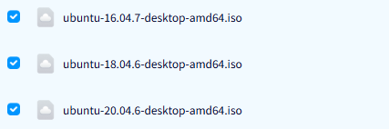
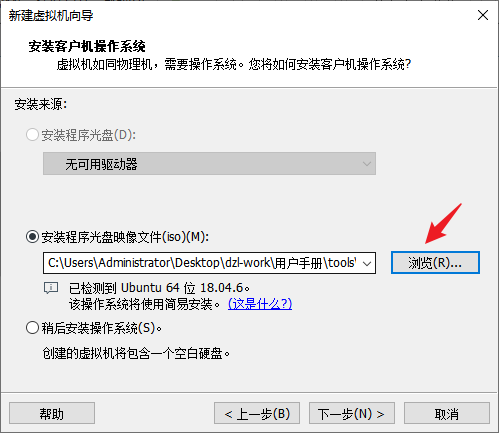
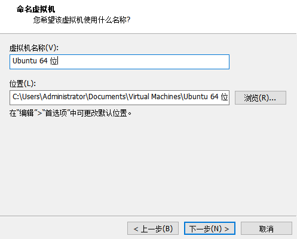
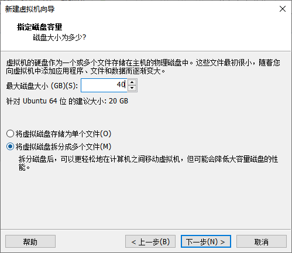
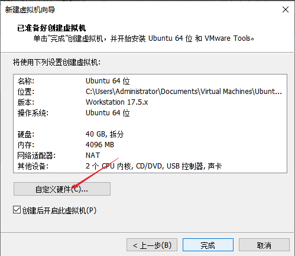
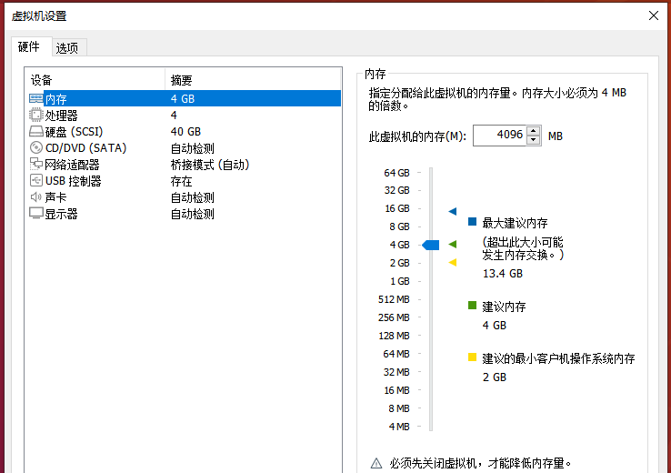
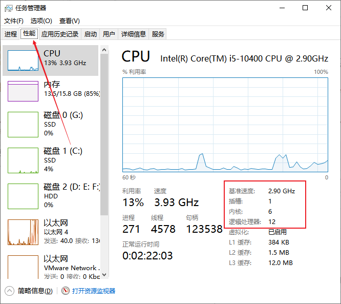
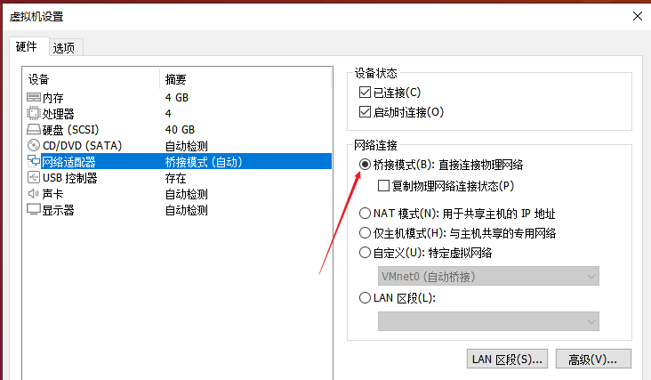
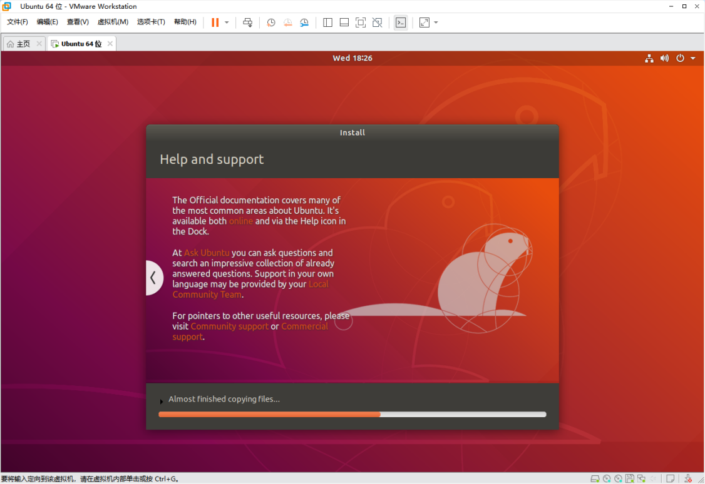

# Ubuntu Virtual Machine

The verified build server runs **Ubuntu 20.04.5 LTS amd64**. Ubuntu 20.04.x 64-bit Desktop is therefore recommended when environment compatibility is the priority.

## Obtain the Ubuntu ISO

The internal file share may provide multiple Ubuntu ISO images.



An ISO may also be downloaded from an official or trusted mirror. Select the required release and download a file containing:

```text
desktop-amd64.iso
```


## Create the Virtual Machine

Click “Create a New Virtual Machine” and select the typical configuration.


Select the downloaded Ubuntu ISO.



Enter a normal user name and password. Do not use the root account for daily builds.


Set the VM name and storage location. Large SDK trees should be placed on a sufficiently large SSD.



## Recommended Resources

The original 4 GB RAM and 40 GB disk screenshots demonstrate the UI only. They are **not sufficient for complete Android, Rockchip, or Allwinner SDK builds**.

| Resource | Minimum Recommendation | Preferred |
| --- | ---: | ---: |
| CPU | 4 cores / 8 threads | 8 cores / 16 threads or more |
| RAM | 16 GB | 32 GB or more |
| System and tools disk | 100 GB | 150 GB or more |
| SDK workspace | 300 GB | 500 GB to 1 TB |
| Storage | SATA SSD | NVMe SSD |

Allocate enough virtual disk space.



Open the hardware customization page.



Do not assign all host memory to the VM.



Use Windows Task Manager to inspect the host resources.



The configured virtual CPU count must not exceed the host's available logical processors.


## Network Mode

Bridged mode is useful when other LAN devices must access the VM directly. NAT is usually simpler when only outbound Internet access is required.



Confirm the VM configuration and start installation.




Log in using the normal account created during setup.


