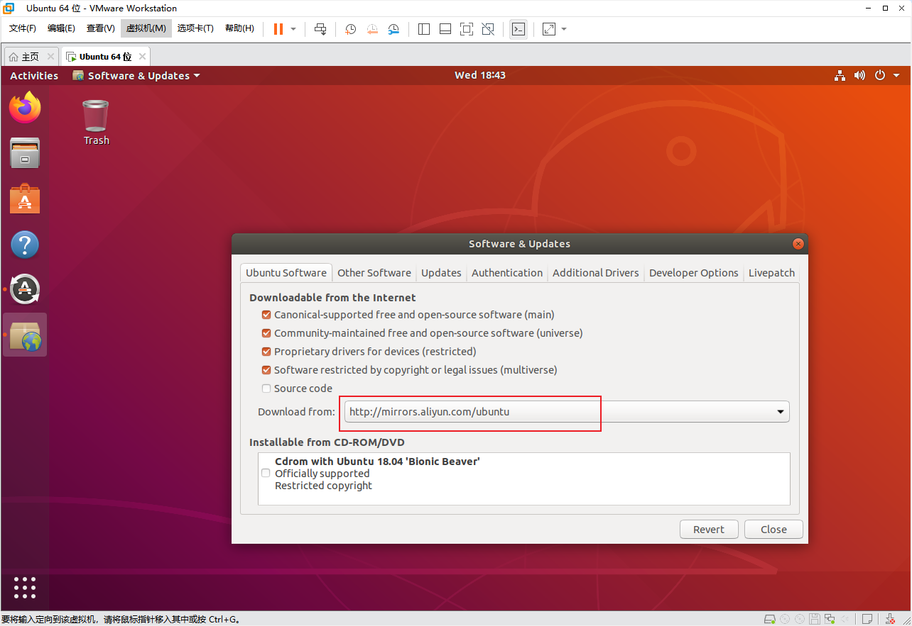
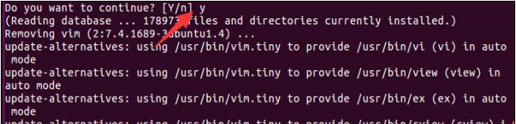
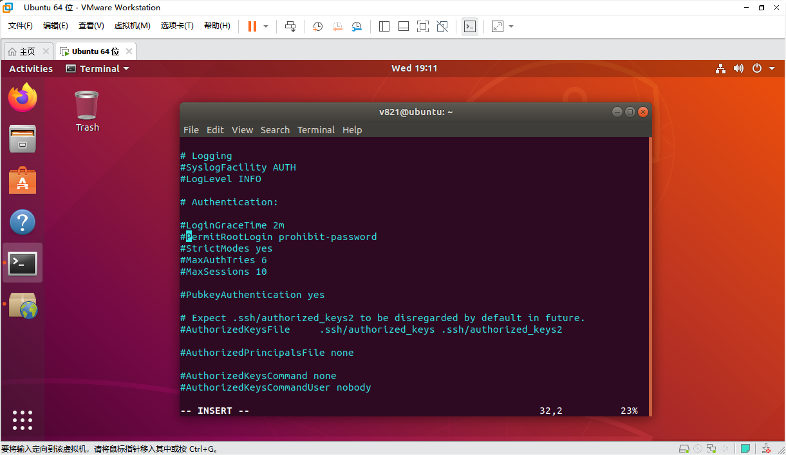
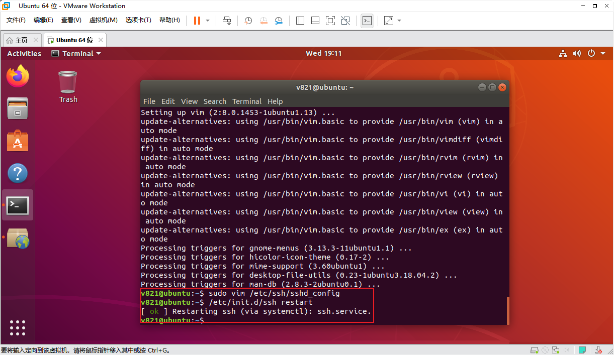
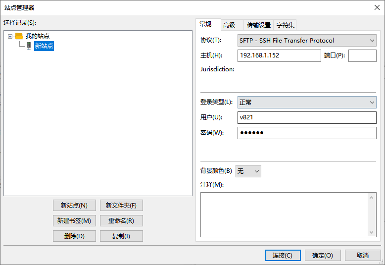

# Ubuntu Development Tools

## Select a Package Mirror

Ubuntu package downloads may be slow on some networks. Use “Software & Updates” to select a suitable mirror.


Open the download-server selector from the Ubuntu Software page.


Select a stable mirror under China and confirm.




Refresh the package index:

```bash
sudo apt-get update
```

A full system upgrade is not required just to prepare an SDK build environment. Run it only when appropriate:

```bash
sudo apt-get upgrade
```

Repair dependencies when needed:

```bash
sudo apt-get -f install
```

## Normal User and Root

Perform daily builds as a normal user and use `sudo` for administrative actions. Enabling root login is normally unnecessary.

To set a root password explicitly:

```bash
sudo passwd root
```


## Basic Utilities

Install `ifconfig`:

```bash
sudo apt-get install -y net-tools
```

Install Vim:

```bash
sudo apt-get install -y vim
```



## File Transfer Between Windows and Ubuntu

### Install the SSH Server

```bash
sudo apt-get install -y openssh-server
sudo systemctl enable --now ssh
sudo systemctl status ssh
```

Use the normal Ubuntu account for SFTP. Root SSH login should remain disabled:

```text
PermitRootLogin no
```



Restart SSH when required:

```bash
sudo service ssh restart
```



Display the VM IPv4 address:

```bash
ip -4 addr
```

After installing `net-tools`, `ifconfig` may also be used.


### Use FileZilla

Install FileZilla Client on Windows.


Create an SFTP site:

| Item | Value |
| --- | --- |
| Protocol | SFTP - SSH File Transfer Protocol |
| Host | Ubuntu VM IP address |
| Port | 22 |
| Logon type | Normal |
| User | Normal Ubuntu user |
| Password | Password for that user |




After connecting, transfer files by dragging or double-clicking.


