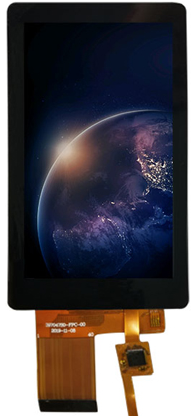

# LCD040CTP Display Module

## 1. Product Appearance

## 2. Product Overview
The LCD040CTP LCD module is designed for Jiuding Chuangzhan x3128/x30 and other development platforms, with a resolution of 480x800. The module integrates an LCD panel, an LCD control board, and a touch panel. Users only need to connect a single 30-pin FPC cable to the MIPI interface on the x3128/x30 development board to use it normally.

## 3. Technical Specifications
| Item               | Specification     |
|--------------------|-------------------|
| Dimensions         | 120mm x 61mm x 9mm |
| LCD Panel Model    | TXW397047S0       |
| Touch IC Model     | GT911             |
| Resolution         | 480 x 800         |

## 4. U42 Pin Definition
| Pin No. | Pin Name                                                   |
|---------|------------------------------------------------------------|
| 1       | VCC5V0_SYS, 5V Power Input                                 |
| 2       | VCC5V0_SYS, 5V Power Input                                 |
| 3       | VCC5V0_SYS, 5V Power Input                                 |
| 4       | VCC3V3_S3, 3.3V Power Input                                |
| 5       | VCC3V3_S3, 3.3V Power Input                                |
| 6       | Touch Panel I2C_SCL                                         |
| 7       | Touch Panel I2C_SDA                                         |
| 8       | Touch Panel Interrupt Output                                |
| 9       | Touch Panel Reset Input                                     |
| 10      | VCC3V3_SYS, 3.3V Power Input (Choose either pin 4/5 or 10/11; can be left floating if unused) |
| 11      | VCC3V3_SYS, 3.3V Power Input (Choose either pin 4/5 or 10/11; can be left floating if unused) |
| 12      | LCD PWM Signal Input                                        |
| 13      | LCD_RESET                                                   |
| 14      | NC (Not Connected)                                          |
| 15      | NC (Not Connected)                                          |
| 16      | GND                                                         |
| 17      | NC (Not Connected)                                          |
| 18      | NC (Not Connected)                                          |
| 19      | GND                                                         |
| 20      | NC (Not Connected)                                          |
| 21      | NC (Not Connected)                                          |
| 22      | GND                                                         |
| 23      | MIPI-CKN                                                    |
| 24      | MIPI-CKP                                                    |
| 25      | GND                                                         |
| 26      | MIPI-D1N                                                    |
| 27      | MIPI-D1P                                                    |
| 28      | GND                                                         |
| 29      | MIPI-D0N                                                    |
| 30      | MIPI-D0P                                                    |
