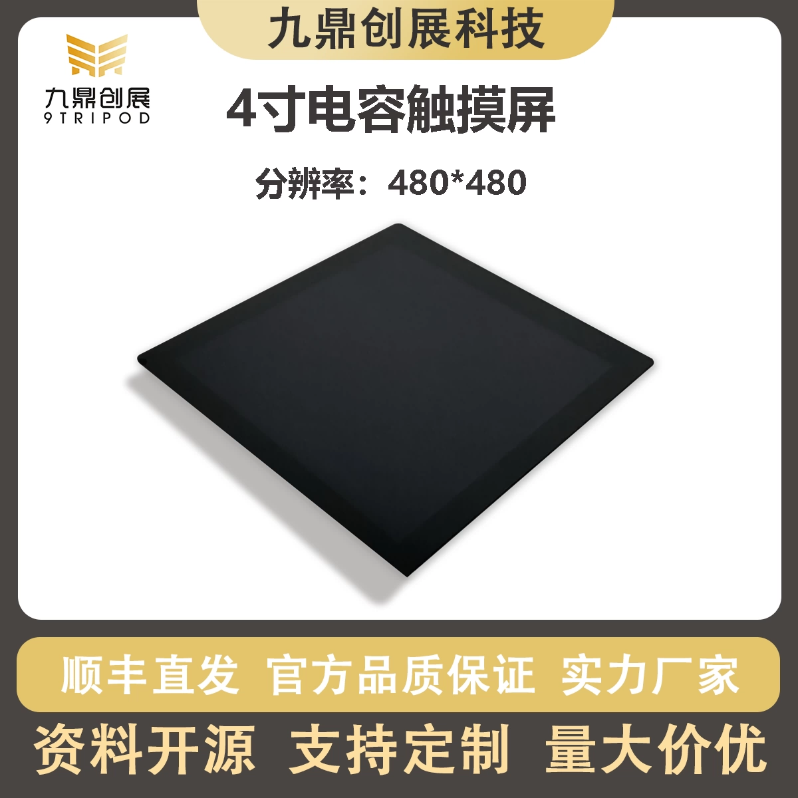

# LCD040D25MM Display Module

## 1. Product Appearance

## 2. Product Specifications
| Category | Parameter |
|----------|-----------|
| Model | LCD040D25MM |
| Product Name | 7-inch MIPI HD Display |
| Resolution | 1920 x 1200 |
| Touch Type | Capacitive Touch (5-point) |
| Connection | FPC |
| Operating Voltage | 5V |
| Compatible Products | I3399 Dev Board, I3566 Dev Board, I3566 Dev Board, I3588 Dev Board, I3588S Dev Board |

## 3. Product Link
[Taobao Store: LCD040D25MM](https://item.taobao.com/item.htm?id=746219733223)
