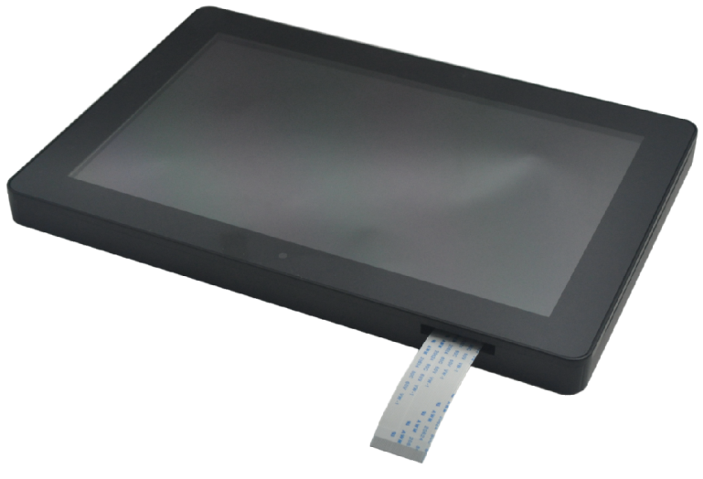
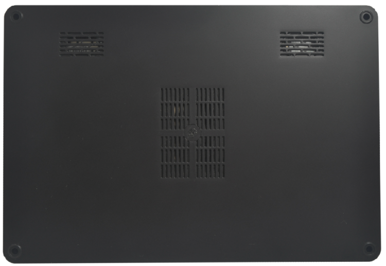

# LCD101HDE Display Module

## 1. Product Appearance

## 2. Product Overview
The LCD101HDE display module is designed for the x3399 development platform, featuring a resolution of 2560x1600 — the popular 2K HD display standard. The module comes with a pre-molded plastic enclosure and integrates a 2K LCD panel, LCD controller board, and touch panel. Users only need to connect a single 30-pin FPC cable from the module to the EDP interface on the x3399 development board to start using it.

## 3. Technical Specifications
| Item             | Specification          |
|------------------|------------------------|
| Dimensions       | 260mm x 177.8mm x 17.5mm |
| LCD Panel Model  | LTL101DL03-T01         |
| Touch IC Model   | GT9271                 |
| Resolution       | 2560 x 1600            |

## 4. J5 Pin Definition
| Pin No. | Pin Name                  |
|---------|---------------------------|
| 1       | GND                       |
| 2       | EDP_TX0N                  |
| 3       | EDP_TX0P                  |
| 4       | GND                       |
| 5       | EDP_TX1N                  |
| 6       | EDP_TX1P                  |
| 7       | GND                       |
| 8       | EDP_AUXN                  |
| 9       | EDP_AUXP                  |
| 10      | GND                       |
| 11      | EDP_TX2N                  |
| 12      | EDP_TX2P                  |
| 13      | GND                       |
| 14      | EDP_TX3N                  |
| 15      | EDP_TX3P                  |
| 16      | GND                       |
| 17      | LCD PWM Signal Input      |
| 18      | GND                       |
| 19      | 3.3V Input                |
| 20      | NC                        |
| 21      | NC                        |
| 22      | LCD Enable Input          |
| 23      | Touch Panel I2C_SCL       |
| 24      | Touch Panel I2C_SDA       |
| 25      | Touch Panel Interrupt Output |
| 26      | Touch Panel Reset Input   |
| 27      | GND                       |
| 28      | 5V Power Input            |
| 29      | 5V Power Input            |
| 30      | 5V Power Input            |
