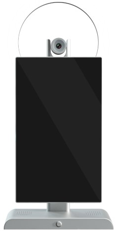
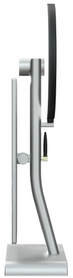
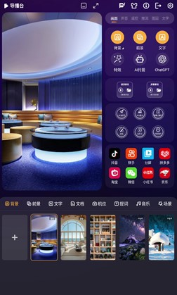
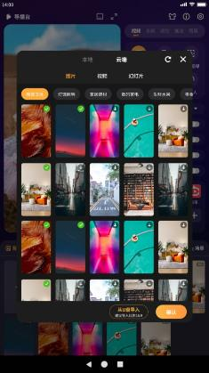
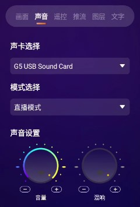
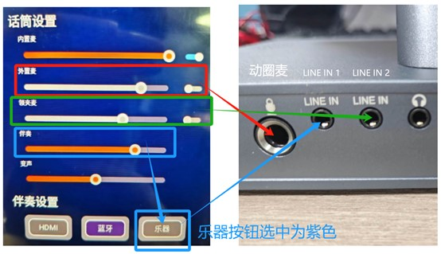

# Product Specification

## Version History

| Version | Date       | Author | Description |
|---------|------------|--------|-------------|
| Rev.01  | 2025-03-18 | jdcz   | Initial version |
| Rev.02  | 2025-06-18 | jdcz   | V54          |

---

## Chapter 1: Product Overview

### 1.1 Product Appearance

*Front View*

*Side View*

### 1.2 Product Specifications

#### Basic Parameters

| Item          | Specification                                                            |
|---------------|--------------------------------------------------------------------------|
| SOC           | RockChip RK3588S                                                         |
| CPU           | Octa-core 64-bit (4×Cortex-A76 + 4×Cortex-A55), 8nm advanced process, up to 2.4GHz |
| GPU           | ARM Mali-G610 MP4 quad-core                                              |
| NPU           | 6 TOPS                                                                  |
| AnTuTu Score  | 580,000                                                                 |
| ISP           | Integrated 48MP ISP with HDR & 3DNR                                     |
| Memory & Storage | 8GB & 128GB or 16GB & 256GB                                          |

#### Hardware Parameters

| Item             | Specification                                                                       |
|------------------|-------------------------------------------------------------------------------------|
| Model            | G5                                                                                  |
| Brand            | Neutral                                                                             |
| Craftsmanship    | CNC process                                                                         |
| Display          | 15.6-inch 1920×1080 display output                                                  |
| Camera           | Sony 50MP IMX766 MIPI camera, supports PDAF ultra-fast autofocus, manual focus, fixed focus |
| Extended Camera  | Supports USB 2.0, USB 3.0, HDMI IN expansion for ultra-HD professional streaming cameras, DSLR cameras, etc. |
| Sound Card       | Built-in microphone and sound card, suitable for knowledge sharing, talent shows, gaming streams, singing streams, and live commerce |
| Extended Sound Card | Expandable via LINE IN, 3.5mm headphone jack, and USB interface for lapel mics, professional karaoke sound cards, etc. |
| Ethernet         | Gigabit Ethernet                                                                     |
| Wireless Network | 2.4G/5G dual-band WiFi 6                                                            |
| Video Output     | 1×HDMI 2.1 (8K@60fps or 4K@120fps)                                                |
| Video Input      | 1×HDMI-IN (1080P@60fps)                                                            |
| Audio           | 2×Speaker output 1×Phone output 1×HDMI audio output 3×Line-In input 1×MIC input |
| Touch            | 1×10-point capacitive touch                                                         |
| External USB     | 1×USB 3.0 1×USB 2.0 1×USB 3.0 capture card output 1×Type-C           |
| Fill Light       | Not included by default, optional accessory                                          |
| Power            | DC 12V input (DC 5.5×2.1mm)                                                       |

#### System Software

| Item             | Specification                                                                       |
|------------------|-------------------------------------------------------------------------------------|
| OS               | Android 12.0                                                                        |
| Domestic Streaming Platforms | Supports Douyin, Kuaishou, Pinduoduo, Taobao, Xiaohongshu, WeChat, JD.com, Baidu Video, YY, and nearly 100 others |
| International Streaming Platforms | Supports TikTok, Facebook, YouTube, Instagram, Twitter, etc.              |
| Broadcast Director | Guide_station.apk                                                                  |

#### Other Parameters

| Item             | Specification                                                                       |
|------------------|-------------------------------------------------------------------------------------|
| Dimensions       | 525mm × 270mm                                                                      |
| Weight           | Approx. 3.4 kg                                                                      |
| Cooling          | Built-in professional heat sink, max temperature under stress test ≤ 60°C            |
| Power Consumption | Typical: ~6.6W (12V/550mA)                                                         |
| Environment      | Operating temp: -10°C ~ 40°C Storage temp: -20°C ~ 70°C Storage humidity: 10% ~ 80% |

---

## Chapter 2: User Guide

### 2.1 Peripheral Support

### 2.2 System Overview

#### 2.2.1 Broadcast Director

The V5.0 main interface of the Jiuding Broadcast Director is shown above. While the interface is clean and intuitive, it supports a wide range of powerful features, detailed as follows:

| Feature | Supported |
| :--- | :--- |
| Camera Preview | Supports 4K, 50MP, and other high-resolution camera previews |
| Full-Screen Camera Preview | Yes |
| Camera Rotation | 0°, 90°, 180°, 270°, 360° |
| Camera Mirror | Yes |
| Camera On/Off | Yes |
| Camera Focus Mode | Phase-detection autofocus (PDAF), manual focus, fixed focus |
| Virtual Lens | Supports disabling the main lens and filling with a background image |
| Picture-in-Picture | Supports virtual background, Lens 1, Lens 2 — three scenes with free combination |
| Camera Zoom | Yes |
| External USB Camera | Yes |
| External HDMI Camera | Yes |
| External DSLR Camera | Yes — specific model adaptation required |
| External Laptop | Yes — laptop screen can be transmitted to the live stream |
| Domestic Streaming Platforms | Douyin, Kuaishou, Pinduoduo, Taobao, WeChat, Xiaohongshu, Baidu Video, YY, Quanmin K-Ge, JD.com, etc. (Contact us for additional platforms) |
| International Streaming Platforms | TikTok, Instagram, Facebook, Twitter, YouTube |
| Virtual Video Keying | Green screen, blue screen (green preferred) |
| Keying Area Protection | Yes |
| Virtual Background | Static images, dynamic videos; Jiuding server, local USB drive, Android/HarmonyOS wireless upload |
| Virtual Foreground | Static images, dynamic videos; Jiuding server, local USB drive, Android/HarmonyOS wireless upload |
| Text Overlay | Text overlay, text color, text outline, background color selection |
| Virtual Audio — 3.5mm 4-pole headset mic | Yes |
| Built-in Microphone | Yes |
| Virtual Audio — USB microphone | Yes |
| Virtual Audio — Line-in recording | Yes |
| Virtual Audio — Microphone volume control | Yes |
| Virtual Audio — Third-party professional sound card | Yes |
| Virtual Audio — 5V/48V condenser mic | Yes |
| Virtual Audio — Dynamic mic | Yes |
| Virtual Audio — Output volume control | Yes |
| Virtual Audio — Output to live stream | Yes |
| Virtual Audio — Output to built-in speaker | Yes |
| Virtual Audio — Output to external sound card (monitoring) | Yes |
| Virtual Audio — Simultaneous output to stream and speaker | Yes |
| Virtual Audio — Simultaneous output to stream and external sound card | Yes |
| Third-party music apps (QQ Music, KuGou, NetEase Cloud Music) — online/local playback to stream, speaker, and sound card | Yes |
| Phone Remote Control | Yes |
| Phone Screen Mirroring to Live Stream | Yes |
| Phone Camera Mirroring to Live Stream | Yes |
| Phone Remote Upload (images/videos) | Yes |
| Teleprompter | Manual typing, import from USB notepad, AI teleprompter |
| AI Hosting | Yes |
| Live Camera | Supports wireless LAN streaming to PC via streaming software (OBS, Live Partner) for stable long-duration streaming; supports USB direct connection to PC for audio/video capture |
| Mobile Game Streaming | Supports mirroring mobile game screens via wireless LAN to the streaming device, with audio mixing |
| Scenes | Save and recall custom scene presets |
| Screen Recording | Supports targeted recording of the live window |

---

## Chapter 3: Audio Section

### 3.1 Interface Description

| Interface Name | Function Description |
| :--- | :--- |
| **Dynamic Mic** | Supports 6.5mm wired microphone input. Enable the **[External Mic]** switch in the director panel and adjust the volume. |
| **LINE IN 1** | Supports 3.5mm line-level instrument accompaniment input. Enable the instrument switch in the director panel and adjust accompaniment volume. Also compatible with other 3.5mm audio inputs. |
| **LINE IN 2** | Supports 3.5mm lapel mic input. Enable the **[Lapel Mic]** switch in the director panel and adjust the volume. |
| **Monitoring** | Supports wired headphones. Plug-and-play, no setup required. Monitors Dynamic Mic, LINE IN 1, and LINE IN 2 audio output. |
| **Type-C** | Supports Type-C devices such as sound cards and lapel mics. |
| **USB 3.0** | Supports USB devices: USB drives, mouse, keyboard, etc. |
| **USB 2.0** | Supports USB devices: USB drives, mouse, keyboard, etc. |
| **USB TO PC** | Supports USB devices and capture card mode via dual-head USB 3.0 cable. Supports mirrored and extended display for video capture. |
| **LAN** | Ethernet port, supports wired network connection. |
| **HDMI OUT** | Supports HDMI video output. |
| **HDMI IN** | Supports HDMI video input. |
| **DC** | Power input, DC 12V/5A. |

### 3.2 Audio Settings

#### 3.2.1 Sound Card Selection

The default sound card is `G5 USB Sound Card`. When an external sound card, USB lapel mic, or Type-C lapel mic is connected, a corresponding device option will automatically appear — simply select it to use the external device.

#### 3.2.2 Mode Selection

- **[Tablet Mode]**: Device speaker **on**, microphone **off**, microphone volume not adjustable. Use this mode for daily activities like watching videos or listening to music without a microphone.
- **[Live Mode]**: Device speaker **off**, microphone **on**, microphone volume adjustable. The speaker is turned off to prevent audio feedback and howling in the live stream. Use this mode during streaming.

#### 3.2.3 Sound Settings

- **[Volume]**: Speaker output volume. Long-press **+** to increase, long-press **−** to decrease. Recommended: set to max, then reduce slightly.
- **[Reverb]**: Adds reverb effect to the microphone. Long-press **+** to enhance, long-press **−** to reduce.

#### 3.2.4 Microphone Settings

- **[Built-in Mic]**: Built-in microphone. Must be in **Live Mode** — enable the switch first, then adjust the volume.
- **[External Mic]**: External mic switch, corresponding to the **Dynamic Mic** input. See the **red** arrow in the diagram.
- **[Lapel Mic]**: Lapel mic switch, corresponding to the **LINE IN 2** input. See the **green** arrow in the diagram.
- **[Accompaniment]**: Accompaniment volume. Select the corresponding source to adjust. Instrument accompaniment uses the **LINE IN 1** port — connect a 3.5mm audio cable. See the **blue** arrow in the diagram.
- **[Voice Change]**: Voice modulation. Center position = normal voice; slide left for a male voice effect; slide right for a female voice effect.

#### 3.2.5 Accompaniment Settings

- **[HDMI]**: Supports HDMI audio input via the HDMI IN port. The HDMI input video will also display.
- **[Bluetooth]**: Built-in Bluetooth. Device name: **G5**. Pair with a phone to play music as accompaniment.
- **[Instrument]**: Supports line-level instruments (electric guitar, electronic keyboard, etc.) via 3.5mm audio cable through the LINE IN 1 port. **Supports simultaneous output with the microphone.**

#### 3.2.6 Function Settings

- **[Vocal Cancel]**: When playing music with vocals, enabling this feature weakens the original vocals to create an accompaniment track.
- **[Noise Reduction]**: Noise reduction switch for the built-in mic. Eliminates ambient noise. Recommended to keep enabled by default.
- **[Ducking]**: When speaking into the microphone while music/accompaniment is playing, the music automatically lowers in volume — voice priority.
- **[Audio Expansion]**: Transmits the device's audio (background video, sound effects, etc.) to the live stream. If the stream has no sound from the device, check that this button is enabled. Recommended to keep on by default.
- **[Douyin Audio Expansion]**: Switch for handling Douyin background noise. Do not disable — keep enabled by default.
- **[One-Tap Reset Voice]**: Click to instantly reset voice modulation to the center (normal voice). No visual change on the button.

### 3.3 Audio Testing

#### 3.3.1 Built-in Mic Test

To test the built-in microphone: connect wired headphones to monitor directly. If no headphones are available, follow these steps: switch to **Live Mode**, set volume to maximum, enable the built-in mic, and set mic volume to max. Start video recording and speak into the camera area for ~10 seconds, then stop. Switch to **Tablet Mode**, open the video folder, play the recorded video, and increase the volume. If audio is present, the built-in mic is working normally.

#### 3.3.2 3.5mm/6.5mm Mic Test

To test a 3.5mm or 6.5mm microphone: follow the same steps as the built-in mic test, but make sure to enable the correct audio switch (refer to Section 3.2.4 — Microphone Settings).

#### 3.3.3 Type-C Lapel Mic Test

To test a Type-C lapel mic: select the Type-C lapel mic sound card. Switch to **Live Mode**. When using the Type-C lapel mic, audio is handled by the lapel mic — the built-in mic, external mic, and lapel mic switches can be turned off. Set volume to max, start recording, speak into the lapel mic for ~10 seconds, then stop. Switch to `G5 USB Sound Card` + `Tablet Mode`, open the video folder, play the recording, and increase the volume. If audio is present, the lapel mic is working normally.

---

> This document is provided by **Shenzhen Jiuding Chuangzhan Technology Co., Ltd.** For more product information, visit our [Taobao Store](https://armeasy.taobao.com).
