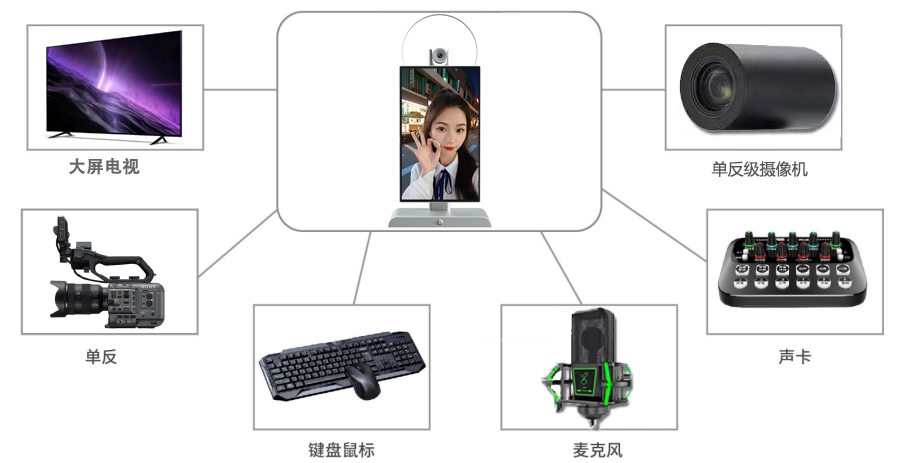

# Product Specification

## Version History

| Version | Date       | Author    | Description     |
|---------|------------|-----------|-----------------|
| Rev.01  | 2023-12-29 | Jiuying   | Initial version |

---

## Chapter 1: Product Overview

### 1.1 Product Appearance

The following image shows the product appearance of the Jiuying X3 10.1-inch All-in-One Live Streaming Device:

### 1.2 Product Specifications

#### Basic Parameters

| Item            | Specification                                                                       |
|-----------------|-------------------------------------------------------------------------------------|
| SOC             | RockChip RK3588S                                                                   |
| CPU             | Octa-core 64-bit (4×Cortex-A76 + 4×Cortex-A55), 8nm advanced process, up to 2.4GHz |
| GPU             | ARM Mali-G610 MP4 quad-core                                                        |
| NPU             | 6 TOPS                                                                             |
| AnTuTu Score    | 570,000                                                                            |
| ISP             | Integrated 48MP ISP with HDR & 3DNR                                                |
| Memory          | 8GB, optional 16GB                                                                 |
| Storage         | 128GB, optional 256GB                                                              |

#### Hardware Parameters

| Item             | Specification                                                                               |
|------------------|---------------------------------------------------------------------------------------------|
| Model            | X3                                                                                          |
| Brand            | Neutral                                                                                     |
| Craftsmanship    | Pure CNC process                                                                           |
| Display          | 10.1-inch 1920×1200 display output                                                         |
| Camera           | Sony 50MP IMX766 MIPI camera, PDAF ultra-fast autofocus                                     |
| Extended Camera  | Supports USB 2.0, HDMI IN expansion for ultra-HD professional streaming cameras, DSLR cameras, etc. |
| Sound Card       | Built-in microphone for knowledge sharing, live commerce                                      |
| Extended Sound Card | Expandable via LINE IN, 3.5mm headphone jack, and USB interface for lapel mics, professional karaoke sound cards, etc. |
| Wireless Network | 2.4G/5G dual-band WiFi 6                                                                    |
| Video Output     | 1× HDMI 2.1 (8K@60fps or 4K@120fps)                                                       |
| Video Input      | 1× HDMI-IN (1080P@60fps)                                                                   |
| Audio           | 2× Speaker output, 1× Phone output, 1× HDMI audio output, 1× Line-In input, 1× MIC input  |
| Touch            | 1× 10-point capacitive touch                                                                |
| External USB     | 2× USB 2.0, 1× Type-C                                                                      |
| Power            | DC 12V input (DC 5.5×2.1mm)                                                                |

#### System Software

| Item               | Specification                                                                               |
|--------------------|---------------------------------------------------------------------------------------------|
| OS                 | Android 12.0                                                                                |
| Domestic Streaming Platforms | Supports Douyin, Kuaishou, Pinduoduo, Taobao, Xiaohongshu, WeChat, JD.com, Baidu Video, YY, and nearly 100 others |
| International Streaming Platforms | Supports TikTok, Facebook, YouTube, Instagram, Twitter, etc.                        |
| Broadcast Director | Guide_station.apk                                                                           |

#### Other Parameters

| Item       | Specification                                                                               |
|------------|---------------------------------------------------------------------------------------------|
| Dimensions | 30cm × 16cm × 2.5cm                                                                       |
| Weight     | Approx. 3 kg                                                                               |
| Cooling    | Built-in professional heat sink, max temperature under stress test ≤ 60°C                     |
| Power Consumption | Typical: ~6.6W (12V/550mA)                                                              |
| Environment | Operating temp: -10°C ~ 40°C Storage temp: -20°C ~ 70°C Storage humidity: 10% ~ 80% |

---

## Chapter 2: User Guide

### 2.1 Peripheral Support

The following image illustrates the device's peripheral interface:

### 2.2 System Overview

#### Broadcast Director

The Broadcast Director interface is shown below:

The V4.0 main interface of the Jiuying Broadcast Director is shown above. While the interface is clean and intuitive, it supports a wide range of powerful features, detailed in the table below:

#### Broadcast Software V4.0 Feature List

| Feature | Supported |
| :--- | :--- |
| Camera Preview | Supports 4K, 50MP, and other high-resolution camera previews |
| Full-Screen Camera Preview | Yes |
| Camera Rotation | 0°, 90°, 180°, 270°, 360° |
| Camera Mirror | Yes |
| Camera On/Off | Yes |
| Virtual Lens | Supports disabling the main lens and filling with a background image |
| Picture-in-Picture | Supports virtual background, Lens 1, Lens 2 — three scenes with free combination |
| Camera Zoom | Yes |
| External USB Camera | Yes |
| External HDMI Camera | Yes |
| External DSLR Camera | Yes — specific model adaptation required |
| External Laptop | Yes — laptop screen can be transmitted to the live stream |
| Domestic Streaming Platforms | Douyin, Kuaishou, Pinduoduo, Taobao, WeChat, Xiaohongshu, Baidu Video, YY, Quanmin K-Ge, JD.com, etc. (Contact us for additional platforms) |
| International Streaming Platforms | TikTok, Instagram, Facebook, Twitter, YouTube |
| Virtual Video Keying | Green screen, blue screen (green preferred) |
| Keying Area Protection | Yes |
| Virtual Background | Static images, dynamic videos; Jiuding server, local USB drive, Android/HarmonyOS wireless upload |
| Virtual Foreground | Static images, dynamic videos; Jiuding server, local USB drive, Android/HarmonyOS wireless upload |
| Text Overlay | Text overlay, text color, text outline, background color selection |
| Virtual Audio — 3.5mm 4-pole headset mic | Yes |
| Built-in Microphone | Yes |
| Virtual Audio — USB microphone | Yes |
| Virtual Audio — Line-in recording | Yes |
| Virtual Audio — Microphone volume control | Yes |
| Virtual Audio — Third-party professional sound card | Yes |
| Virtual Audio — 5V/48V condenser mic | Yes |
| Virtual Audio — Dynamic mic | Yes |
| Virtual Audio — Output volume control | Yes |
| Virtual Audio — Output to live stream | Yes |
| Virtual Audio — Output to built-in speaker | Yes |
| Virtual Audio — Output to external sound card (monitoring) | Yes |
| Virtual Audio — Simultaneous output to stream and speaker | Yes |
| Virtual Audio — Simultaneous output to stream and external sound card | Yes |
| Third-party music apps (QQ Music, KuGou, NetEase Cloud Music) — online/local playback to stream, speaker, and sound card | Yes |
| Phone Remote Control | Yes |
| Phone Screen Mirroring to Live Stream | Yes |
| Phone Camera Mirroring to Live Stream | Yes |
| Phone Remote Upload (images/videos) | Yes |
| Teleprompter | Manual typing, import from USB notepad, AI teleprompter |
| AI Hosting | Yes |
| Scenes | Save and recall custom scene presets |
| Screen Recording | Supports targeted recording of the live window |

---

> This document is provided by **Shenzhen Jiuding Chuangzhan Technology Co., Ltd.** For more product information, visit our [Taobao Store](https://armeasy.taobao.com).
