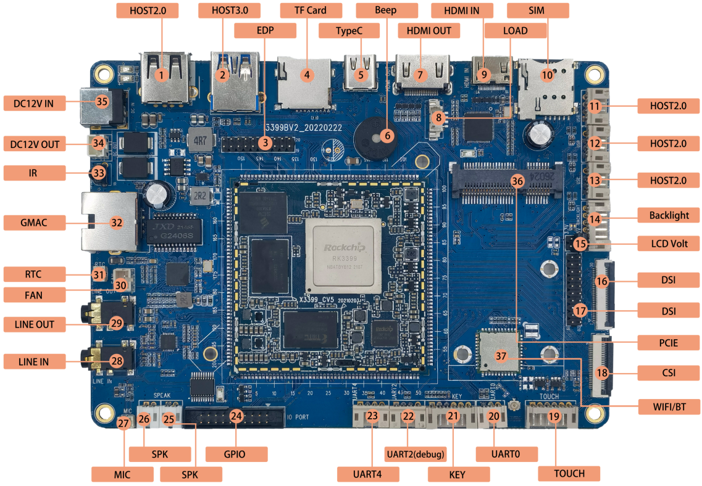

# Hardware Resources

This page keeps the hardware overview only. For detailed connector usage, see [Interface Details](./i3399-interface-details). For the 200-pin core-board definition, see [Pin Definition](./i3399-pin-definition).

## Connector Location Map

## Hardware Interface Overview

| No. | Name | Description |
| --- | --- | --- |
| 【1】 | USB HOST | HOST2.0接口 |
| 【2】 | USB HOST | HOST3.0接口 |
| 【3】 | EDP | EDP接口 |
| 【4】 | TF Card | TF卡座 |
| 【5】 | Type-C | TYPEC接口，兼容OTG功能 |
| 【6】 | BEEP | 蜂鸣器 |
| 【7】 | HDMI OUT | HDMI输出接口 |
| 【8】 | LOAD | HDMI IN芯片程序烧录口 |
| 【9】 | HDMI IN | HDMI输入接口 |
| 【10】 | SIM卡槽 | 3G、4G手机卡槽 |
| 【11】 | USB HOST | HOST2.0接口 |
| 【12】 | USB HOST | HOST2.0接口 |
| 【13】 | USB HOST | HOST2.0接口 |
| 【14】 | 背光驱动 | LCD背光驱动接口 |
| 【15】 | LCD电压选择 | 16，17标识显示屏接口的电平选择，3.3V或5V |
| 【16】 | MIPI DSI | 接MIPI接口的屏，FPC接口 |
| 【17】 | MIPI DSI | 接MIPI接口的屏，排针接口 |
| 【18】 | MIPI CSI | MIPI摄像头接口 |
| 【19】 | 触摸屏接口 | I2C电容触摸屏接口 |
| 【20】 | 串口 | uart0，TTL电平 |
| 【21】 | 按键接口 | 6PIN PH座，按键信号连接座 |
| 【22】 | UART2 | 串口2，TTL电平，默认调试串口 |
| 【23】 | UART4 | UART4，TTL电平接口 |
| 【24】 | GPIO接口 | 扩展GPIO口 |
| 【25】 | 喇叭接口 | 外置双声道扬声器 |
| 【26】 | 喇叭接口 | 外置双声道扬声器 |
| 【27】 | MIC | 耳麦接口 |
| 【28】 | LINE IN | 音频输入接口 |
| 【29】 | LINE OUT | 耳机接口 |
| 【30】 | Fan | 散热风扇电源接口 |
| 【31】 | RTC | RTC电池座 |
| 【32】 | GMAC / Ethernet | 千兆以太网接口 |
| 【33】 | 红外接收头 | HS0038红外一体化接收头 |
| 【34】 | DC OUT | 12V电源输出 |
| 【35】 | DC IN | 12V DC电源输入 |
| 【36】 | PCIE接口 | 接3G、4G模块的PCIE接口 |
| 【37】 | WIFI、BT | 6221A-SRC，双频WIFI/BT模组 |

## Software and Driver Support

I3399 supports Android 7.1, Qt, Ubuntu, and Debian-based systems. Common hardware functions include LCD/EDP, backlight, PMIC, touch, eMMC, SD card, keys, ADC, buzzer, IR, power management, USB HOST, USB OTG/Type-C, audio, camera, HDMI, PCIe/4G, GPS-related expansion, Ethernet, Wi-Fi/Bluetooth, and USB peripherals. The actual enabled functions depend on the firmware and hardware configuration delivered with the product.
