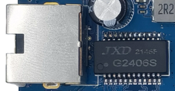
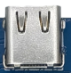
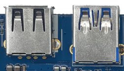
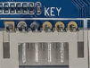
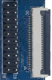
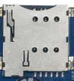
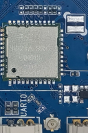

# Interface Details

This page describes external connector usage and avoids repeating the full 200-pin table.

## Power Input and Output

The board uses a 12V DC input. The white PH connector near the lower-left corner can be used as a 12V output for peripherals.

## Debug UART

UART2 is the default debug serial port and is exported through a 4-pin PH connector. UART0 and UART4 are also exported through PH connectors.

## HDMI

The board provides a standard Type-A HDMI connector for HDMI OUT and a mini Type-C style connector for HDMI IN.

## Camera

The FPC connector near the lower-right corner is a 26-pin camera interface. Camera power, reset, clock, and driver settings must match the selected module.

## Ethernet

The board supports Gigabit Ethernet and uses the on-board YT8521 PHY.

## Audio

Audio interfaces include headset output, LINE IN, dual 2W speaker outputs, and MIC input.

## TF Card

The external TF card slot can be used for firmware update, media storage, or external data storage.

## Type-C

The Type-C interface supports USB OTG for flashing and data synchronization and can also be used for high-speed extension scenarios.

## USB HOST

The board exposes USB3.0, USB HOST2.0, and several PH-header USB HOST2.0 interfaces for USB peripherals.

## USB HOST2.0 Expansion

The right-side white PH connectors are USB HOST2.0 expansion connectors for internal USB modules or adapter cables.

## Power / Reset / User Keys

Reset and recovery-related keys are placed on the back side. Other power and user-key signals are exported through a 6-pin PH connector.

## LCD / DSI / EDP

The board provides a 30-pin DSI connector, a 20-pin DSI header, and an EDP interface for high-resolution displays.

## GPIO Expansion

The GPIO header is used for external control, level detection, or low-speed peripheral expansion. Actual function depends on pinmux and device-tree configuration.

## RTC Battery

The RTC battery connector keeps the real-time clock running when the main power is removed.

## Buzzer

The active buzzer is controlled through a transistor and PWM signal. It can be used for PWM tests or audible notifications.

## IR Receiver

The IR receiver uses an integrated HS0038B receiver and can be used for remote-control input.

## SIM Card

The SIM slot is used together with the PCIe 4G module. Insert the carrier SIM card when 4G network access is required.

## PCIe

The PCIe connector can be used for a PCIe 4G module or other PCIe expansion device.

## Wi-Fi / Bluetooth

The board includes a 2.4G/5G dual-band SDIO Wi-Fi/Bluetooth module.

