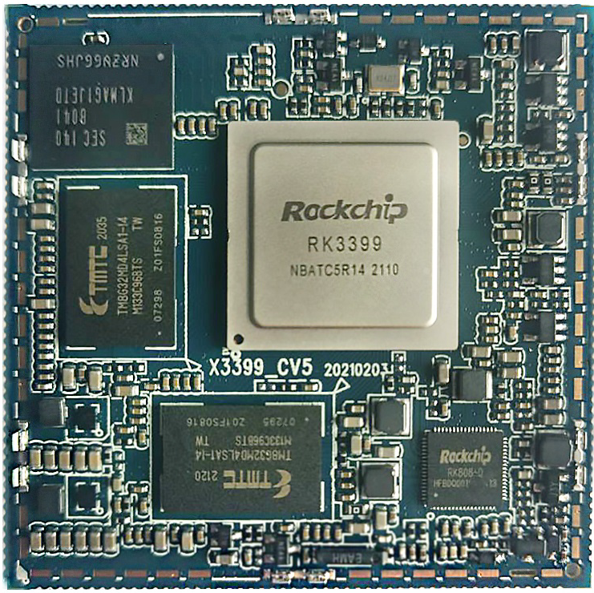

# Product Introduction

The I3399 mainboard is based on the Rockchip RK3399 platform and consists of the X3399CV5 stamp-hole core board and a carrier board. RK3399 uses a dual Cortex-A72 + quad Cortex-A53 big.LITTLE CPU architecture and an ARM Mali-T860 GPU. It is suitable for industrial control, media terminals, security, in-vehicle systems, finance terminals, consumer electronics, display control, and education equipment.

The carrier board exposes HDMI, Camera, Gigabit Ethernet, USB, LCD/DSI/EDP, audio, keys, PCIe, SIM, Wi-Fi/Bluetooth, and other common interfaces. It is suitable for system porting, driver debugging, application verification, and product integration. The board also includes a microcontroller-based watchdog/power-control logic to power-cycle the processor when the system hangs, which is useful for long-running products.

## Feature Highlights

- ARM Cortex-A53 quad-core + Cortex-A72 dual-core CPU.
- 1.4GHz × 4 + 1.8GHz × 2 clock configuration.
- 2GB / 4GB LPDDR4.
- 16GB eMMC by default.
- 4 USB HOST2.0 interfaces, 1 USB HOST3.0 interface, and 1 Type-C interface with OTG support.
- 3 TTL UART ports; UART2 is used as the default debug port.
- TF card interface.
- Reset, power, and independent key signals exported through a 6-pin PH connector.
- Stereo speaker output, MIC input, headset output, and LINE IN.
- HDMI OUT, HDMI IN, DSI/EDP display interfaces.
- On-board 6221A-SRC dual-band Wi-Fi/Bluetooth.
- Gigabit Ethernet, MIPI camera, PCIe module, and IR receiver support.

## Core Board Features

- 55mm × 55mm size with up to 200 exported pins.
- RK808 PMU for stable and cost-effective power management.
- Multiple eMMC brands and capacities supported; 16GB Toshiba eMMC is used by default.
- Dual-channel LPDDR4, 2GB by default and 4GB optional.
- Suspend and wake-up support.
- Android 6.0/7.0, Linux, Debian 9 and related systems supported.
- Reliability tests include high/low temperature, repeated reboot, Android stability, and benchmark tests.

## Product Appearance

## Core Board Appearance

## Core Board Structure

## System Configuration

| Item | Parameter |
| --- | --- |
| CPU | RK3399 |
| Main frequency | Quad-core Cortex-A53 1.4GHz + dual-core Cortex-A72 1.8GHz |
| Memory | 2GB or 4GB LPDDR4, up to 4GB |
| Storage | 4GB / 8GB / 16GB eMMC optional, 16GB by default |
| Power IC | RK808 PMU, dynamic frequency scaling support |

## Interface Parameters

| Item | Parameter |
| --- | --- |
| LCD | MIPI, EDP, and HDMI display output |
| Touch | Capacitive touch |
| Audio | AC97 / IIS, recording and playback |
| SD | 2 SDIO channels |
| eMMC | On-board eMMC, pins are not exported separately |
| Ethernet | Gigabit Ethernet |
| USB HOST2.0 | 2 HOST2.0 interfaces |
| USB HOST3.0 | 2 TYPE3.0 interfaces |
| UART | 5 UART ports, flow-control capable UART supported |
| PWM | 4 PWM outputs |
| I2C | 7 I2C outputs |
| SPI | 1 SPI output |
| ADC | 1 ADC output |
| Camera | 1 BT656/BT601 interface and 1 MIPI output |
| HDMI | HD audio/video output |

## Electrical Characteristics

| Item | Parameter |
| --- | --- |
| Main 3.3V input | 3.3V / 4.3A, 3.3V / 5A recommended |
| Secondary 3.3V input | 3.3V / 300mA, must not be mixed with main 3.3V |
| Output voltage | 1.8V for carrier-board power, 0V after suspend |
| Operating temperature | 0 to 70°C |
| Storage temperature | -10 to 40°C |

## Structure Parameters

| Item | Parameter |
| --- | --- |
| Form factor | Stamp-hole module |
| Core board size | 55mm × 55mm × 3mm |
| Pin pitch | 1.0mm |
| Pad size | 0.5mm × 1.8mm, center-symmetric package |
| Pin count | 200 pins |
| PCB layers | 8 layers |
| Warpage | ≤ 0.5% |
| Window area | The red area in the structure drawing is the recommended carrier-board opening area |

