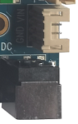
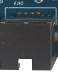
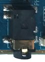
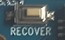
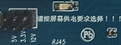
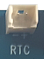
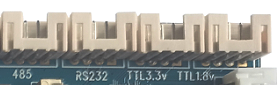
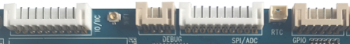

# Interface Details

## Power Connector

I3566 uses 12V DC power input. The DC jack and the 4-pin PH connector on the right side are electrically connected, so either one can be used as the input.

## Debug UART

UART2 is the default debug UART. Users can change the debug UART through software configuration.

## HDMI

The board uses a standard Type-A HDMI connector. With an HDMI extension cable, audio and video can be output to HDMI 2.0-capable TVs, monitors, and other display terminals.

## Ethernet

I3566 supports one Gigabit Ethernet port with the on-board YT8521SC Ethernet PHY.

## Audio

The board supports headphone output, external single-channel 2W speaker output, and microphone input. The headphone output can also feed an external amplifier.

## TF Card

The external TF-card connector can be used for TF-card upgrade or storing media files.

## Independent Key

I3566 has two keys: one independent key and one Reset key. The independent key is sampled through ADC and is also used as the forced-upgrade key.

| Key | Function |
| --- | --- |
| VOL+ | Volume up key (used for upgrade) |
| RESET | Reset key |

## OTG

The OTG interface is routed through a standard Type-A USB connector. It can be used for firmware download or as USB HOST for general USB devices. When the 2-pin jumper near the connector is shorted, the USB connector works as HOST; when open, it works as OTG.

## HOST 2.0

RK3566 has two HOST 2.0 ports. One port is expanded to four HOST 2.0 ports through a HUB, while the other is not routed out on the I3566 core board. Three expanded HOST 2.0 ports are routed through PH connectors, and one is reserved for the 4G PCIe slot.

## HOST 3.0

RK3566 provides one HOST 3.0 port, routed to a standard HOST 3.0 connector.

## Power-on, Reset, and Recovery

I3566 does not provide a separate power-on button and powers on automatically when power is applied. Press Reset during runtime to hard reset. The volume-up key is used as the Recovery key during flashing.

## LCD, Backlight, and Touch

I3566 supports DSI, LVDS, and EDP display interfaces. DSI0 / LVDS output is selected by software, and EDP is used for EDP panels. Backlight power can be selected as 3.3V, 5V, or 12V through jumpers.

## RTC Battery and IR

The backup battery keeps RTC running after power loss, with 3V supply by default. The IR receiver connector is reserved for user expansion.

## Wi-Fi / Bluetooth Module

I3566 includes a 2.4G / 5G dual-band SDIO Wi-Fi / BT module. The default model is 6221A-SRC, and AP6398S, AP6375S, and Ofeixin dual-band Wi-Fi modules are also compatible.

## UART

RK3566 has 10 UARTs. I3566 reserves two TTL UARTs through PH connectors, corresponding to UART6 and UART0. UART2 is reserved as the debug UART. RS485 and RS232 are expanded from UART9 and UART5.

## Reserved GPIO

Three PH connectors are reserved for GPIO expansion.

## Fan Power

The board reserves a fan power-control connector. It can be used when required, although RK3566 usually does not need active cooling in most use cases.

