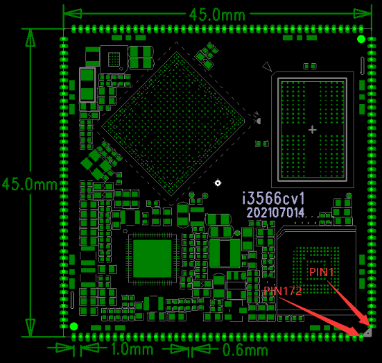

# Core Board Pin Definition

The I3566CV1 core board uses a 172-pin stamp-hole package. The core-board size is 45mm x 45mm x 3mm, and the pin pitch is 1.0mm. The tables below preserve the complete core-board pin definition from the hardware manual for baseboard design, pin-mux checking, and driver debugging.

:::note
All MIPI differential pairs cannot be multiplexed as normal GPIO.
:::

## Core Board Pin Definition 1: Pin 1-43

| Pin No. | Signal | Type | Function Description |
| --- | --- | --- | --- |
| 1 | GPIO2_B7 | GPIO | UART6_RTS_M0,SPI1_MOSI_M0,I2S2_SCLK_RX_M0 |
| 2 | GPIO2_B1 | GPIO | UART8_RTS_M0,I2C4_SDA_M1,SDMMC1_PWREN |
| 3 | GPIO2_B2 | GPIO | UART8_CTS_M0,I2C4_SCL_M1,SDMMC1_DET |
| 4 | GND | Ground |  |
| 5 | ADC2 | ADC输入 | ADC输入通道2 |
| 6 | ADC1 | ADC输入 | ADC输入通道1 |
| 7 | ADC0 | ADC输入 | ADC输入通道0 |
| 8 | GPIO1_B2 | GPIO | I2S1_SDO3_M0,I2S1_SDI1_M0 |
| 9 | GPIO1_B1 | GPIO | I2S1_SDO2_M0,I2S1_SDI2_M0 |
| 10 | GPIO1_B0 | GPIO | I2S1_SDO1_M0,I2S1_SDI3_M0 |
| 11 | GPIO1_A0 | GPIO | UART3_RX_M0,I2C3_SDA_M0 |
| 12 | GPIO1_A1 | GPIO | UART3_TX_M0,I2C3_SCL_M0 |
| 13 | GPIO4_C0 | GPIO | CIF_CLKOUT,PWM11_IR_M1 |
| 14 | GPIO4_C1 | GPIO | CIF_CLKIN,GMAC1_MCLKINOUT_M1,UART1_CTS_M1,I2S2_SCLK_RX_M1 |
| 15 | GPIO4_B6 | GPIO | CIF_HREF,GMAC1_MDC_M1,UART1_RTS_M1,I2S2_MCLK_M1 |
| 16 | GPIO4_B7 | GPIO | CIF_VSYNC,GMAC1_MDIO_M1,I2S2_SCLK_TX_M1 |
| 17 | GPIO4_A5 | GPIO | CIF_8BIT_D7 |
| 18 | GPIO4_A4 | GPIO | CIF_8BIT_D6 |
| 19 | GPIO4_A3 | GPIO | CIF_8BIT_D5 |
| 20 | GPIO4_A2 | GPIO | CIF_8BIT_D4 |
| 21 | GPIO4_A1 | GPIO | CIF_8BIT_D3 |
| 22 | GPIO4_A0 | GPIO | CIF_D10 |
| 23 | GPIO3_D7 | GPIO | CIF_D9, GMAC1_TXD3_M1 ,UART1_RX_M1 |
| 24 | GPIO3_D6 | GPIO | CIF_D8,GMAC1_TXD2_M1,UART1_TX_M1 |
| 25 | GPIO4_B3 | GPIO | I2C4_SCL_M0,ETH1_REFCLKO_25M_M1,SPI3_CLK_M0,I2S2_SDO_M1 |
| 26 | GPIO4_B2 | GPIO | I2C4_SDA_M0,GMAC_RXER_M1,SPI3_MOSI_M0,I2S2_SDI_M1 |
| 27 | GPIO4_B4 | GPIO | I2C2_SDA_M1,BT656_CLK_M1 |
| 28 | GPIO4_B5 | GPIO | I2C2_SCL_M1,I2S1_SDO3_M1 |
| 29 | GPIO0_C7 | GPIO | PWM0_M1,UART0_CTS |
| 30 | GPIO4_A7 | GPIO | CAM_CLKOUT0,GMAC1_RXD0_M1,SPI3_CS1_M0,I2S1_LRCK_RX_M1 |
| 31 | GPIO4_A6 | GPIO | GMAC1_TXEN_M1,SPI3_CS0_M0,I2S1_SCLK_RX_M1 |
| 32 | GPIO4_B1 | GPIO | GMAC1_RXDV_CRS_M1,I2S1_SDO2_M1 |
| 33 | GPIO4_B0 | GPIO | CAMCLKOUT1,GMAC1_RXD1_M1,SPI3_MISO_M0,I2S1_SDO0_M1 |
| 34 | GPIO3_C7 | GPIO | CIF_D1,SDMMC2_D1_M0,I2S1_SCLK_TX_M1 |
| 35 | GPIO3_C6 | GPIO | CIF_D0,SDMMC2_D0_M0,I2S1_MCLK_M1 |
| 36 | GPIO3_D5 | GPIO | CIF_D7,SDMMC2_PWREN_M0,I2S1_SDI3_M1 |
| 37 | GPIO3_D4 | GPIO | CIF_D6,SDMMC2_DET_M0,I2S1_SDI2_M1 |
| 38 | GPIO3_D3 | GPIO | CIF_D5, SDMMC2_CLK_M0, I2S1_SDI1_M1 |
| 39 | GPIO3_D2 | GPIO | CIF_D4, SDMMC2_CMD_M0, I2S1_SDI0_M1 |
| 40 | GPIO3_D1 | GPIO | CIF_D3,SDMMC2_D3_M0,I2S1_SDO0_M1 |
| 41 | GPIO3_D0 | GPIO | CIF_D2,SDMMC2_D2_M0,I2S1_LRCK_TX_M1 |
| 42 | GPIO4_C6 | GPIO | PWM13_M1,SPI3_CS0_M1,UART9_RX_M1,I2S3_SDI_M1 |
| 43 | GPIO4_C5 | GPIO | PWM12_M1,SPI3_MISO_M1,UART9_TX_M1,I2S3_SDO_M1 |

## Core Board Pin Definition 2: Pin 44-86

| Pin No. | Signal | Type | Description |
| --- | --- | --- | --- |
| 44 | GPIO4_C4 | GPIO | SPDIF_TX_M2,I2S3_LRCK_M1 |
| 45 | GPIO4_C3 | GPIO | PWM15_IR_M1,SPI3_MOSI_M1,I2S3_SCLK_M1 |
| 46 | GPIO4_C2 | GPIO | PWM14_M1,SPI3_CLK_M1,I2S3_MCLK_M1 |
| 47 | GPIO3_C2 | GPIO | BT1120_D14,SPI1_MISO_M1,UART5_TX_M1,I2S1_SDO3_M2 |
| 48 | GPIO3_C3 | GPIO | BT1120_D15,SPI1_CLK_M1,UART5_RX_M1, I2S1_SCLK_RX_M2 |
| 49 | USB2_HOST2_DM | USB differential pair | USB2_HOST2_DM |
| 50 | USB2_HOST2_DP | USB differential pair | USB2_HOST2_DP |
| 51 | GND | Ground |  |
| 52 | GPIO3_C5 | GPIO | PWM15_IR_M0,SPDIF_TX_M1,GMAC1_MDIO_M0,UART7_RX_M1,I2S1_LRCK_RX_M2 |
| 53 | GPIO3_C4 | GPIO | PWM14_M0,GMAC1_MDC_M0,UART7_TX_M1 |
| 54 | GPIO3_B4 | GPIO | I2C5_SDA_M0,GMAC1_RXER_M0 |
| 55 | GPIO3_B7 | GPIO | PWM12_M0,GMAC1_TXEN_M0,UART3_TX_M1 |
| 56 | GPIO3_A3 | GPIO | BT1120_D2,GMAC1_TXD3_M0,I2S3_SCLK_M0,SDMMC2_D2_M1 |
| 57 | GPIO3_A2 | GPIO | BT1120_D1,GMAC1_TXD2_M0,I2S3_MCLK_M0,SDMMC2_D1_M1 |
| 58 | GPIO3_B6 | GPIO | PWM11_IR_M0,BT1120_D12,I2C3_SDA_M1,GMAC1_TXD1_M0 |
| 59 | GPIO3_B5 | GPIO | PWM10_M0,BT1120_D11,I2C3_SCL_M1,GMAC1_TXD0_M0 |
| 60 | GPIO3_A6 | GPIO | BT1120_CLK,GMAC1_TXCLK_M0, I2S3_SDI_M0,SDMMC2_CLK_M1 |
| 61 | GPIO3_B3 | GPIO | BT1120_D9,I2C5_SCL_M0,GMAC1_RXDV_CRS_M0 |
| 62 | GPIO3_B1 | GPIO | PWM8_M0,BT1120_D7,GMAC1_RXD0_M0,UART4_RX_M1 |
| 63 | GPIO3_B2 | GPIO | PWM9_M0,BT1120_D8,GMAC1_RXD1_M0, UART4_TX_M1 |
| 64 | GPIO3_A4 | GPIO | BT1120_D3,GMAC1_RXD2_M0,I2S3_LRCK_M0,SDMMC_D3_M1 |
| 65 | GPIO3_A5 | GPIO | BT1120_D4,GMAC1_RXD3_M0, I2S3_SDO_M0, ,SDMMC_CMD_M1 |
| 66 | GPIO3_A7 | GPIO | BT1120_D5,GMAC1_RXCLK_M0,SDMMC2_DET_M1 |
| 67 | GPIO3_C1 | GPIO | BT1120_D13,SPI1_MOSI_M1,I2S1_SDO2_M2 |
| 68 | GPIO3_B0 | GPIO | BT1120_D6,ETH1_REFCLKO_25M_M0, SDMMC_PWREN_M1 |
| 69 | GPIO3_C0 | GPIO | PWM13_M0,GMAC1_MCLKINOUT_M0,UART3_RX_M1,PDM_SDI3_M2 |
| 70 | MIPI_CSI_RX_D3N | CSI信号线 | MIPI CSI differential pair |
| 71 | MIPI_CSI_RX_D3P | CSI信号线 | MIPI CSI differential pair |
| 72 | MIPI_CSI_RX_D2N | CSI信号线 | MIPI CSI differential pair |
| 73 | MIPI_CSI_RX_D2P | CSI信号线 | MIPI CSI differential pair |
| 74 | MIPI_CSI_RX_D1N | CSI信号线 | MIPI CSI differential pair |
| 75 | MIPI_CSI_RX_D1P | CSI信号线 | MIPI CSI differential pair |
| 76 | MIPI_CSI_RX_D0N | CSI信号线 | MIPI CSI differential pair |
| 77 | MIPI_CSI_RX_D0P | CSI信号线 | MIPI CSI differential pair |
| 78 | MIPI_CSI_RX_CLK1N | CSI信号线 | MIPI CSI differential pair |
| 79 | MIPI_CSI_RX_CLK1P | CSI信号线 | MIPI CSI differential pair |
| 80 | MIPI_CSI_RX_CLK0N | CSI信号线 | MIPI CSI differential pair |
| 81 | MIPI_CSI_RX_CLK0P | CSI信号线 | MIPI CSI differential pair |
| 82 | GND | Ground |  |
| 83 | MIPI_DSI_TX0_CLKN/LVDS_TX0_CLKN | DSI或LVDS信号线 | DSI or LVDS differential pair, selected by software |
| 84 | MIPI_DSI_TX0_CLKP/LVDS_TX0_CLKP | DSI或LVDS信号线 | DSI or LVDS differential pair, selected by software |
| 85 | MIPI_DSI_TX0_D3N/LVDS_TX0_D3N | DSI或LVDS信号线 | DSI or LVDS differential pair, selected by software |
| 86 | MIPI_DSI_TX0_D3P/LVDS_TX0_D3P | DSI或LVDS信号线 | DSI or LVDS differential pair, selected by software |

## Core Board Pin Definition 3: Pin 87-129

| Pin No. | Signal | Type | Description |
| --- | --- | --- | --- |
| 87 | MIPI_DSI_TX0_D2N/LVDS_TX0_D2N | DSI或LVDS信号线 | DSI or LVDS differential pair, selected by software |
| 88 | MIPI_DSI_TX0_D2P/LVDS_TX0_D2P | DSI或LVDS信号线 | DSI or LVDS differential pair, selected by software |
| 89 | MIPI_DSI_TX0_D1N/LVDS_TX0_D1N | DSI或LVDS信号线 | DSI or LVDS differential pair, selected by software |
| 90 | MIPI_DSI_TX0_D1P/LVDS_TX0_D1P | DSI或LVDS信号线 | DSI or LVDS differential pair, selected by software |
| 91 | MIPI_DSI_TX0_D0N/LVDS_TX0_D0N | DSI或LVDS信号线 | DSI or LVDS differential pair, selected by software |
| 92 | MIPI_DSI_TX0_D0P/LVDS_TX0_D0P | DSI或LVDS信号线 | DSI or LVDS differential pair, selected by software |
| 93 | GPIO4_C7 | GPIO | HDMITX_SCL,I2C5_SCL_M1 |
| 94 | GPIO4_D0 | GPIO | HDMITX_SDA,I2C5_SDA_M1 |
| 95 | GPIO4_D1 | GPIO | HDMITX_CEC_M0,SPI3_CS1_M1 |
| 96 | HDMI_TX_HPDIN | HDMI插入检测管脚 |  |
| 97 | HDMI_TXCLKN_PORT | HDMI信号线 | HDMI high-speed differential pair |
| 98 | HDMI_TXCLKP_PORT | HDMI信号线 | HDMI high-speed differential pair |
| 99 | HDMI_TX0N_PORT | HDMI信号线 | HDMI high-speed differential pair |
| 100 | HDMI_TX0P_PORT | HDMI信号线 | HDMI high-speed differential pair |
| 101 | HDMI_TX1N_PORT | HDMI信号线 | HDMI high-speed differential pair |
| 102 | HDMI_TX1P_PORT | HDMI信号线 | HDMI high-speed differential pair |
| 103 | HDMI_TX2N_PORT | HDMI信号线 | HDMI high-speed differential pair |
| 104 | HDMI_TX2P_PORT | HDMI信号线 | HDMI high-speed differential pair |
| 105 | GPIO0_D0 | GPIO | UART2_RX_M0，默认为调试UART |
| 106 | GPIO0_D1 | GPIO | UART2_TX_M0，默认为调试UART |
| 107 | GPIO0_C0 | GPIO | PWM1,UART0_RX |
| 108 | GPIO0_C1 | GPIO | PWM2,UART0_TX |
| 109 | GND | Ground |  |
| 110 | USB3_HOST1_DP | USB信号线 | USB high-speed differential pair |
| 111 | USB3_HOST1_DM | USB信号线 | USB high-speed differential pair |
| 112 | USB3_HOST1_SSTXP | USB信号线 | USB high-speed differential pair |
| 113 | USB3_HOST1_SSTXN | USB信号线 | USB high-speed differential pair |
| 114 | USB3_HOST1_SSRXP | USB信号线 | USB high-speed differential pair |
| 115 | USB3_HOST1_SSRXN | USB信号线 | USB high-speed differential pair |
| 116 | USB_OTG0_VBUSDET | OTG检测脚 | 用于OTG管脚识别 |
| 117 | USB_OTG0_ID | OTG ID脚 | 用于HOST和DEVICE状态判断 |
| 118 | USB_OTG0_DM | USB信号线 | USB high-speed differential pair |
| 119 | USB_OTG0_DP | USB信号线 | USB high-speed differential pair |
| 120 | EDP_TX_AUXN | EDP屏信号线 | EDP屏接口差分对 |
| 121 | EDP_TX_AUXP | EDP屏信号线 | EDP屏接口差分对 |
| 122 | EDP_TX_D3N | EDP屏信号线 | EDP屏接口差分对 |
| 123 | EDP_TX_D3P | EDP屏信号线 | EDP屏接口差分对 |
| 124 | EDP_TX_D2N | EDP屏信号线 | EDP屏接口差分对 |
| 125 | EDP_TX_D2P | EDP屏信号线 | EDP屏接口差分对 |
| 126 | EDP_TX_D1N | EDP屏信号线 | EDP屏接口差分对 |
| 127 | EDP_TX_D1P | EDP屏信号线 | EDP屏接口差分对 |
| 128 | EDP_TX_D0N | EDP屏信号线 | EDP屏接口差分对 |
| 129 | EDP_TX_D0P | EDP屏信号线 | EDP屏接口差分对 |

## Core Board Pin Definition 4: Pin 130-172

| Pin No. | Signal | Type | Description |
| --- | --- | --- | --- |
| 130 | GND | Ground |  |
| 131 | GPIO0_C4 | GPIO | PWM5,SPI0_CS1,UART0_RTS |
| 132 | GPIO0_C3 | GPIO | PWM4 |
| 133 | GPIO0_C2 | GPIO |  |
| 134 | GPIO0_A4 | GPIO | SDMMC0_DET |
| 135 | GPIO2_A2 | GPIO | SDMMC0_CLK,UART5_TX |
| 136 | GPIO2_A0 | GPIO | SDMMC0_D3,UART5_RTS |
| 137 | GPIO1_D7 | GPIO | SDMMC0_D2,UART5_CTS |
| 138 | GPIO1_D6 | GPIO | SDMMC0_D1,PWM9,UART2_RX,UART6_RX |
| 139 | GPIO1_D5 | GPIO | SDMMC0_D0,PWM8,UART2_TX,UART6_TX |
| 140 | GPIO2_A1 | GPIO | SDMMC0_CMD,PWM10,UART5_RX |
| 141 | SNSN | 电池信号脚 | 电池负极 |
| 142 | VCC_BAT- | 电池负极 | 电池负极 |
| 143 | VCC_BAT+ | 电池正级 | 电池正级 |
| 144 | GND | Ground |  |
| 145 | GND | Ground |  |
| 146 | VBUS | 电源输入 | PMIC 5V电源输入 |
| 147 | VBUS | 电源输入 | PMIC 5V电源输入 |
| 148 | TS | PMIC GPIO口 | PMIC GPIO output |
| 149 | SPKP_OUT | 喇叭输出 | 喇叭输出正极 |
| 150 | SPKN_OUT | 喇叭输出 | 喇叭输出负极 |
| 151 | MIC1_IN | 麦克风输入 | 麦克风输入通道1 |
| 152 | MIC2_IN | 麦克风输入 | 麦克风输入通道2 |
| 153 | HPR_OUT | Headphone output | 耳机右声道输出 |
| 154 | HPL_OUT | Headphone output | 耳机左声道输出 |
| 155 | HP_SNS | 耳机噪声抑制 | 耳机噪声抑制管脚，靠近耳机座子下地 |
| 156 | PMIC_PWRON | 开机管脚 | PMIC上电开机管脚，低电平有效 |
| 157 | PMIC_RESET_KEY | 复位管脚 | PMIC复位管脚 |
| 158 | GPIO2_C3 | GPIO | I2S2_LRCK_TX_M0,UART9_RTS,SPI2_MOSI |
| 159 | GPIO2_C4 | GPIO | I2S2_SDO_M0,UART9_CTS,SPI2_CS0 |
| 160 | GPIO2_C5 | GPIO | I2S2_SDI_M0,UART8_TX,SPI2_CS1 |
| 161 | GPIO2_C2 | GPIO | I2S2_SCLK_TX_M0,UART7_CTS,SPI2_MISO |
| 162 | GPIO2_C1 | GPIO | UART7_RTS,SPI2_CLK_M0,I2S2_MCLK_M0 |
| 163 | GPIO2_B4 | GPIO | UART1_TX_M0 |
| 164 | GPIO2_B3 | GPIO | UART1_RX_M0 |
| 165 | GPIO2_B0 | GPIO | SDMMC1_CLK,UART9_TX |
| 166 | GPIO2_A7 | GPIO | SDMMC1_CMD,UART9_RX |
| 167 | GPIO2_A3 | GPIO | SDMMC1_D0,UART6_RX |
| 168 | GPIO2_A4 | GPIO | SDMMC1_D1,UART6_TX |
| 169 | GPIO2_A6 | GPIO | SDMMC1_D3,UART7_TX |
| 170 | GPIO2_A5 | GPIO | SDMMC1_D2,UART7_RX |
| 171 | GPIO2_B6 | GPIO | UART1_CTSn_M0,SPI1_MISO |
| 172 | GPIO2_B5 | GPIO | UART1_RTSn_M0,SPI1_CLK |

