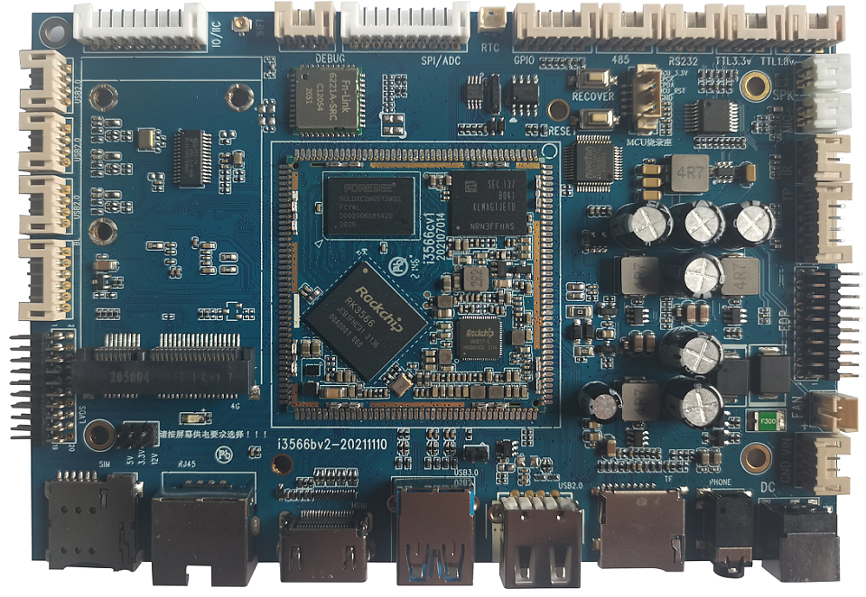

# Product Introduction

The I3566 mainboard is based on the Rockchip RK3566 platform and is designed for embedded product development, system porting, interface verification, and driver debugging. The board integrates common peripheral resources such as display, network, audio, USB, UART, GPIO, and 4G expansion, making it suitable for RK3566 platform evaluation and rapid application prototyping.

## Feature Highlights

- Quad-core ARM Cortex-A55, up to 1.8GHz x 4.
- 1GB / 2GB / 4GB / 8GB LPDDR4 / LPDDR4X memory options, 2GB standard.
- 16GB standard flash.
- Four USB HOST 2.0 ports: one Type-A USB connector multiplexed as USB OTG, and three ports routed through PH connectors.
- One USB HOST 3.0, three TTL UARTs, one RS232, one RS485, and one TF-card interface.
- One HDMI output, one DSI or LVDS display interface, and one EDP display interface.
- Capacitive touch, stepless backlight control, IR receiver, external speaker, MIC input, and headphone output.
- On-board dual-band Wi-Fi / BT module, YT8521 Gigabit Ethernet, and PCIe 4G module expansion.

## Specification Summary

| Item | Parameter |
| --- | --- |
| SoC | Rockchip RK3566 |
| CPU | Quad Cortex-A55 1.8GHz |
| Memory | 1GB / 2GB / 4GB / 8GB LPDDR4 / LPDDR4X, 2GB standard |
| Storage | 4GB / 8GB / 16GB eMMC options, 16GB standard |
| Display | DSI / LVDS / EDP / HDMI |
| Network | YT8521 Gigabit Ethernet, dual-band Wi-Fi / BT |
| USB | Four USB HOST 2.0 ports, one USB HOST 3.0 port, and one OTG port |
| UART | Three TTL UARTs, one RS232, and one RS485 |
| Power | 12V DC board input; core-board VBUS 5V / 2A, VBAT 3.5V to 4.2V |
| Core board size | 45mm x 45mm x 3mm, 172-pin stamp-hole package |

## Core-board Characteristics

- 45mm x 45mm core-board size.
- 172 pins routed out.
- RK817 PMU for stable and reliable operation.
- LPDDR4 / LPDDR4X design with 1GB / 2GB / 4GB / 8GB options.
- Supports Android and Linux operating systems.
- Supports Gigabit Ethernet.
- Reliability verified by high/low-temperature and repeated reboot tests.

## System Configuration

| CPU | RK3566 |
| --- | --- |
| Clock | Quad Cortex-A55 (1.8GHz) |
| Memory | 2GB standard, hardware compatible with 1GB / 4GB / 8GB |
| Storage | 4GB / 8GB / 16GB eMMC options, 16GB standard |
| Power IC | RK817; supports adapter and battery power |

## Interface Parameters

| LCD interface | Supports DSI / LVDS / EDP / HDMI output |
| --- | --- |
| Touch interface | Capacitive touch |
| Audio interface | Supports direct headphone / speaker output and recording / playback |
| SD-card interface | Two SDIO output channels |
| eMMC interface | On-board eMMC interface; pins are not routed out separately |
| Ethernet interface | Supports one Gigabit Ethernet port |
| USB HOST 2.0 interface | One HOST 2.0 port |
| USB HOST 3.0 interface | One HOST 3.0 port |
| OTG interface | One OTG port |
| UART interface | 10 UARTs, including flow-control-capable UARTs |
| PWM interface | 16 PWM outputs |
| I2C interface | 6 I2C outputs |
| SPI interface | 4 SPI outputs |
| ADC interface | 2 ADC outputs (6 channels not routed out) |
| Camera interface | CSI / BT601 / BT656 / BT1120 / RAW input |

## Electrical Characteristics

| VBUS input voltage | 5V/2A |
| --- | --- |
| VBAT input voltage | 3.5到4.2V，典型值3.7V |
| Operating temperature | -10~70度 |
| Storage temperature | -10~40度 |

## Software Resources

I3566 supports Android 11 and Linux / Qt systems. Driver support is listed below:

| system / driver | Linux4.19+ / Android11 | Linux 4.19 + Qt |
| --- | --- | --- |
| 7-inch MIPI panel (1024 x 600) | ✓ | ✓ |
| Backlight driver | ✓ | ✓ |
| PMIC driver (RK817) | ✓ | ✓ |
| Capacitive touch | ✓ | ✓ |
| eMMC driver | ✓ | ✓ |
| SD-card driver | ✓ | ✓ |
| Independent key | ✓ | ✓ |
| ADC driver | ✓ | ✓ |
| Power on/off | ✓ | ✓ |
| Suspend / wake-up | ✓ | ✓ |
| Two USB HOST 2.0 drivers | ✓ | ✓ |
| One USB HOST 3.0 driver | ✓ | ✓ |
| One OTG driver | ✓ | ✓ |
| PCIe bus driver | ✓ | ✓ |
| Optical audio driver | ✓ | ✓ |
| RTC driver | ✓ | ✓ |
| Audio | ✓ | ✓ |
| Recording | ✓ | ✓ |
| Dual-band Wi-Fi / BT 4.0 | ✓ | ✓ |
| GPS | ✓ | ✓ |
| CSI camera driver | ✓ | ✓ |
| USB camera driver | ✓ | ✓ |
| UART | ✓ | ✓ |
| HDMI 2.0 | ✓ | ✓ |
| Gigabit Ethernet | ✓ | ✓ |
| USB mouse / keyboard | ✓ | ✓ |
| U-Boot | ✓ | ✓ |

