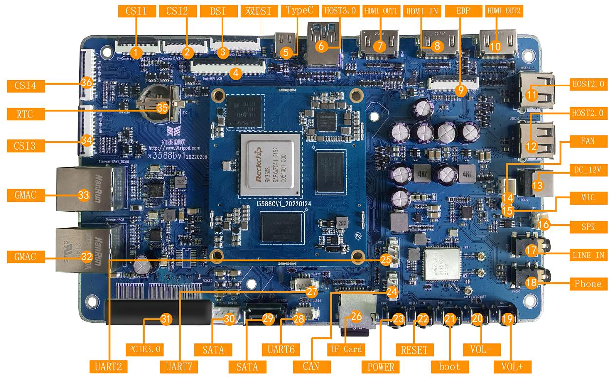

# Hardware Resources

## Hardware Interface Overview

| No. | Name | Description |
|---|---|---|
| 【1】 | MIPI CSI1 | MIPI摄像头接口 |
| 【2】 | MIPI CSI2 | MIPI摄像头接口 |
| 【3】 | 显示接口 | 单通道DSI接口 |
| 【4】 | 显示接口 | 双通道DSI接口 |
| 【5】 | TypeC 接口 | 标准TypeC 接口，用于程序下载等 |
| 【6】 | USB3.0 | USB HOST3.0 接口 |
| 【7】 | HDMI OUT | HDMI1输出接口 |
| 【8】 | HDMI IN | HDMI输入接口 |
| 【9】 | 显示接口 | EDP 接口，和HDMI2 输出接口复用 |
| 【10】 | HDMI OUT | HDMI2输出接口 |
| 【11】 | HOST2.0 | USB HOST2.0 接口 |
| 【12】 | HOST2.0 | USB HOST2.0 接口 |
| 【13】 | DC 插座 | 12V直流Power输入接口 |
| 【14】 | FAN | 风扇Power接口 |
| 【15】 | 咪头 | 咪头录音输入 |
| 【16】 | 喇叭接口 | 外置双声道扬声器 |
| 【17】 | LINE IN | 音频录音接口 |
| 【18】 | 耳机座 | 耳机输出 |
| 【19】 | 独立按键 | 音量加，在升级时用作 Recovery键 |
| 【20】 | 独立按键 | 音量减 |
| 【21】 | 独立按键 | boot 按键，用于maskrom 或强制升级 |
| 【22】 | 独立按键 | 复位按键 |
| 【23】 | 独立按键 | PWRKEY |
| 【24】 | CAN | CAN总线接口 |
| 【25】 | UART2 | UART2，TTL电平接口，默认为调试串口 |
| 【26】 | TF卡 | TF卡座 |
| 【27】 | UART7 | UART7，TTL电平接口 |
| 【28】 | UART6 | UART6，TTL电平接口 |
| 【29】 | SATA接口 | SATA信号接口 |
| 【30】 | SATA接口 | SATAPower接口 |
| 【31】 | PCIE 接口 | PCIE 总线接口，可用于 PCIE 接口设备扩展， 如WIFI6、SATA、串口、以太网等 |
| 【32】 | GMAC | 千兆Ethernet Interface，PCIE 接口 |
| 【33】 | GMAC | 千兆Ethernet Interface，RGMII接口 |
| 【34】 | MIPI CSI3 | MIPI摄像头接口 |
| 【35】 | RTC | RTC 钮扣电池 |

