# Interface Details

This page summarizes the hardware interfaces and keeps the interface images from the original hardware manual.

## Power Switch and DC Jack

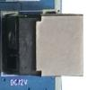

The mainboard uses a 12V DC power input. Use a suitable power adapter according to the hardware design requirements.

## Debug UART

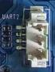

The default debug UART is UART2. The debug port can be used to view boot logs and enter the system console.

## HDMI Interface

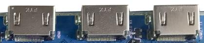

The mainboard provides HDMI input/output interfaces. The exact display path and supported modes depend on the firmware configuration.

## Camera Interface

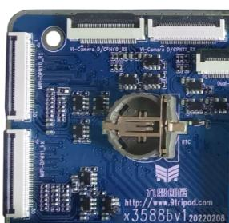

The mainboard provides FPC camera connectors for external MIPI CSI cameras. Check lane configuration and power sequence before connecting a camera.

## Ethernet Interface

The mainboard provides wired Ethernet interfaces for network access.

## Headphone Interface

The headphone jack can be used for audio output.

## LINE IN Interface

The LINE IN connector is used for external audio input.

## Speaker Interface

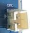

The speaker connector is used for external speaker output.

## Microphone Interface

The microphone connector is used for recording input.

## TF Card Slot

The TF card slot can be used for removable storage or related boot/update functions depending on firmware support.

## Buttons

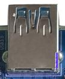

The independent buttons are used for power, reset, boot, recovery, and other board control functions.

## Type-C Interface

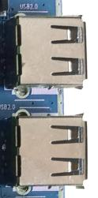

The Type-C interface is mainly used for program download, ADB debugging, or USB OTG functions depending on the board design.

## USB HOST2.0 Interface

USB HOST2.0 can be used to connect USB mouse, keyboard, flash disk, or other USB peripherals.

## Power Button

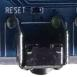

The power button is used to power on, shut down, suspend, or wake the system depending on firmware behavior.

## Reset Button

The reset button is used to reset the system.

## BOOT Button

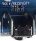

The BOOT button is used for firmware download or forcing the board into upgrade mode.

## Recovery Button

The Recovery button is used to enter recovery or loader-related modes.

## LCD Interface

The LCD interface is used for external display modules. Confirm timing, power, and backlight configuration before use.

## Backup Battery

The backup battery provides RTC power so the system time can be retained after power loss.

## Wi-Fi / Bluetooth Module

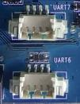

The onboard Wi-Fi/Bluetooth module provides wireless network and Bluetooth connectivity.

## UART Interfaces

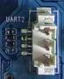

UART connectors are provided for external serial devices or debugging.

## PCIe Interface

The PCIe interface can be used for supported high-speed peripherals.

## SATA Interface

The SATA interface can be used for supported storage devices.
