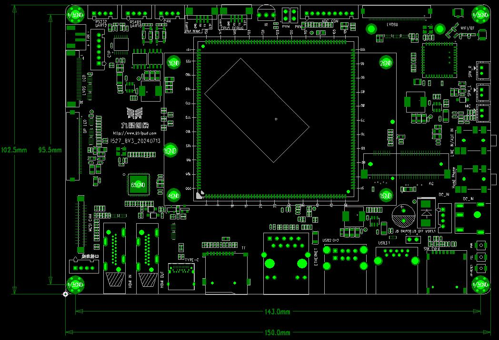

# Hardware Resources

## Board specifications

| Item | Specification |
|---|---|
| Board | I527BV3 |
| Processor | Allwinner T527/A527 series, Arm Cortex-A55 |
| Memory | 2 GB / 4 GB LPDDR4X |
| eMMC | 4/8/16/32/64 GB and other BOM options |
| PMIC | AXP717B |
| Input | 12 V DC, 3 A recommended |
| Size | 150 mm × 102 mm × 1.6 mm |

## Interfaces

| Category | Resources |
|---|---|
| Display | HDMI OUT, eDP, two LVDS resources, multiplexed MIPI DSI |
| Video input | HDMI IN through LT6911C to MIPI CSI |
| Camera | One 4-lane MIPI CSI connector |
| Touch | 6-pin I2C touch connector and touch signals on panel connectors |
| Network | Gigabit Ethernet and PCIe 4G/SIM expansion |
| USB | One USB 3.0 Host, two USB 2.0 Host, one Type-C OTG/flashing port |
| Storage | eMMC, TF card and M.2 expansion |
| Communication | Two CAN, one RS485, one RS232 and two debug UARTs |
| Audio | Stereo 0.5 W speakers, microphone, headphone and line input |
| Wireless | AW869A dual-band Wi-Fi 6 and Bluetooth 5.2 |
| Other | PWM, ADC, infrared, RTC battery and 12 V fan |

## Connector locations

See [Interface Details](./i527-interface-details.md) for pin assignments.
