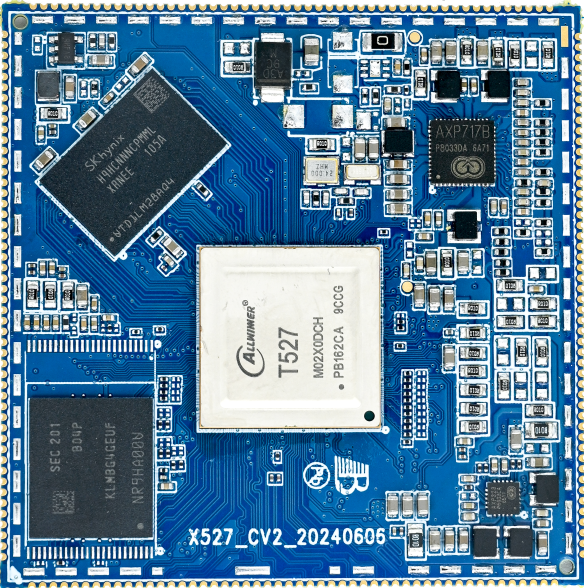

# Product Introduction

The I527BV3 development board is based on the Allwinner T527/A527 family and uses the X527CV2 core module. The core module integrates the SoC, LPDDR4X, eMMC and AXP717B PMIC, while the carrier board exposes display, networking, USB, audio, camera, communication and storage interfaces.


## Board highlights

- 150 mm × 102 mm × 1.6 mm
- 12 V DC input, 12 V / 3 A adapter recommended
- Gigabit Ethernet using RTL8211F
- One USB 3.0 Host and two USB 2.0 Host ports through a hub
- Native HDMI OUT and HDMI IN converted to MIPI CSI by LT6911C
- eDP, two LVDS resources and MIPI DSI multiplexing
- One 4-lane MIPI CSI camera connector
- Two CAN channels, RS485, RS232 and two debug UARTs
- AW869A dual-band Wi-Fi 6 and Bluetooth 5.2 module
- TF, PCIe 4G and M.2 expansion
- Stereo 0.5 W speaker outputs, microphone, headphone and line input

## X527CV2 core module



| Item | Specification |
|---|---|
| CPU | Allwinner T527/T527N/A527 series, Arm Cortex-A55 |
| Clock | Up to about 2.0 GHz depending on the SoC and software configuration |
| Memory | 2 GB / 4 GB LPDDR4X |
| Storage | On-board eMMC |
| PMIC | AXP717B |
| Size | 55 mm × 55 mm × 1.2 mm |
| Package | 200 castellated pins, 1.0 mm pitch |

## Source-tree name

Use the following board name for product configuration, device trees and documentation paths:

```text
i527bv3
```

A source archive or repository may still contain `x527` or `t527` in its package name; select `i527bv3` inside the released SDK.
