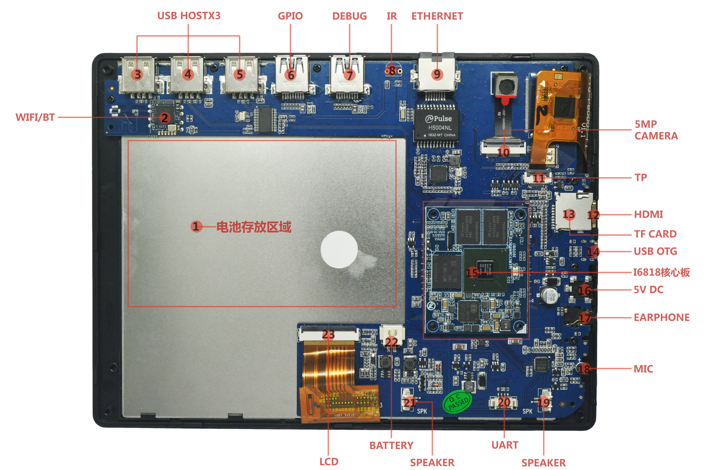

# Hardware Resources

This page summarizes the i6818 hardware interface locations and functions. See [Pin Definition](./i6818-pin-definition) for complete core-board and expansion connector pins, and [Interface Details](./i6818-interface-details) for usage notes.

## Hardware Interface List

| No. | Name | Description |
| --- | --- | --- |
| 【1】 | Battery area | Area reserved for lithium battery after final assembly |
| 【2】 | Wi-Fi / BT | RT8723 Wi-Fi / Bluetooth module |
| 【3】 | USB HOST 2.0 | USB HOST 2.0 port |
| 【4】 | USB HOST 2.0 | USB HOST 2.0 port |
| 【5】 | USB HOST 2.0 | USB HOST 2.0 port |
| 【6】 | GPIO expansion port | GPIO expanded through USB 3.0 style connector |
| 【7】 | GPIO expansion port | GPIO expanded through USB 3.0 style connector; debug UART is routed here |
| 【8】 | IR receiver | IR receiver interface, unpopulated by default |
| 【9】 | Gigabit Ethernet port | Wired Ethernet interface |
| 【10】 | Camera | 5MP MIPI camera |
| 【11】 | Touchscreen connector | Capacitive touchscreen connector |
| 【12】 | HDMI port | mini HDMI port |
| 【13】 | TF-card slot | TF-card connector |
| 【14】 | OTG connector | For flashing; connect the PC to the OTG port |
| 【15】 | Core board | Board-to-board core board; supports i4418cv3 and i6818cv3 |
| 【16】 | Power connector | 5V small DC jack |
| 【17】 | Headphone jack | Headphone output |
| 【18】 | MIC | Headset microphone input |
| 【19】 | SPEAKER | Speaker output connector |
| 【20】 | UART | Debug UART, TTL level by default |
| 【21】 | SPEAKER | Speaker output connector |
| 【22】 | BATTERY | Single-cell lithium battery connector |
| 【23】 | LCD | LCD connector |

## Top Interfaces

From left to right, the top side provides three HOST 2.0 connectors, two USB-3.0-shaped GPIO expansion connectors, and an Ethernet connector. HOST 2.0 is used for USB mouse, keyboard, USB disk, and other USB devices. The USB-3.0-shaped connectors are not USB 3.0 data ports; they expand GPIO and can route UART, I2C, GPIO, PWM, and other signals. The DEBUG port can connect to a serial debug adapter. Ethernet supports Gigabit networking.

## Side Interfaces

The side provides HOME and power keys, HDMI, TF card, USB OTG, 5V DC power input, headphone jack, and reset hole.
