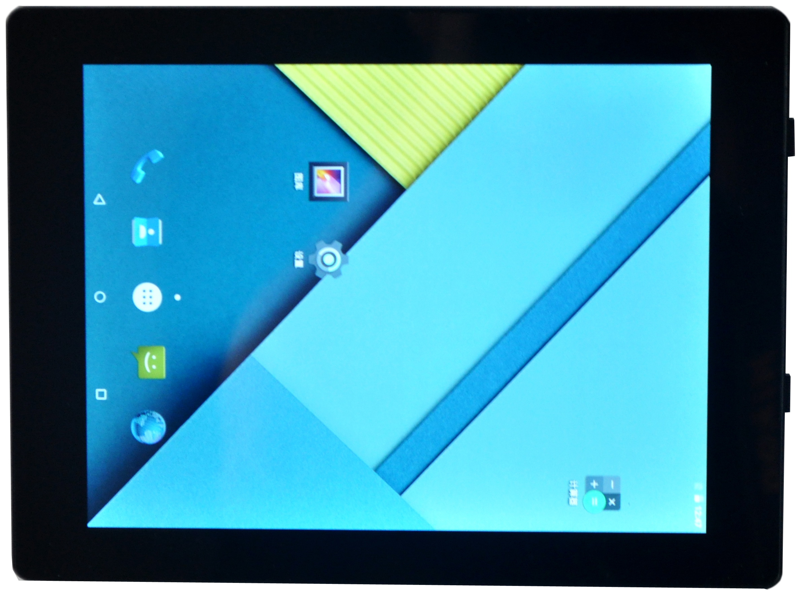

# Product Introduction

i6818 is designed around the S5P6818 SoC. S5P6818 uses a 64-bit octa-core Cortex-A53 architecture and is pin-compatible with S5P4418; the major difference is the ARM CPU core architecture. The hardware uses the AXP228 PMIC, and the platform software is based on Android 5.1.

Unlike a traditional exposed-PCBA development board, i6818 is integrated into an 8-inch tablet form factor. It provides Ethernet, three USB HOST ports, two GPIO expansion ports, mini HDMI, TF card, OTG, headphone jack, DC jack, and a reset hole. The baseboard integrates Wi-Fi, Bluetooth, camera, HDMI, audio, Gigabit Ethernet, dual speakers, and a 5000mAh battery.

i6818 and the i6818CV3 core board are suitable for industrial control, power, communications, medical, media, security, automotive, finance, consumer electronics, handheld devices, game consoles, display control, and teaching instruments.

## Feature Highlights

- Core board with dual 100-pin board-to-board connectors; core board size is 50mm x 40mm.
- CPU: octa-core ARM Cortex-A53 at 1.4GHz.
- Memory: 1GB DDR3, customizable to 2GB DDR3.
- Flash: 4GB / 8GB / 16GB / 32GB eMMC options; 8GB eMMC standard.
- Standard 8-inch 1024 x 768 LVDS IPS display.
- Three external USB HOST 2.0 ports and one USB OTG port.
- Reserved five TTL UARTs, one I2C, and one PWM; expandable through a USB-interface adapter board.
- Built-in Wi-Fi / BT, G-sensor, dual stereo speakers, MIC, and external headphone output.
- Supports Gigabit Ethernet, mini HDMI, TF card, MIPI camera, and USB mouse/keyboard.
- Built-in 5MP MIPI camera with autofocus support.

## Specification Summary

| Item | Parameter |
| --- | --- |
| SoC | Samsung / Nexell S5P6818 |
| CPU | Octa-core ARM Cortex-A53, 1.4GHz |
| Memory | 1GB DDR3, customizable to 2GB DDR3 |
| Storage | 8GB eMMC standard; 4GB / 8GB / 16GB / 32GB eMMC options |
| Display | 8-inch 1024 x 768 LVDS IPS panel; RGB / MIPI / LVDS supported |
| Camera | Built-in 5MP MIPI camera with autofocus support |
| Network | Built-in Wi-Fi / BT and Gigabit Ethernet |
| USB | Three USB HOST 2.0 ports and one USB OTG port |
| Audio | Built-in dual speakers and MIC; external headphone jack |
| Dimensions | Core board 50mm x 40mm; development board 201.9mm x 150.8mm x 17mm |
| Power | 5V DC input and single-cell lithium battery connector |

## S5P4418 / S5P6818 Comparison

|  | S5P4418 | S5P6818 |
| --- | --- | --- |
| time to market | October 2014 | 2014 |
| Process | 28nm | 28nm |
| CPU frequency | 1.4G | 1.4G |
| Package size | 0.65mm pin pitch, 17*17mm2 513-FCBGA package | 0.65mm pin pitch, 17*17mm2 513-FCBGA package |
| CPU architecture | Quad-core Cortex-A9 | Octa-core Cortex-A53 |
| cache capacity | 32KB*4 I/D cache, 1MB L2 cache | 32KB*4 I/D cache, 1MB L2 cache |
| DDR3 interface | Single channel 32-bit data bus, up to 800MHz operating frequency | Single channel 32-bit data bus, up to 800MHz operating frequency |
| multimedia decoding | H.263，H.264，MPEG1，MPEG2，MPEG4，VC1，VP8，Theora，AVS，RV8/9/10，MJPEG(Almost all formats) | H.263，H.264，MPEG1，MPEG2，MPEG4，VC1，VP8，Theora，AVS，RV8/9/10，MJPEG(Almost all formats) |
| multimedia coding | H.263，H.264，MPEG4，MJPEG | H.263，H.264，MPEG4，MJPEG |
| display interface | RGB，MIPI，LVDS | RGB，MIPI，LVDS |
| Maximum display resolution | 2048*1280 | 2048*1280 |
| Ethernet interface | Requires address-bus expansion | Integrated Gigabit Ethernet controller |
| GPIO level | 3.3V | 3.3V |
| ADC | 8-channel 12-bit 0~1.8V | 8-channel 12-bit 0~1.8V |
| USB interface | 1 channel HOST, 1 channel HSIC, 1 channel OTG | 1 channel HOST, 1 channel HSIC, 1 channel OTG |
| Chip ID | Supports 128-bit unique ID | Supports 128-bit unique ID |

## Version Information

| Version | Date | Author | Description |
| --- | --- | --- | --- |
| Rev.01 | 2017-6-30 | lqm | Initial version |

