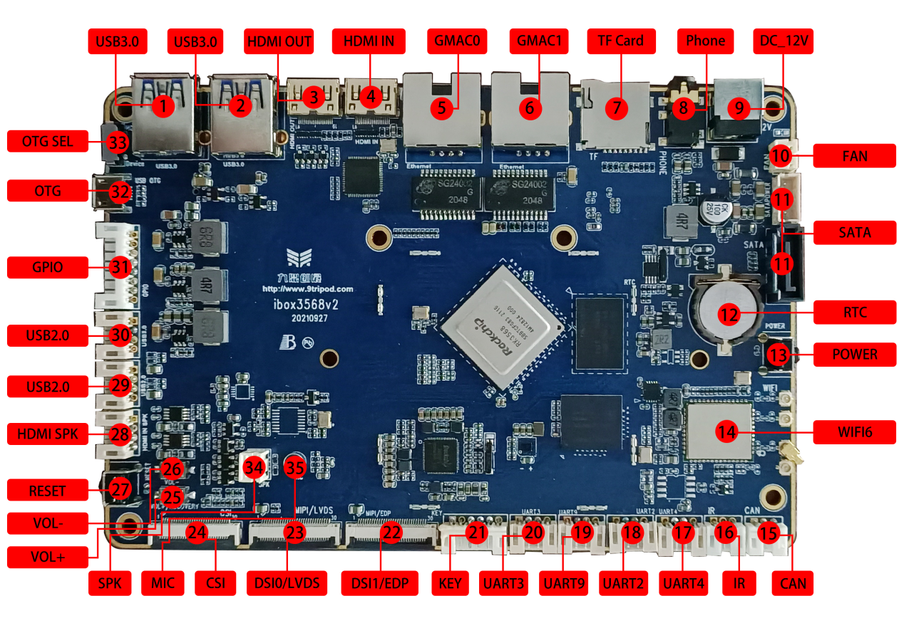

# Hardware Resources

This page summarizes the interface locations and hardware resources of the ibox3568 mainboard. For connector usage notes, see [Interface Details](./ibox3568-interface-details).

## Hardware Interface List

| No. | Name | Description |
| --- | --- | --- |
| 【1】 | USB 3.0 | USB 3.0 connector; compatible USB 2.0 pins are shared with OTG |
| 【2】 | USB 3.0 | USB HOST 3.0 connector |
| 【3】 | HDMI OUT | HDMI output connector |
| 【4】 | HDMI IN | HDMI input connector |
| 【5】 | GMAC0 | Gigabit Ethernet port 0 |
| 【6】 | GMAC1 | Gigabit Ethernet port 1 |
| 【7】 | TF card | TF-card socket |
| 【8】 | Headphone holder | Headphone output |
| 【9】 | DC socket | 12V DC power input |
| 【10】 | Cooling fan power holder | 12V fan power connector |
| 【11】 | SATA interface | SATA signal and power connector |
| 【12】 | RTC | RTC backup coin-cell battery |
| 【13】 | Independent keys | PWRKEY |
| 【14】 | Wi-Fi/BT | AP6375S Wi-Fi 6 / BT combo module |
| 【15】 | CAN | CAN bus connector |
| 【16】 | Infrared receiver interface | Can connect external HS0038 integrated IR receiver |
| 【17】 | UART4 | UART4, TTL-level interface |
| 【18】 | UART2 | UART2, TTL-level interface, default debug UART |
| 【19】 | UART9 | UART9, TTL-level interface |
| 【20】 | UART3 | UART3, TTL-level interface |
| 【21】 | KEY | Key electrical signal connector for external keys |
| 【22】 | display interface | DSI or EDP interface |
| 【23】 | display interface | DSI or LVDS interface |
| 【24】 | MIPI CSI | MIPI Camera connector |
| 【25】 | Independent keys | Mapped to volume up |
| 【26】 | Independent keys | Mapped to volume down |
| 【27】 | Independent keys | RESET |
| 【28】 | HDMI speaker interface | Audio output for HDMI input source |
| 【29】 | HOST 2.0 | USB HOST 2.0 connector |
| 【30】 | HOST 2.0 | USB HOST 2.0 connector |
| 【31】 | GPIO | GPIO expansion connector |
| 【32】 | OTG | OTG download connector, shared with one USB 3.0 port |
| 【33】 | USB toggle switch | Upper position: Host; lower position: Device |
| 【34】 | Speaker interface | External dual-channel speaker |
| 【35】 | Microphone | Microphone recording input |
| 【36】 | PCIe interface | PCIe bus connector for PCIe device expansion, such as Wi-Fi 6, SATA, UART, and Ethernet. Note: the PCIe connector is on the back side and is not marked in the interface map. |

