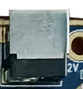
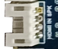
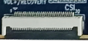
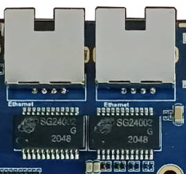
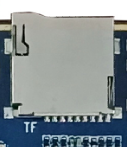
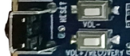
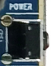
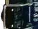
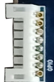

# Interface Details

## Power Connector

ibox3568 uses 12V DC power input. The connector shown below is the 12V DC input connector.

## Debug UART

ibox3568 uses UART2 as the default debug UART. Users can change the debug UART through software configuration.

## HDMI

ibox3568 reserves two Mini HDMI connectors. The left connector is HDMI OUT, and the right connector is HDMI IN. The HDMI IN circuit supports playing the input audio source through the speaker connector.

## Camera

This is a general 30-pin Camera connector and supports OV series Cameras, reducing the need for Camera adapter boards. For different Camera models, adjust the output voltage according to the Camera specification.

## CAN

A 3-pin PH connector is provided at the lower-right corner of the board for external CAN bus devices.

## Ethernet

ibox3568 supports two Gigabit Ethernet ports using YT8521CA Ethernet chips from Motorcomm.

## SATA

The SATA area on the right side has two connectors. The upper 4-pin PH connector supplies power to the SATA device, and the lower connector carries SATA electrical signals. It can be used to connect SATA devices such as external hard drives.

## Audio

The headphone connector supports headphone output and can also feed an external amplifier. The speaker / recording connector supports single-channel 2W speaker output, and the microphone is used for external audio pickup.

## TF Card

The external TF-card connector can be used for TF-card upgrade or storing media files.

## Independent Keys

ibox3568 has four keys: two independent keys, one PWRKEY, and one Reset key. The independent keys are sampled through ADC. A 6-pin PH connector is also reserved for power and independent key signals, allowing users to route key signals to the enclosure through an extension cable.

| Key | Function |
| --- | --- |
| VOL+ | Volume up key |
| VOL- | Volume down key |
| PWRKEY | Power key |
| RESET | Reset key |

## OTG

The RK3568 OTG interface is shared with one USB 3.0 interface. ibox3568 uses a hardware DIP switch for mode switching. When switched upward, the OTG signal works as HOST. When switched downward, the OTG signal works as Device for firmware download, and the USB 2.0 function of the nearby USB 3.0 connector is unavailable.

## HOST 2.0

RK3568 provides two standard Type-A HOST 2.0 ports. ibox3568 routes them through two 4-pin PH connectors.

## HOST 3.0

RK3568 provides two HOST 3.0 ports, routed to two HOST 3.0 connectors. The HOST 2.0 function of the left HOST 3.0 connector is shared with OTG. It is complete only when the DIP switch next to OTG is switched upward.

## Power, Reset, and Recovery

After the external power adapter is connected, the board powers on automatically. In Android, pressing PWRKEY suspends the system, pressing it again wakes it, and holding it opens the shutdown dialog. Press RESET during runtime to hard reset. The volume-up key is used as the Recovery key during flashing.

## LCD

RK3568 supports dual DSI, LVDS, and EDP display interfaces. The left connector is DSI0 / LVDS, selected by software. The right connector is DSI1 / EDP, selected by 0R resistor hardware configuration.

## RTC Battery and IR

The backup battery keeps RTC running after power loss. ibox3568 includes an external RTC chip with operating current lower than 0.6uA. The IR connector is a reserved 3-pin PH connector for an external HS0038B integrated IR receiver.

## Wi-Fi / Bluetooth Module

ibox3568 includes a 2.4G / 5G dual-band Wi-Fi 6 SDIO Wi-Fi / BT module, and is compatible with AP6398S, AP6375S, and Ofeixin dual-band Wi-Fi modules.

## UART

RK3568 has 10 UARTs. ibox3568 reserves four TTL-level UARTs through PH connectors, corresponding to UART2, UART3, UART4, and UART9. UART2 is the default debug UART.

## PCIe

Compared with RK3288, RK3568 adds a PCIe bus. ibox3568 reserves a surface-mounted PCIe connector for standard PCIe device expansion.

## Reserved GPIO

ibox3568 reserves an 8-pin PH connector for GPIO expansion.

