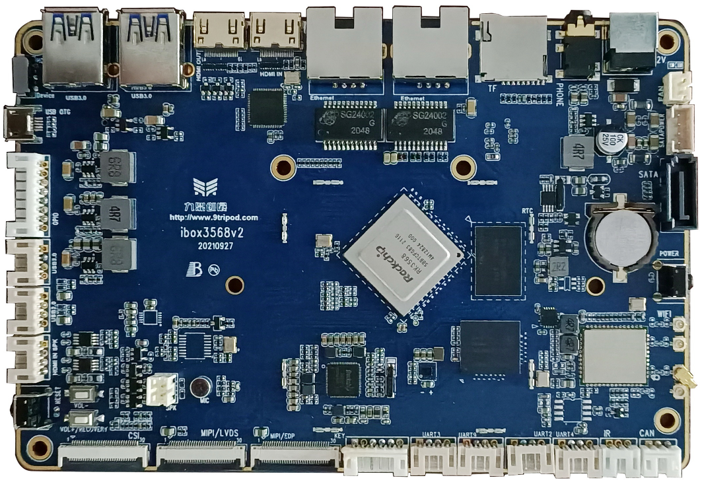

# Product Introduction

The ibox3568 mainboard is based on the Rockchip RK3568 / RK3568B2 platform and uses an integrated PCBA design. It integrates dual Gigabit Ethernet, HDMI input/output, SATA, PCIe, CAN, MIPI Camera, display, audio, USB, UART, and GPIO resources. It is suitable for embedded product development, system porting, interface verification, and driver debugging.

## Feature Highlights

- Quad-core ARM Cortex-A55, up to 2GHz x 4.
- 1GB / 2GB / 4GB / 8GB LPDDR4 / LPDDR4X memory options, 2GB standard.
- 4GB / 8GB / 16GB / 32GB / 64GB / 128GB eMMC options, 16GB standard.
- Two USB HOST 2.0 ports, two USB HOST 3.0 ports, and one Micro USB OTG connector.
- Four TTL UARTs including one debug UART, one TF-card interface, and one CAN interface.
- One HDMI OUT, one HDMI IN, one SATA, and one standard PCIe 3.0 interface.
- DSI / LVDS and DSI / EDP display interfaces, MIPI Camera, capacitive touch, and backlight adjustment.
- On-board Wi-Fi 6 / BT module and dual YT8521 Gigabit Ethernet ports.

## Specification Summary

| Item | Parameter |
| --- | --- |
| SoC | Rockchip RK3568 / RK3568B2 |
| CPU | Quad Cortex-A55 2GHz |
| Memory | 1GB / 2GB / 4GB / 8GB LPDDR4 / LPDDR4X, 2GB standard |
| Storage | 4GB / 8GB / 16GB / 32GB / 64GB / 128GB eMMC options, 16GB standard |
| Display | HDMI OUT, HDMI IN, DSI / LVDS, DSI / EDP |
| Network | Dual YT8521 Gigabit Ethernet, Wi-Fi 6 / BT |
| Expansion | SATA, CAN, PCIe 3.0, MIPI CSI, GPIO, UART |
| Power | 12V DC input, 6.5V~16V / 2A |
| Mainboard size | 150mm x 100mm x 3mm |

## Board Characteristics

- Integrated PCBA design, 150mm x 100mm board size.
- RK809 PMU for stable and reliable operation.
- Single-chip LPDDR4 / LPDDR4X design for better compatibility and lower cost.
- 1GB / 2GB / 4GB / 8GB memory options; multiple eMMC options with 16GB standard.
- Memory runs stably at 1560MHz.
- Supports Android, Linux, Ubuntu, and Debian operating systems.
- Dual Gigabit Ethernet, standard PCIe, HDMI IN, and multiple peripheral expansion interfaces.
- Reliability verified by high/low-temperature and repeated reboot tests.

## System Configuration

| CPU | RK3568 / RK3568B2 |
| --- | --- |
| Clock | Quad Cortex-A55 (2GHz) |
| Memory | 2GB standard, hardware compatible with 1GB / 4GB / 8GB |
| Storage | 4GB / 8GB / 16GB eMMC options, 16GB standard |
| Power IC | RK809, supports dynamic frequency scaling |

## Interface Parameters

| LCD interface | Supports DSI / LVDS / EDP / HDMI output |
| --- | --- |
| Touch interface | Capacitive touch |
| Audio interface | Supports direct headphone / speaker output and recording / playback |
| SD-card interface | One port |
| Ethernet interface | Supports two Gigabit Ethernet ports |
| USB HOST 2.0 connector | Two HOST 2.0 ports |
| USB HOST 3.0 connector | Two HOST 3.0 ports |
| OTG interface | One OTG port, shared with one USB 3.0 port |
| UART interface | Four ports |
| Camera interface | One CSI interface |
| CAN interface | One port |
| PCIe 3.0 interface | One port |

## Electrical Characteristics

| 12V input voltage | 6.5V~16V，2A |
| --- | --- |
| RTC input voltage | 3V/0.6uA |
| Operating temperature | -10~70 degrees |
| Storage temperature | -10~40 degrees |

## Software Resources

ibox3568 supports Android 11 and Linux systems. Driver support is listed below:

| system / driver | Linux4.19+ / Android11 | Linux4.19+ / Debian10 | Linux4.19+ / Ubuntu | Linux 4.19 + Qt |
| --- | --- | --- | --- | --- |
| 7-inch MIPI panel (1024 x 600) | ✓ | ✓ | ✓ | ✓ |
| 10.1-inch EDP panel (1920 x 1080) | ✓ | ✓ | ✓ | ✓ |
| Backlight driver | ✓ | ✓ | ✓ | ✓ |
| PMIC driver (RK809) | ✓ | ✓ | ✓ | ✓ |
| Capacitive touch | ✓ | ✓ | ✓ | ✓ |
| eMMC driver | ✓ | ✓ | ✓ | ✓ |
| SD-card driver | ✓ | ✓ | ✓ | ✓ |
| Independent keys | ✓ | ✓ | ✓ | ✓ |
| ADC driver | ✓ | ✓ | ✓ | ✓ |
| Power on/off | ✓ | ✓ | ✓ | ✓ |
| Suspend / wake-up | ✓ | ✓ | ✓ | ✓ |
| Two USB HOST 2.0 drivers | ✓ | ✓ | ✓ | ✓ |
| Two USB HOST 3.0 drivers | ✓ | ✓ | ✓ | ✓ |
| One OTG driver | ✓ | ✓ | ✓ | ✓ |
| SATA | ✓ | ✓ | ✓ | ✓ |
| PCIe bus driver | ✓ | ✓ | ✓ | ✓ |
| Optical audio driver | ✓ | Not verified | Not verified | ✓ |
| RTC driver | ✓ | ✓ | Not verified | ✓ |
| Audio | ✓ | ✓ | Not verified | Coming soon |
| Recording | ✓ | Not supported | Not supported | Coming soon |
| Dual-band Wi-Fi / BT 4.0 | ✓ | ✓ | ✓ | Coming soon |
| GPS | ✓ | ✓ | ✓ | ✓ |
| CSI Camera driver | ✓ | Not supported | Not supported | Coming soon |
| USB Camera driver | ✓ | ✓ | ✓ | ✓ |
| UART | ✓ | ✓ | ✓ | ✓ |
| HDMI 2.0 | ✓ | ✓ | ✓ | ✓ |
| HDMI IN | ✓ | Not verified | Not verified | Not verified |
| Dual Gigabit Ethernet | ✓ | ✓ | ✓ | ✓ |
| USB mouse / keyboard | ✓ | ✓ | ✓ | ✓ |
| U-Boot | ✓ | ✓ | ✓ | ✓ |

