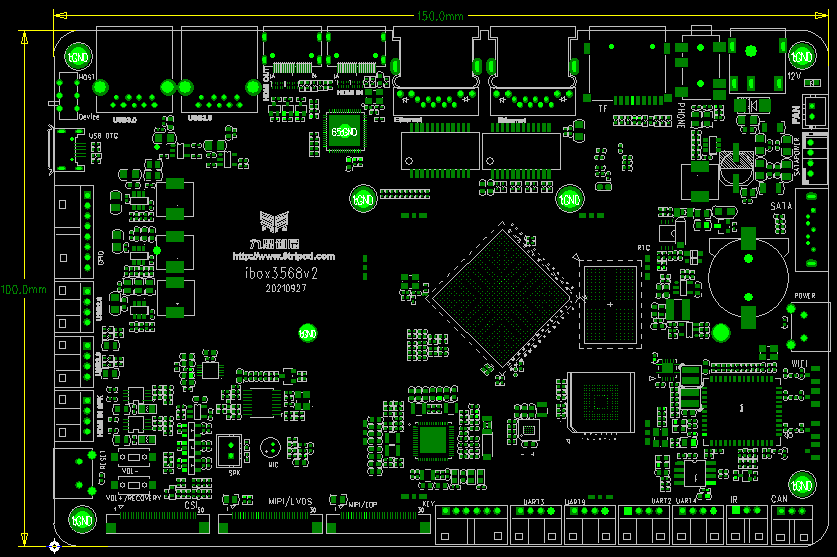

# Dimensions and Specifications

## Mainboard Appearance

## Mainboard Layout

## Mechanical Parameters

| Appearance | Stamp-hole style |
| --- | --- |
| Mainboard size | 150mm*100mm*3mm |
| PCB layers | 8层 |
| Warpage | No more than 0.75% |

