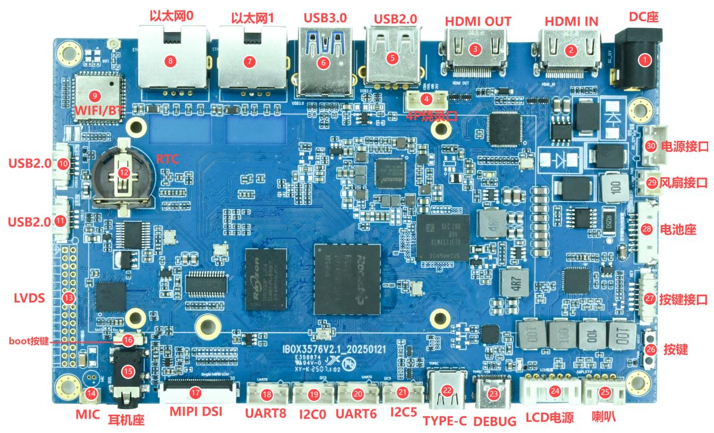
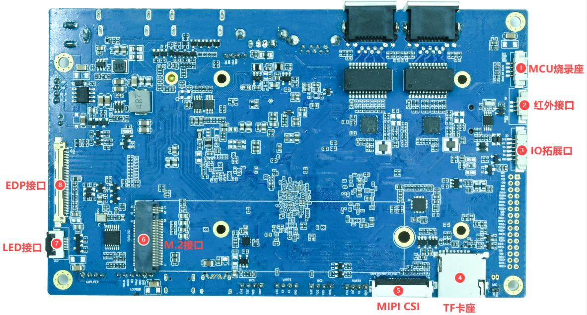

# Hardware Resources

## Hardware Interface Overview - Front Side

| No. | Name | Description |
|---|---|---|
| 【1】 | DC 座 | 12V直流Power输入接口 |
| 【2】 | HDMIIN | HDMI 输入接口 |
| 【3】 | HDMIOUT | HDMI 输出接口 |
| 【4】 | 4P烧录座 | 4P2.0mmPH座，用于烧录LT6911C 程序 |
| 【5】 | USB2.0 | USB2.0 接口 |
| 【6】 | USB3.0 | USB3.0 接口 |
| 【7】 | 以太网1 | 千兆Ethernet Interface，RGMII 接口 |
| 【8】 | 以太网0 | 千兆Ethernet Interface，RGMII 接口 |
| 【9】 | WIFI/BT | WIFI/蓝牙模块 |
| 【10】 | USB2.0 | 4P1.25mm座子 USB2.0 接口 |
| 【11】 | USB2.0 | 4P1.25mm座子 USB2.0 接口 |
| 【12】 | RTC | RTC 电池接口 |
| 【13】 | LVDS | LVDS屏幕接口 |
| 【14】 | MIC | 咪头，录音输入 |
| 【15】 | 耳机座 | 耳机及耳麦接口 |
| 【16】 | boot按键 | 下载按键，用于烧录固件 |
| 【17】 | MIPI DSI | MIPI 屏幕接口 |
| 【18】 | UART8 | 4P2.0mmPH座，UART8，TTL 电平接口 |
| 【19】 | I2C0 | 4P2.0mmPH座，I2C0，I2C 接口 |
| 【20】 | UART6 | 4P2.0mmPH座，UART6，TTL 电平接口 |
| 【21】 | I2C5 | 4P2.0mmPH座，I2C5，I2C 接口 |
| 【22】 | TYPE-C | TYPE_C 接口，用于程序下载等 |
| 【23】 | DEBUG | TYPE-C 座子，用于串口调试 |
| 【24】 | LCD Power | LCD 屏幕背光Power，6P2.0mmPH座 |
| 【25】 | 喇叭 | 2×15W 双声道喇叭接口，4PIN 2.0mm卧式PH座 |
| 【26】 | 按键 | 复位与Power按键 |
| 【27】 | 按键接口 | 按键外接接口，6P1.25mm座子 |
| 【28】 | 电池座 | 8P1.25mm座子 |
| 【29】 | 风扇接口 | 12V风扇接口 |
| 【30】 | Power接口 | 4P2.0mmPH座子，用于外部供电 |

## Hardware Interface Overview - Back Side

| No. | Name | Description |
|---|---|---|
| 【1】 | MCU烧录座 | MCU单片机烧录接口 |
| 【2】 | 红外接口 | 红外传感器接口，用于遥控开关机 |
| 【3】 | IO 拓展接口 | IO 拓展接口 |
| 【4】 | TF 卡座 | TF卡座 |
| 【5】 | MIPI CSI | MIPI摄像头接口 |
| 【6】 | M.2 接口 | M.2硬盘接口 |
| 【7】 | LED接口 | 外接LED 接口 |
| 【8】 | EDP 接口 | 40PINEDP 接口 |

