# Interface Details

This page summarizes the hardware interfaces of the IBOX3576 mainboard. Repeated headers, footers, table of contents, copyright pages, and unrelated product lists have been removed. Interface diagrams and pin definition tables are preserved.

## Power Input and DC Jack

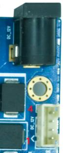

IBOX3576 uses a 12V DC power input. The DC jack shown in the manual is the 12V input connector. A 12V/3A power adapter is recommended.

| Pin | Signal |
|---|---|
| 1 | 12V |
| 2 | 12V |
| 3 | GND |
| 4 | GND |

## HDMI IN Interface

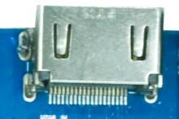

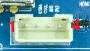

The board uses a standard Type-A HDMI connector and supports one HDMI IN channel. This HDMI IN path uses LT6911C to convert HDMI signals to MIPI signals. The LT6911C programming connector pin definition is shown below.

| Pin | Signal |
|---|---|
| 1 | CSDA |
| 2 | CSCL |
| 3 | GND |
| 4 | 3.3V |

## HDMI OUT Interface

The board uses a standard Type-A HDMI connector and supports one HDMI OUT channel. This HDMI OUT path is the native RK3576 HDMI interface routed directly from the CPU.

## USB3.0 Interface

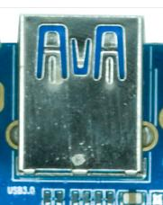

The board supports one USB3.0 interface, which can be used for USB flash drives, mouse, keyboard, and other peripherals.

## USB2.0 Interface

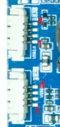

The board provides one USB2.0 Type-A connector and two USB2.0 4-pin connectors with 1.25 mm pitch. These ports are converted by a USB hub. The Type-A port can be used for USB flash drives, mouse, and other peripherals; the 4-pin connectors can be used for USB touch panels and other devices.

| Pin | Signal |
|---|---|
| 1 | 5V |
| 2 | USB_DM |
| 3 | USB_DP |
| 4 | GND |

## Ethernet Interface

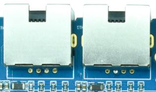

The board supports dual Gigabit Ethernet interfaces. They use RTL8211F PHYs on GMAC interfaces, allowing high-speed wired network access.

## Wi-Fi / Bluetooth

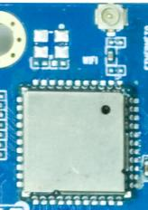

The onboard Wi-Fi module is RTL8821CS, supporting Wi-Fi 5 and Bluetooth 4.2 for wireless networking and Bluetooth connectivity.

## RTC Battery

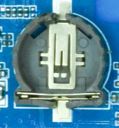

The 3V coin-cell battery holder provides backup power for RTC, ensuring that system time is retained after power loss.

## LVDS Interface

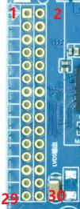

The board provides one standard LVDS display interface. This interface is multiplexed with MIPI DSI, so LVDS and MIPI DSI cannot be used at the same time.

| Pin | Signal | Pin | Signal |
|---|---|---|---|
| 1 | LVDS_VCC | 2 | LVDS_VCC |
| 3 | LVDS_VCC | 4 | GND |
| 5 | GND | 6 | GND |
| 7 | RXO0- | 8 | RXO0+ |
| 9 | RXO1- | 10 | RXO1+ |
| 11 | RXO2- | 12 | RXO2+ |
| 13 | GND | 14 | GND |
| 15 | RXOC- | 16 | RXOC+ |
| 17 | RXO3- | 18 | RXO3+ |
| 19 | RXE0- | 20 | RXE0+ |
| 21 | RXE1- | 22 | RXE1+ |
| 23 | RXE2- | 24 | RXE2+ |
| 25 | GND | 26 | GND |
| 27 | RXEC- | 28 | RXEC+ |
| 29 | RXE3- | 30 | RXE3+ |

## Microphone Interface

The board supports recording input through a 2-pin 1.25 mm connector.

| Pin | Signal |
|---|---|
| 1 | MIC |
| 2 | GND |

## Headphone Interface

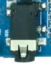

The headphone jack can be used for audio output. It can also be routed to an external amplifier input such as a home-theater audio input.

## Speaker Interface

The board uses an NTP8918 power amplifier and supports 2 × 15W stereo output. The connector pin definition is shown below.

| Pin | Signal |
|---|---|
| 1 | OUT1A |
| 2 | OUT1B |
| 3 | OUT2A |
| 4 | OUT2B |

## MIPI DSI Interface

The board provides one MIPI display interface for MIPI display panels. It is multiplexed with LVDS, so only one of MIPI DSI or LVDS can be used.

| Pin | Signal | Pin | Signal |
|---|---|---|---|
| 1 | VCC_5V0 | 16 | GND |
| 2 | VCC_5V0 | 17 | MIPI_DPHY_DSI_TX_D3N |
| 3 | VCC_5V0 | 18 | MIPI_DPHY_DSI_TX_D3P |
| 4 | VCC3V3_S3 | 19 | GND |
| 5 | VCC3V3_S3 | 20 | MIPI_DPHY_DSI_TX_D2N |
| 6 | I2C0_SCL_M1_TP | 21 | MIPI_DPHY_DSI_TX_D2P |
| 7 | I2C0_SDA_M1_TP | 22 | GND |
| 8 | TP_INT_L | 23 | MIPI_DPHY_DSI_TX_CLKN |
| 9 | TP_RST_L | 24 | MIPI_DPHY_DSI_TX_CLKP |
| 10 | VCC3V3_S3 | 25 | GND |
| 11 | VCC3V3_S3 | 26 | MIPI_DPHY_DSI_TX_D1N |
| 12 | LCD_BL_PWM1_CH1_M0 | 27 | MIPI_DPHY_DSI_TX_D1P |
| 13 | MIPI_DSI_RST | 28 | GND |
| 14 | NC | 29 | MIPI_DPHY_DSI_TX_D0N |
| 15 | LCD_PWREN_H | 30 | MIPI_DPHY_DSI_TX_D0P |

## UART and I2C Expansion Interfaces

The board routes out two UART interfaces, UART6 and UART8, and two I2C interfaces, I2C0 and I2C5.

### UART connector

| Pin | Signal |
|---|---|
| 1 | 3.3V |
| 2 | UART_RX |
| 3 | UART_TX |
| 4 | GND |

### I2C connector

| Pin | Signal |
|---|---|
| 1 | 3.3V |
| 2 | I2C_SCL |
| 3 | I2C_SDA |
| 4 | GND |

## Type-C Interface

The OTG port uses a Type-C connector and is mainly used for firmware download and ADB debugging.

## Debug Interface

This Type-C connector is the debug UART port and is used to view system logs and debug the system.

## LCD Power Interface

This connector provides LCD backlight power and related control signals.

| Pin | Signal |
|---|---|
| 1 | GND |
| 2 | GND |
| 3 | LVDS_BL_PWM |
| 4 | LVDS_BL_EN |
| 5 | 12V |
| 6 | 12V |

## Buttons

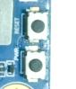

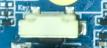

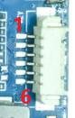

The board provides three independent buttons: reset, power, and flashing/boot button. It also provides a 6-pin 1.25 mm connector for external keys or user-defined functions.

| Pin | Signal |
|---|---|
| 1 | PWRKEY |
| 2 | V+_KEY |
| 3 | V-_KEY |
| 4 | MENU_KEY |
| 5 | ESC_KEY |
| 6 | GND |

## Battery Interface

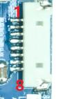

The board reserves a dual-cell lithium battery connector. The battery can power the board, and the DC input can also charge the battery.

| Pin | Signal | Pin | Signal |
|---|---|---|---|
| 1 | SCL | 5 | GND |
| 2 | SDA | 6 | VBAT |
| 3 | GND | 7 | VBAT |
| 4 | GND | 8 | VBAT |

## Fan Interface

This connector is used for a fan, mainly for CPU cooling.

| Pin | Signal |
|---|---|
| 1 | GND |
| 2 | 12V |

## MCU Programming Interface

This connector is used to program the MCU. The MCU mainly controls system power on/off.

| Pin | Signal |
|---|---|
| 1 | 3.3V |
| 2 | SWIM |
| 3 | GND |
| 4 | NRST |

## Infrared Sensor Interface

This connector is used for an infrared sensor. After connecting the sensor, the board can support remote power-on via infrared remote control.

| Pin | Signal |
|---|---|
| 1 | 3.3V |
| 2 | GND |
| 3 | IR |

## IO Expansion Interface

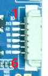

This connector is an IO expansion interface. Users can define the IO functions as needed.

| Pin | Signal | Pin | Signal |
|---|---|---|---|
| 1 | 3.3V | 4 | IO4_B0_D33 |
| 2 | IO3_A2_D33 | 5 | IO3_D6_D18 |
| 3 | IO1_D5_D33 | 6 | GND |

## TF Card Interface

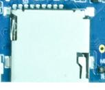

The board routes out an external TF card slot. It can be used for TF boot or for storing multimedia files.

## MIPI CSI Interface

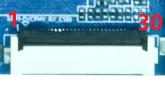

The board routes out two MIPI CSI interfaces for MIPI cameras. The pin definition is shown below.

| Pin | Signal | Pin | Signal |
|---|---|---|---|
| 1 | GND | 16 | GND |
| 2 | MIPI_DPHY_CSI0_RX_CLKP | 17 | NC |
| 3 | MIPI_DPHY_CSI0_RX_CLKN | 18 | NC |
| 4 | GND | 19 | MIPI_AF |
| 5 | MIPI_DPHY_CSI0_RX_D0P | 20 | I2C4_SCL_M3_MIPI_CAM0/2 |
| 6 | MIPI_DPHY_CSI0_RX_D0N | 21 | I2C4_SDA_M3_MIPI_CAM0/2 |
| 7 | GND | 22 | MIPI_DPHY_CSI_CAM2_CLKOUT |
| 8 | MIPI_DPHY_CSI0_RX_D1P | 23 | MIPI_DCPHY_CSI_CAM0_CLKOUT |
| 9 | MIPI_DPHY_CSI0_RX_D1N | 24 | MIPI_DPHY_CSI_CAM2_PDN_H |
| 10 | GND | 25 | MIPI_DCPHY_CSI_CAM0_PDN_H |
| 11 | MIPI_DPHY_CSI0_RX_D2P | 26 | MIPI_DPHY_CSI_CAM2_RST_H |
| 12 | MIPI_DPHY_CSI0_RX_D2N | 27 | MIPI_DCPHY_CSI_CAM0_RST_H |
| 13 | GND | 28 | VCC1V8_CAM3 |
| 14 | MIPI_DPHY_CSI0_RX_D3P | 29 | VCC2V8_CAM3 |
| 15 | MIPI_DPHY_CSI0_RX_D3N | 30 | MIPI_1.2V_CAM3 |

## LED Interface

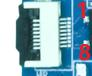

This connector is used for external LEDs. Users can customize the connector function.

| Pin | Signal |
|---|---|
| 1 | 3.3V |
| 2 | 3.3V |
| 3 | GND |
| 4 | GND |
| 5 | LED_R |
| 6 | LED_R |
| 7 | LED_G |
| 8 | LED_G |

## M.2 Interface

The board provides an M.2 storage connector. It can be used to store multimedia files or for storage expansion.

## EDP Interface

This is a 40-pin EDP connector for EDP display panels. It is multiplexed with HDMI, so EDP and HDMI are mutually exclusive.

| Pin | Signal | Pin | Signal |
|---|---|---|---|
| 1 | TP_RST | 21 | VCC_3V3_S3 |
| 2 | GND | 22 | BITSET |
| 3 | EDP_TX3N | 23 | GND |
| 4 | EDP_TX3P | 24 | GND |
| 5 | GND | 25 | GND |
| 6 | EDP_TX2N | 26 | GND |
| 7 | EDP_TX2P | 27 | EDP_HPD |
| 8 | GND | 28 | GND |
| 9 | EDP_TX1N | 29 | GND |
| 10 | EDP_TX1P | 30 | GND |
| 11 | GND | 31 | GND |
| 12 | EDP_TX0N | 32 | LCD_EN |
| 13 | EDP_TX0P | 33 | PWM2_CH3_M3 |
| 14 | GND | 34 | I2C5_SCL_M3 |
| 15 | EDP_AUXP | 35 | I2C5_SDA_M3 |
| 16 | EDP_AUXN | 36 | VCC12V_IN |
| 17 | GND | 37 | VCC12V_IN |
| 18 | VCC_3V3_S3 | 38 | VCC12V_IN |
| 19 | VCC_3V3_S3 | 39 | VCC12V_IN |
| 20 | VCC_3V3_S3 | 40 | TP_INT |

