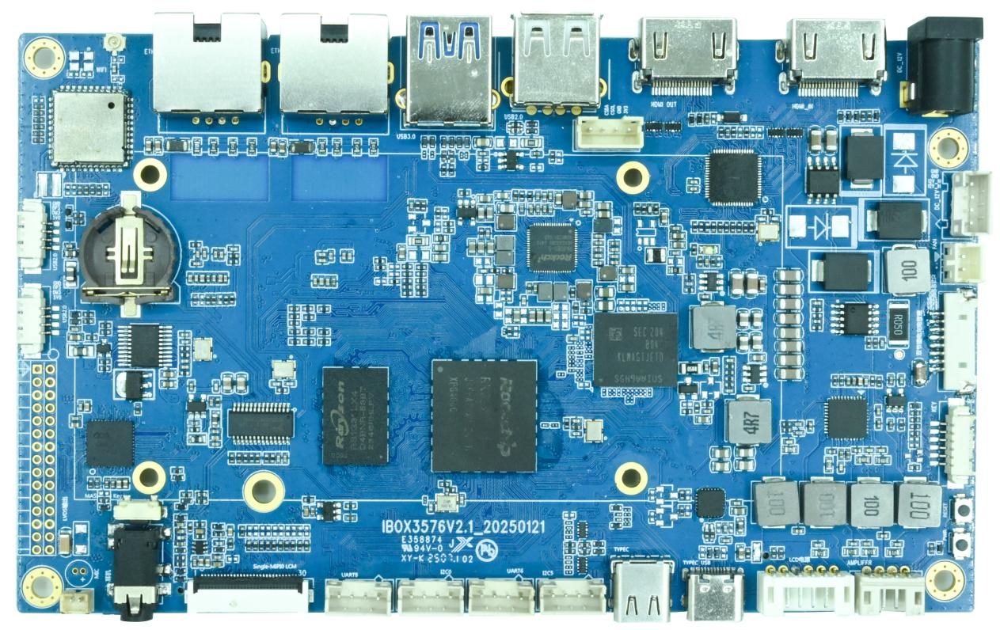

# Product Introduction

## Overview

IBOX3576 is an integrated mainboard based on the Rockchip RK3576 processor. It is developed and produced by Shenzhen Jiuding Chuangzhan Technology Co., Ltd.

RK3576 is a low-power and high-performance general-purpose SoC processor from Rockchip. It is suitable for ARM-based PCs, edge computing devices, personal mobile Internet devices, and other digital multimedia applications. The processor integrates CPU, GPU, MPU, NPU, VPU, and rich peripheral interfaces for complex AIoT scenarios.

## Product Appearance

## Specifications

| Item | Description |
|---|---|
| CPU | RK3576(QuadA72+QuadA53) |
| Main frequency | 1.8GHz |
| RAM | 2GB or 4GB or 8GB |
| ROM | 4GB or 8GB or 16GB or 32GB or 64GB |
| PowerIC | Using RK806-S, Supported dynamic FM |

| Item | Description |
|---|---|
| Power | DC input, 12V/3A |
| LCD interface | 1 channel MIPI-DSI/LVDS multiplexing, 1 channel EDP/HDMI multiplexing |
| Touch interface | Capacitive touch, I2C interface |
| Camera interface | 1 MIPI-CSI input |
| SD card interface | 1 SDIO output channel |
| emmc interface | Onboard emmc interface, no pins are lead out separately |
| USB interface | 3 USB2.0, 1 USB3.0, 1 TYPE-C |
| HDMI interface | 1 channel HDMI2.0TX, 1 channel HDMIOUT |
| Ethernet Interface | Supported2-way Gigabit Ethernet Interface |
| UART interface | 2 way |
| I2C interface | 2 way |
| Audio Interface | 1 MIC, 1 headphone output, two-channel speakers |
| PCIE interface | 1-way PCIE2.0 |

| Item | Description |
|---|---|
| Operating System | Android14 |
| Low-level Drivers |  |

## Related Pages

- [Hardware Resources](./ibox3576-hardware-resources)
- [Interface Details](./ibox3576-interface-details)
- [Development Environment](./ibox3576-development-environment)
- [Android Build and Flash](./ibox3576-android-build-flash)
