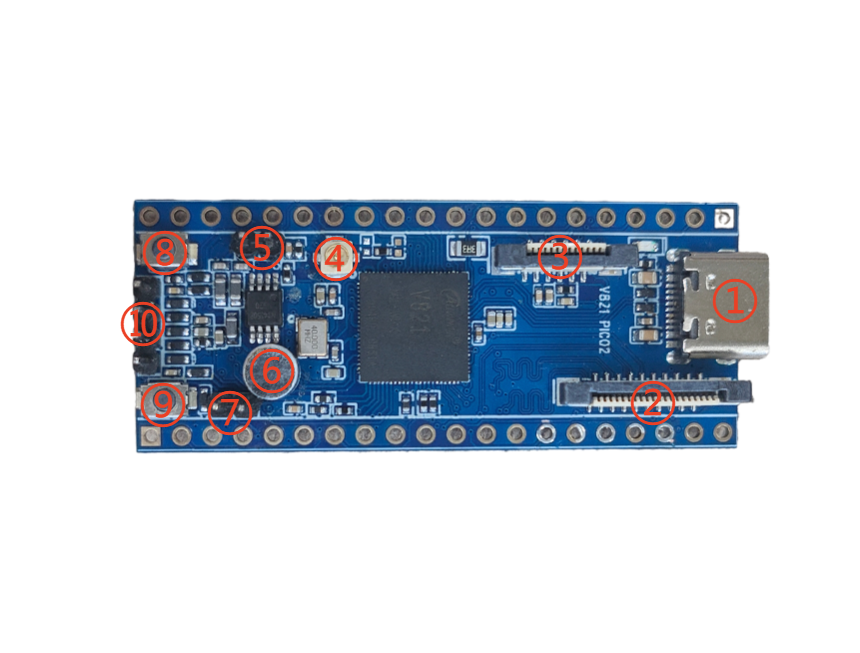

# Hardware Resources

| No. | Interface | Description |
| ---: | --- | --- |
| 1 | 16-pin Type-C | Power, firmware flashing, and USB communication |
| 2 | Camera | 20-pin 0.5 mm MIPI CSI FPC connector |
| 3 | Display | 12-pin 0.5 mm SPI/DBI LCD FPC connector |
| 4 | Antenna | First-generation IPEX connector |
| 5 | Speaker | 2-pin 2.0 mm PH connector |
| 6 | Onboard microphone | Analog audio input |
| 7 | External MIC | External microphone input |
| 8 | User key | Push button connected to PD13 |
| 9 | FEL key | Forces USB flashing mode |
| 10 | DEBUG | UART0 debug connector |
| 11 | SPI NOR | 128 MB firmware storage |
| 12 | TF card | Boot or media storage |
| 13 | 2×20 header | Power, ground, and multiplexed GPIO signals |

All digital I/O uses 3.3 V logic unless the schematic states otherwise.
