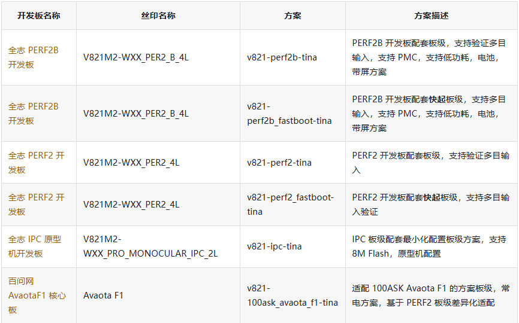
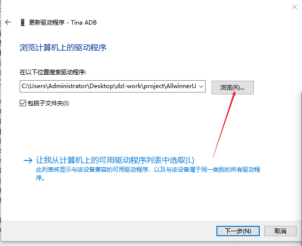

# Build and Flash

```bash
cd <SDK>
source build/envsetup.sh
lunch
m
pack
```

The selected target must match the board, storage medium, and product scenario.



For partial builds:

```bash
m kernel
m openwrt
m rtos
```

## USB Flashing

1. Install the Allwinner USB driver on Windows.
2. Load the generated `.img` file in the flashing tool.
3. Power off the board.
4. Hold FEL while connecting USB or resetting.
5. Start flashing after the device is detected.



Check the USB cable, FEL timing, driver, power supply, and storage configuration when flashing fails.
