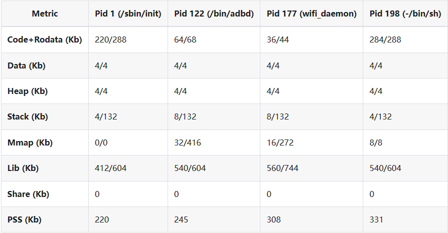

# Resources and Quick Configuration

Memory may be shared by Linux, RTOS, CMA, media pools, and AMP shared buffers.

```bash
cat /proc/meminfo
cat /proc/iomem
cat /proc/buddyinfo
cat /proc/zoneinfo
dmesg | grep -iE "memory|cma|reserved"
```



Quick Config can combine JSON fragments:

```json
{
  "use_common_conifg": true,
  "quick_config_include": [
    "sensor.json",
    "storage_change.json"
  ]
}
```

Changing storage requires coordinated Boot0, U-Boot, kernel, partition, rootfs, and pack settings.

The Linux and RTOS RISC-V toolchains use different ABI and ISA options. Always use the toolchain shipped with the SDK.

CPU OPP changes must keep frequency, voltage, oscillator, boot PLL, and standby firmware consistent.
