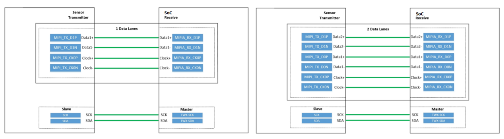

# Camera Development

```text
Sensor → MIPI CSI → VIN → ISP → MPP/Application
```



Sensor drivers are located under paths such as:

```text
bsp/drivers/vin/modules/sensor/
```

Adaptation checklist:

1. Power rails, MCLK, RESET, PWDN, I2C address, and lane count.
2. VIN, CSI, ISP, and sensor Device Tree nodes.
3. Sensor mode, format, resolution, and frame rate.
4. Kernel VIN/V4L2/ISP configuration.
5. Final DTB and ISP tuning files.

```bash
dmesg | grep -iE "vin|csi|mipi|isp|sensor"
media-ctl -p
v4l2-ctl --list-devices
```
