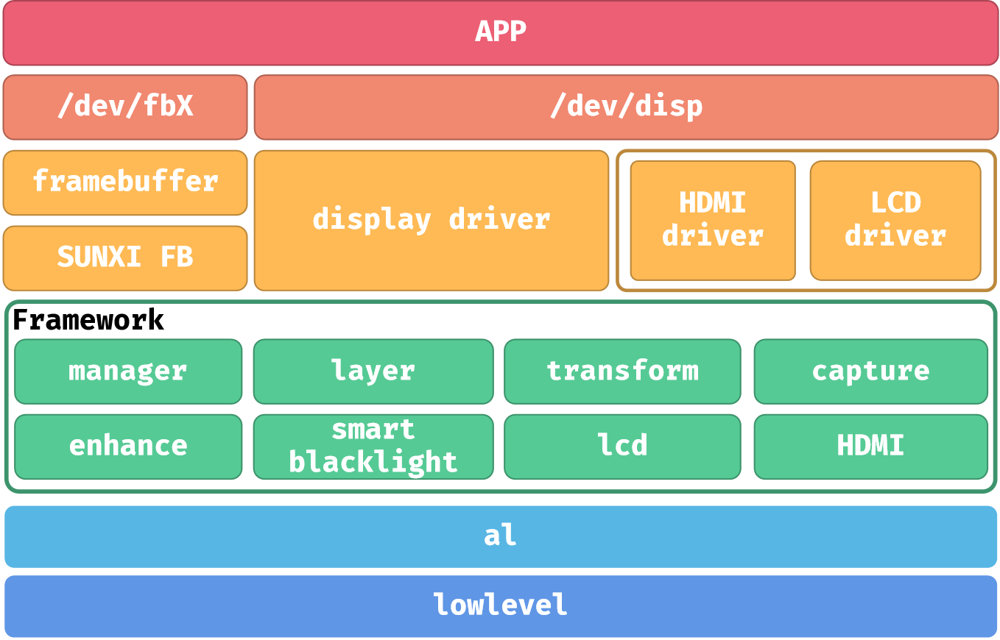

# Display, U-Boot, and SPI LCD

PICO2 primarily uses an SPI/DBI LCD. Select one matching display stack from DISP, LCD_FB, or FBTFT.



Important panel parameters include driver name, interface type, active resolution, total timing, porches, pixel clock, start delay, and PWM.

U-Boot logo flow:

```text
Enable display driver
→ Configure U-Boot DTS
→ Configure panel and PWM
→ Prepare boot-resource partition
→ Package BMP logo
```

```bash
dmesg | grep -iE "spi|lcd|disp|pwm"
cat /sys/kernel/debug/pinctrl/*/pinmux-pins
cat /sys/kernel/debug/clk/clk_summary
```
