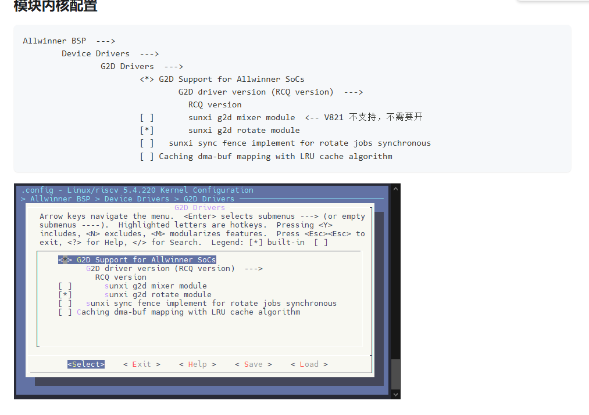

# LVGL, G2D, and MPP

LVGL may run on framebuffer, DRM, or the vendor display API.


G2D provides scaling, rotation, mirroring, pixel-format conversion, and composition. Verify address, stride, width, and cache alignment.



MPP includes camera capture, ISP, video encoding/decoding, audio, G2D, CE, UVC, and smart-IPC samples.

```text
Enable MPP and samples
→ Build libraries
→ Build samples
→ Package or copy to TF card
→ Prepare configuration
→ Run and inspect logs/streams
```
