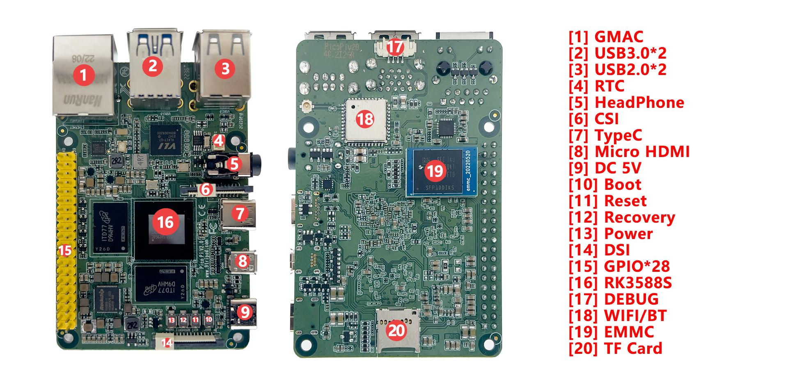
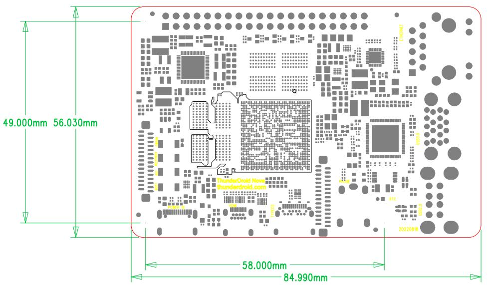

# Hardware Resources

## Hardware Interface Overview

| No. | Name | Description |
|---|---|---|
| 【1】 | GMAC | 千兆Ethernet Interface，PCIE 接口 |
| 【2】 | HOST3.0 | 双层USB HOST3.0接口 |
| 【3】 | HOST2.0 | 双层USB HOST2.0 接口 |
| 【4】 | RTC | RTC 钮扣电池 |
| 【5】 | 耳机座 | 4级带MIC 耳机座 |
| 【6】 | MIPI CSI | MIPI 摄像头接口 |
| 【7】 | TypeC 接口 | 标准TypeC 接口，用于程序下载等 |
| 【8】 | HDMIOUT | Micro HDMI输出接口 |
| 【9】 | 5VIN | 5V直流Power输入，标准TypeC Power输入接口 |
| 【10】 | 独立按键 | boot 按键，用于maskrom 或强制升级 |
| 【11】 | 独立按键 | 复位按键 |
| 【12】 | 独立按键 | 在升级时用作Recovery 键 |
| 【13】 | 独立按键 | PWRKEY |
| 【14】 | 显示接口 | DSI接口 |
| 【15】 | GPIO 扩展口 | 约28个GPIO 扩展口 |
| 【16】 | RK3588S | 主控芯片 |
| 【17】 | UART2 | UART2，TTL 电平接口，默认为调试串口 |
| 【18】 | WIFI-BT | 双频WIFI5.0、BT 模块 |
| 【19】 | EMMC | 存储ROM，可插拨，默认16G或32G可选 |
| 【20】 | TF 卡 | TF 卡座 |

## Product Dimensions

