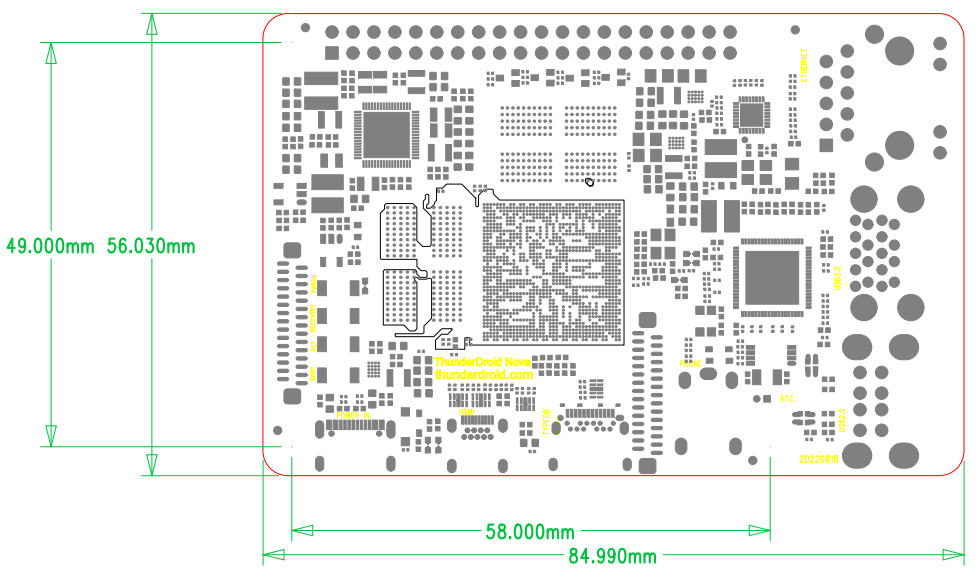

# Hardware Resources

This page summarizes the major connectors and their functions. The interface map marks GMAC, USB 3.0, USB 2.0, RTC, headphone jack, MIPI CSI, Type-C, Micro HDMI, DC 5V, Boot, Reset, Recovery, Power, DSI, GPIO, RK3588S, Debug, Wi-Fi/BT, eMMC, and TF Card.

## Hardware Interface List

| No. | Name | Description |
| --- | --- | --- |
| 【1】 | GMAC | Gigabit Ethernet connector and PCIe interface |
| 【2】 | HOST 3.0 | Dual-layer USB HOST 3.0 connector |
| 【3】 | HOST 2.0 | Dual-layer USB HOST 2.0 connector |
| 【4】 | RTC | RTC coin-cell battery |
| 【5】 | Headphone jack | 4-pole headphone jack with MIC |
| 【6】 | MIPI CSI | MIPI camera connector |
| 【7】 | Type-C interface | Standard Type-C interface for program downloading, etc. |
| 【8】 | HDMI OUT | Micro HDMI output connector |
| 【9】 | 5V IN | 5V DC Power input, standard Type-CPower input interface |
| 【10】 | Independent key | boot button, used for MaskRom or forced upgrade |
| 【11】 | Independent key | Reset key |
| 【12】 | Independent key | Used as Recovery key during upgrade |
| 【13】 | Independent key | PWRKEY |
| 【14】 | Display connector | DSI connector |
| 【15】 | GPIO expansion header | About 28 GPIO expansion pins |
| 【16】 | RK3588S | Main SoC |
| 【17】 | UART2 | UART2, TTL-level interface, default debug UART |
| 【18】 | Wi-Fi / BT | Dual-band Wi-Fi 5.0 and BT module |
| 【19】 | eMMC | Pluggable storage ROM; default 16GB or 32GB options |
| 【20】 | TF card | TF-card socket |

## Dimensions

- Board size: 85mm x 56mm.
- The dimension drawing includes 84.990mm, 56.030mm, 58.000mm, 49.000mm, and other reference dimensions.
