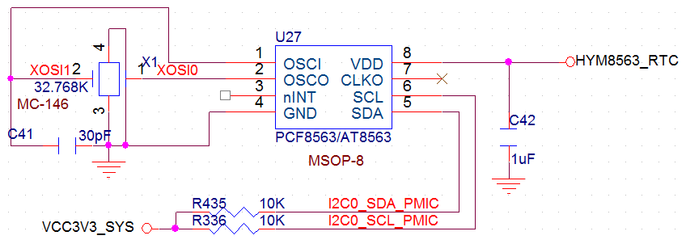

# Hardware Design

PX30 has a limited pin count but provides a complete set of peripherals. Carrier-board design should pay special attention to multiplexing among display, camera, Ethernet, TF card, UART, USB, MIPI, and power sequencing.

## DDR Selection

PX30 supports DDR3, DDR4, DDR3L, LPDDR3, and LPDDR2. X30CV1 uses DDR3, standard 1GB and customizable to 2GB. X30CV2 uses LPDDR3 and can support 2GB with a single device, making it cost-effective for larger-memory designs.

## Flash Selection

PX30 supports NAND Flash and eMMC. The hardware manual recommends eMMC for better stability and performance. X30CV1 defaults to an external 8GB eMMC.

## Camera Interface

PX30 supports both MIPI and parallel cameras. The parallel camera consumes many IOs and shares pins with Ethernet. The X30 board reserves only the MIPI camera connector; the parallel camera pins are used as 100M Ethernet.

## Display Interface

PX30 supports MIPI, LVDS, and RGB panels. MIPI and LVDS share one pin group and cannot be used simultaneously. RGB uses a separate group. The board reserves one MIPI/LVDS connector and one RGB connector.

:::note
PX30 has no native HDMI output. An external conversion chip is required for HDMI output.
:::

## Audio Interface

PX30 provides a standard I2S audio interface. The companion RK809 PMU integrates the audio codec, so no external audio decoder is required.

## SDIO Interface

PX30 has three SDIO ports: one for eMMC, one for Wi-Fi/BT, and one for TF card. SDMMC0 D0/D1 are multiplexed with UART2, so the UART2 mux group must be checked during debugging.

## Power Design

Pins 109 and 110 are the 5V/1A main power input. Pin 115 is the RTC power input. The hardware manual emphasizes that pin 115 RTC power must not be later than pin 110 main power. In principle, RTC power should not be lower than the main input voltage.

Key power pins:

- Pin 95: PMU LDO7 output, up to 400mA, programmable voltage.
- Pin 96: PMU LDO8 output, up to 400mA, programmable voltage.
- Pins 109/110: 5V/1A main power input.
- Pins 111/112: GND.
- Pin 113: PMU control pin for external power enable.
- Pin 114: PMU 5V/1.5A output.
- Pin 115: RTC power input.
- Pin 116: PMU DC output, 1.5V to 3.6V programmable, up to 2.5A.
- Pin 117: PMU LDO4 output, up to 400mA.
- Pin 118: PMU LDO2 output, up to 400mA.

## USB Design

PX30 provides one HOST port and one OTG port. USB2.0 speed can reach 480Mbps. OTG and HOST are high-speed signals and should be routed as length-matched differential pairs with 90-ohm impedance and a continuous reference plane.

| Differential Pin No. | Differential Signal |
| --- | --- |
| 119、120 | OTG_DP、OTG_DM |
| 123、124 | USB_HOST_DM、USB_HOST_DP |

## MIPI Design

PX30 supports DSI and CSI. DSI corresponds to core-board pins 7 to 16 for MIPI display. CSI corresponds to pins 81 to 90 for MIPI camera. MIPI has higher data rate than LVDS, so use length-matched differential routing with 100-ohm impedance.
