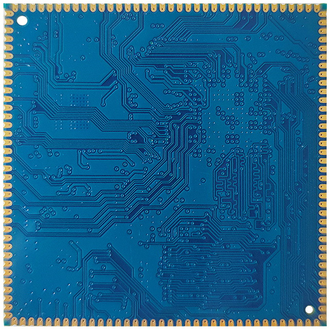

# Size and Specifications

## X30CV1 Appearance

## X30CV2 Appearance

## Core Board Layout

## Structure Parameters

| Item | Parameter |
| --- | --- |
| Form factor | Stamp-hole module |
| Core board size | 45mm x 45mm x 2.6mm |
| Pin pitch | 1.2mm |
| Pad size | 2.0mm x 0.7mm |
| Pin count | 144 pins |
| PCB layers | 8 layers |
| Warpage | Less than 0.5% |

## Specification Summary

| Item | Parameter |
| --- | --- |
| CPU | PX30 |
| Clock | Quad-core Cortex-A35, 1.3GHz |
| Memory | X30CV1 uses DDR3; X30CV2 uses LPDDR3 |
| Storage | 4GB/8GB/16GB eMMC optional, standard 8GB |
| PMIC | RK809 / RT809 as listed in the manual, supports dynamic frequency scaling |
| LCD | MIPI, LVDS, and RGB interfaces |
| Touch | Capacitive touch; USB or UART resistive touch can be extended |
| Audio | AC97 / I2S interface, recording and playback |
| SD | 1 SDIO output channel |
| eMMC | On-board eMMC; pins are not exported separately |
| Ethernet | 100M Ethernet |
| USB USB HOST2.0 | 3 USB HOST2.0 ports |
| UART | 6 UARTs, flow-control UART supported |
| PWM | 8 PWM outputs |
| I2C | 4 I2C outputs |
| SPI | 2 SPI outputs |
| ADC | 3 ADC outputs |
| Camera | 1 CSI input |

| Item | Parameter |
| --- | --- |
| 5V input | 5V / 1A |
| RTC input | 5V / 30uA |
| Output voltages | 1.8V, 3V, 3.3V, 5V |
| Operating temperature | -20°C to 80°C |
| Storage temperature | -10°C to 50°C |

