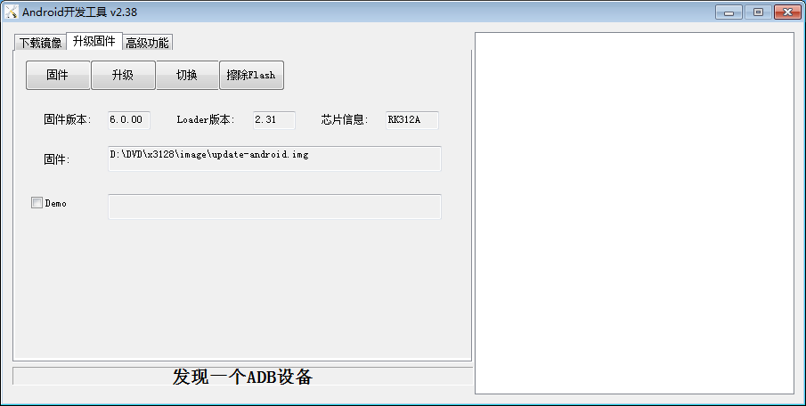
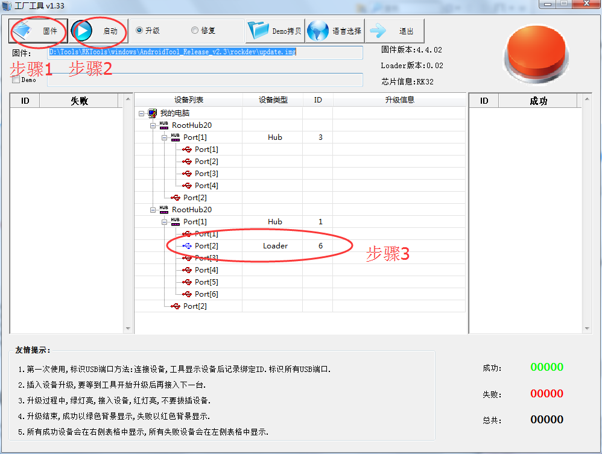

# Android Build and Flashing

## Install Source Dependencies

The original manual uses Ubuntu 14.04 64-bit. Update the package list before installing dependencies:

```bash
sudo apt-get update
sudo apt-get install git-core gnupg openjdk-7-jdk flex bison gperf libsdl-dev libwxgtk2.8-dev build-essential zip curl libncurses5-dev zlib1g-dev genromfs u-boot-tools libxml2-utils texinfo mercurial subversion whois
sudo apt-get install lsb-core libc6-dev-i386 g++-multilib lib32z1-dev lib32ncurses5-dev
```

The cross-compiler is already integrated in the source package:

```text
Sourcetree/prebuilts/gcc/Linux-x86/arm/arm-eabi-4.8
```

If the system GCC is too new, switch to GCC 4.8:

```bash
sudo apt-get install gcc-4.8 g++-4.8 g++-4.8-multilib

cd /usr/bin
sudo mv gcc gcc.bk
sudo ln -s gcc-4.8 gcc
sudo mv g++ g++.bk
sudo ln -s g++-4.8 g++
```

## Install Android Source Package

The source package name depends on the actual release. The original manual uses `x3128_marshmallow.tar.bz2` as an example:

```bash
cp yourcdromdir/source/x3128_marshmallow.tar.bz2 ~/
cd
tar xvf x3128_marshmallow.tar.bz2
cd x3128_marshmallow
git checkout .
```

## Build Commands

Build as a normal user. Do not use root.

```bash
./mk.sh -u    # Build U-Boot
./mk.sh -k    # Build Android kernel
./mk.sh -s    # Build Android file system
./mk.sh -U    # Generate unified update image
./mk.sh -h    # Show help
```

The output is usually generated under `out/release`. Common files include:

- `RK3128MiniLoaderAll_V2.31.bin`: loader / U-Boot related image. The actual name may vary by release.
- `kernel.img`: kernel image.
- `resource.img`: resource image, including boot logo and device tree information.
- `boot.img`: Android boot image.
- `system.img`: Android system partition image.
- `recovery.img`: recovery image.
- `misc.img`: partition used for boot-mode switching and recovery parameters.
- `update-Android.img`: unified update firmware.

## Flash update.img on Windows

After installing the Rockchip driver, open AndroidTool, choose the upgrade firmware tab, and load `update-Android.img`. Hold the Recovery key, connect USB OTG and 12V DC power, and click Upgrade after a LOADER device is detected.



For batch flashing, use FactoryTool. Select the firmware, enable Upgrade, click Start, and connect devices one by one.



## Flashing with upgrade_tool on Linux

Example tool path:

```text
RKTools/Linux/Linux_Upgrade_Tool_v1.2
```

Copy `update-Android.img` to the same directory as `upgrade_tool`, then run:

```bash
sudo ./upgrade_tool
```

Common commands:

```text
CD                    Select device
SD                    Switch to rockusb upgrade mode
UF update-Android.img Upgrade full firmware
UL loader.bin         Upgrade loader
DI -k kernel.img      Flash kernel.img
DI -s system.img      Flash system.img
DI resource resource.img
DI -r recovery.img
EF                    Erase flash
```

You can also run from `out/release`:

```bash
sudo upgrade_tool di -k kernel.img
sudo upgrade_tool di -s system.img
sudo upgrade_tool di resource resource.img
sudo upgrade_tool di -r recovery.img
sudo upgrade_tool ul RK3128MiniLoaderAll_V2.31.bin
sudo upgrade_tool uf update-Android.img
```

## Rkflashkit

Rkflashkit provides both GUI and command-line modes for flashing, backup, erase, and reboot operations:

```bash
sudo apt-get install build-essential fakeroot
git clone https://github.com/Linuxerwang/rkflashkit
cd rkflashkit
./waf debian
sudo apt-get install python-gtk2
sudo dpkg -i rkflashkit_0.1.4_all.deb
sudo rkflashkit
```

Command-line example:

```bash
sudo rkflashkit flash @boot boot.img @kernel.img kernel.img reboot
```
