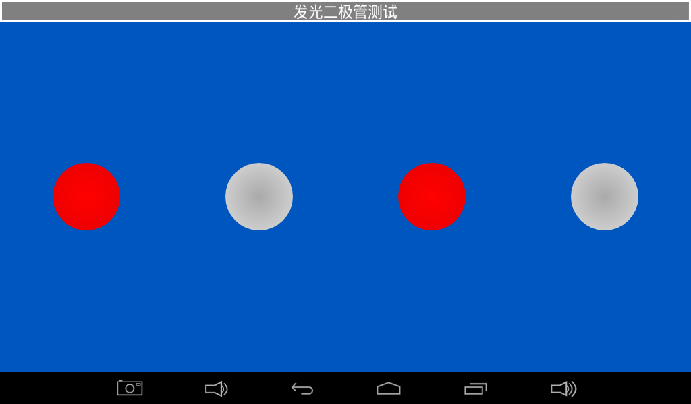
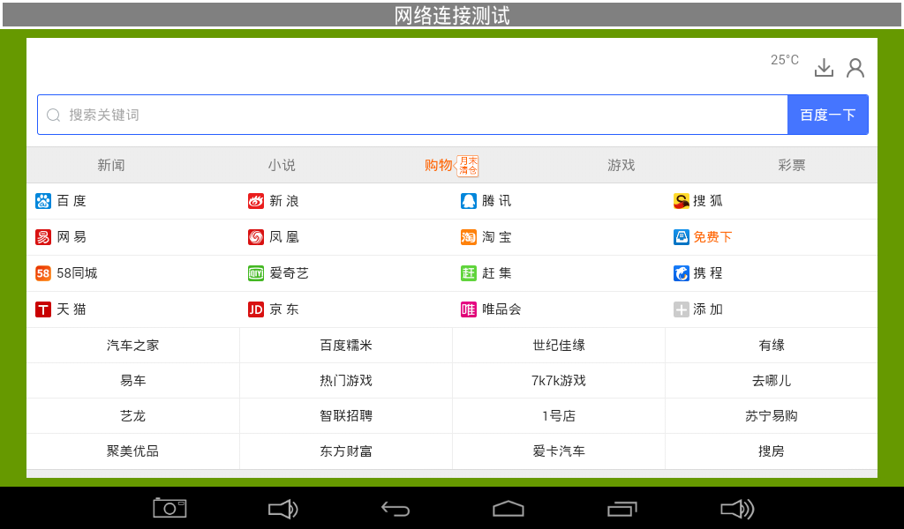

# Test Program

The X3128 Android system includes a test program for production tests and hardware verification. Open the Android Test application from the app list. Swipe left or right on the touch screen, or use a mouse, to switch test items.

## LCD Test

Tap the solid-color area in the center of the screen to switch colors and check whether the LCD has missing colors or dead pixels.

## Touch Panel Test

Tap Start Test and draw on the screen. In mass production, diagonal-line drawing is commonly used to verify the touch circuit.

## LED Test

Tap a lamp icon in the UI. When it turns red, the corresponding LED on the board turns on. When it is gray, the LED turns off.

## Buzzer, Backlight, and Key Tests

- Buzzer test: press and hold Start Test to make the buzzer sound; release it to stop.
- Backlight test: drag the slider or circle to adjust backlight brightness.
- Key test: press or release the independent keys on the board and observe the state shown in the UI.

## Battery, ADC, and G-sensor Tests

- Battery test: shows battery information after a battery is connected.
- ADC test: monitors four ADC voltages.
- G-sensor test: X, Y, and Z values change when the board is rotated.

## Audio and Camera Tests

- Audio test: tap Start Test to play a test sound.
- Camera test: after a camera is connected, tap Start Test to view the camera preview.

## Network and UART Tests

- Wireless network test: after Wi-Fi is connected, nearby networks are listed.
- Network connection test: when wired or wireless network is working, the test page can browse a web page.
- UART test: connect TXD and RXD of the UART under test to verify transmit and receive functions.

