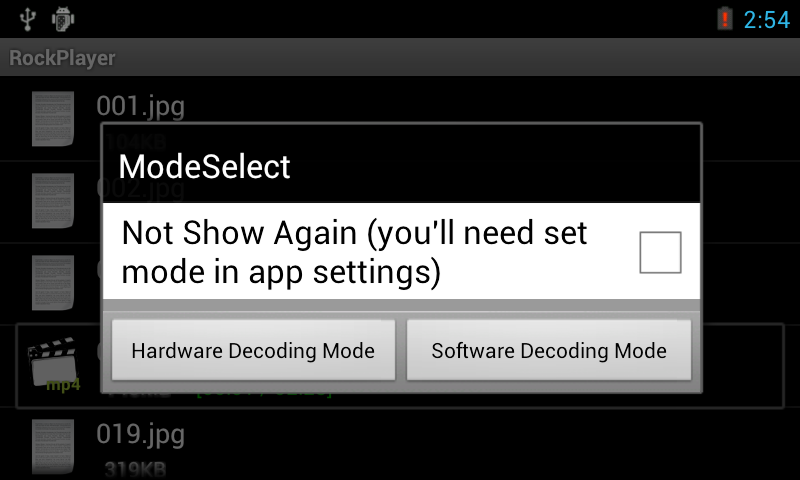
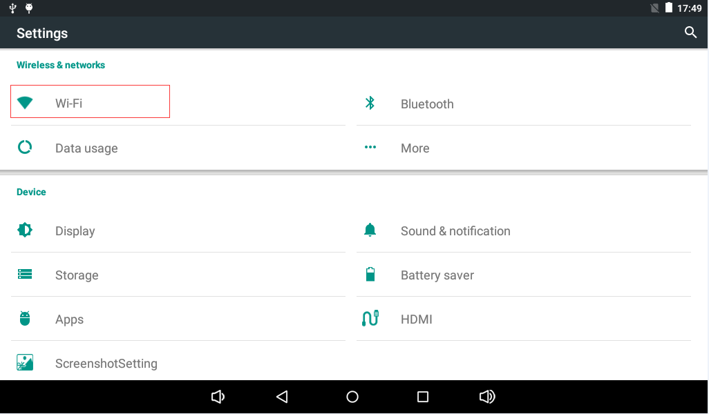
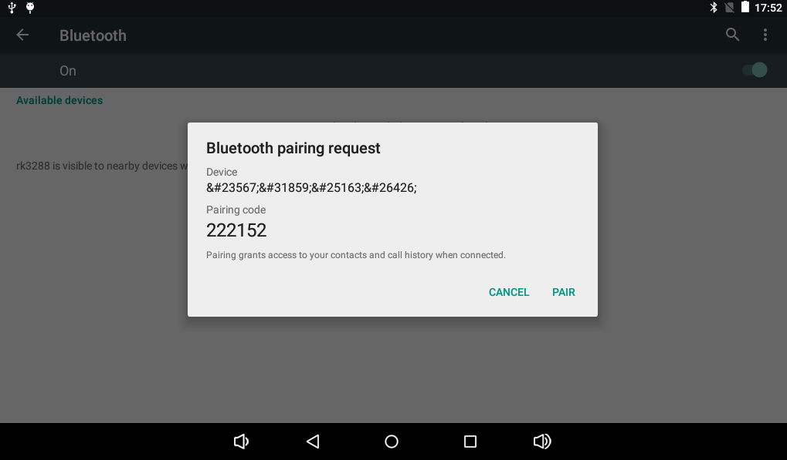

# Android User Guide

## Command Terminal

Connect the serial cable to the debug UART. After Android boots, the serial terminal can be used to view Android shell output and system logs.

## Audio and Video Playback

Place MP3 or video files on the external SD card. The Music and Gallery applications can automatically detect supported files. Unsupported video formats can be played with a third-party player such as RockPlayer.


For videos supported by RK3128 hardware decoding, select hardware decoding mode. For formats such as RMVB or RM, select software decoding mode.



## Wi-Fi

The X3128 has an on-board Wi-Fi / BT combo module. Open Settings, enable Wi-Fi, select a wireless network, and enter the password to connect.




## Bluetooth File Transfer and Bluetooth Speaker

Open Bluetooth in Settings and search for devices. After pairing, files such as images can be shared, and a Bluetooth speaker can be used for audio playback.




## USB Mouse and Keyboard

Connect a USB mouse or wireless USB keyboard/mouse receiver to the USB HOST interface to operate the Android UI.

## TF Card and USB Flash Drive

The system automatically mounts the TF card after boot. A USB flash drive is mounted under `/storage`.

```bash
ls /storage
```

## Screen Rotation

The board integrates a G-sensor. The UI rotates when the board orientation changes. Some applications may not support auto rotation.

## Camera

Open the Android Camera application to enter preview mode. The default X3128 configuration supports a 0.3MP parallel camera GC0308.


## Wired Ethernet

Connect an Ethernet cable to the board. After the link LEDs blink normally, the wired network can be used.


## HDMI Display

HDMI can output the LCD content to a TV or monitor, supporting 1080p and compatible with 720p, 576p, and 480p. On RK3128, HDMI display and LCD display cannot work normally at the same time.


## Power Off and Suspend / Resume

After a 12V power adapter is connected, the board powers on automatically. Long-press the power key to open the shutdown dialog. Short-press the power key to turn off the screen and enter suspend; short-press again to wake up.


