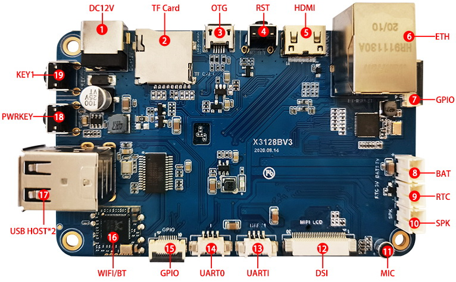
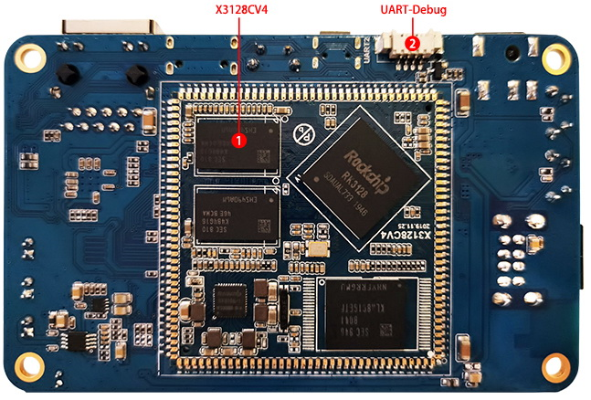

# Hardware Resources

This page summarizes the connector positions and hardware resources on both sides of the X3128BV3 mainboard. For the 144-pin core-board definition, see [Pin Definition](./x3128bv3-pin-definition). For interface usage notes, see [Interface Details](./x3128bv3-interface-details).

## Front-Side Interface Map

| No. | Name | Description |
| --- | --- | --- |
| 【1】 | DC Jack | 12V DC power input |
| 【2】 | TF Card | TF card slot |
| 【3】 | USB OTG | USB OTG interface |
| 【4】 | RESET | Reset key |
| 【5】 | HDMI | HDMI output interface |
| 【6】 | Gigabit Ethernet Port | RT8211E 接口 |
| 【7】 | GPIO | GPIO expansion connector |
| 【8】 | Lithium Battery Interface | 3.7V lithium battery interface |
| 【9】 | RTC Battery Socket | RTC battery socket, 3V |
| 【10】 | Speaker Interface | External speaker interface |
| 【11】 | Microphone | Microphone input |
| 【12】 | MIPI / LVDS Interface | For MIPI or LVDS display panel |
| 【13】 | UART1 | UART 1, TTL level |
| 【14】 | UART0 | UART 0, TTL level |
| 【15】 | GPIO | GPIO expansion connector |
| 【16】 | Wi-Fi / BT | RT8723BU Wi-Fi / BT combo module |
| 【17】 | USB HOST | Expanded by HUB chip, dual HOST 2.0 |
| 【18】 | POWER | Power key |
| 【19】 | Independent Key | Recovery flashing key, K1 |

## Back-Side Interface Map

| No. | Name | Description |
| --- | --- | --- |
| 【1】 | X3128CV4 | 144-pin castellated core board |
| 【2】 | UART2 | Debug UART, multiplexed with TF card |

