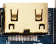
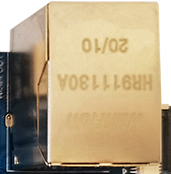
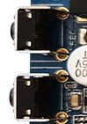
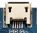
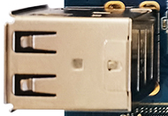
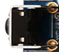
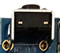
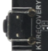
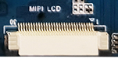

# Interface Details

## Power Input

The X3128BV3 is powered by a 12V DC supply. The black DC jack is the 12V DC power input connector.

## Debug UART

The X3128 reserves UART2 as the debug UART and also provides UART0 and UART1 as general UART ports. UART2 is used as the default debug port and should be used with a serial conversion board for RS232-level conversion.

## HDMI Interface

The X3128BV3 uses a mini HDMI connector. With a mini HDMI cable, it can output audio/video to a TV or monitor. Because RK3128 is a low-cost platform, HDMI and LCD cannot display simultaneously.

## Ethernet Interface

The board integrates RTL8211E and supports Gigabit Ethernet.

## Audio Interfaces

The board supports direct external speaker output.

The board supports recording input. A microphone is already mounted on the board, so no external headset microphone is required.

## TF Card Slot

The X3128BV3 provides an external TF card slot for storing data files.

## Independent Key

| Key | Function |
| --- | --- |
| Recovery/K1 | Independent key / recovery key |

## USB OTG Interface

This interface is used for firmware flashing and synchronization. It can also work as a HOST port through an OTG cable.

## USB HOST Interface

RK3128 has one native USB HOST port. The X3128BV3 expands three HOST ports through a HUB chip: one is used for USB Wi-Fi / Bluetooth, and the other two are routed to standard USB connectors.

## Power, Reset, and Recovery Keys

After the external power adapter is connected, the board powers on automatically. In Android, short-press POWER to suspend, short-press again to wake up, and long-press POWER to open the shutdown dialog.

Press RESET during system operation to perform a hardware reset.

Press the Recovery key during flashing to enter the flashing mode.

## LCD Interface

The X3128BV3 reserves a 30-pin LCD connector by default. The LCD data signals are connected to the LCD controller board through a FFC cable. This connector includes a PWM backlight control pin for multi-level backlight adjustment. VGA, LVDS, and MIPI are implemented through this interface.

## Backup Battery

The backup battery keeps RTC running after power loss, preventing the system time from being lost.
