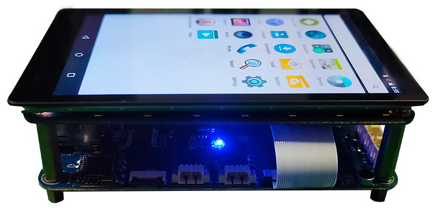

# Product Introduction

The X3128BV3 development board is based on the Rockchip RK3128 platform and consists of a castellated core board, a baseboard, and an LCD board. The core board uses a 6-layer PCB design and is suitable for tablets, vehicle terminals, learning machines, POS devices, game consoles, and industrial monitoring products. The baseboard provides rich peripheral interfaces for validating the main RK3128 hardware features.

## Feature Highlights

- RK3128 quad-core Cortex-A7 processor, 1.3GHz.
- Mali400-MP2 GPU, supporting OpenGL ES 1.1 / 2.0.
- Standard 1GB DDR3 memory; compatible with 256MB / 512MB / 2GB DDR3 options.
- Storage options include 4GB / 8GB / 16GB eMMC, with 8GB eMMC as the standard configuration.
- LVDS / MIPI display interfaces are supported. The core board can support 24-bit RGB. HDMI and LCD are mutually exclusive.
- On-board RT8723 Wi-Fi / BT module and RTL8211E Gigabit Ethernet.
- Interfaces include USB HOST, USB OTG, TF card, UART, GPIO, audio, MIC, RTC, GPS, and GPRS.
- Supports software power on/off, suspend/resume, stepless backlight adjustment, IR receiver, USB mouse and keyboard.

## System Configuration

| CPU | RK3128 |
| --- | --- |
| CPU Clock | Quad-core Cortex-A7, 1.3GHz |
| Memory | Standard 1GB; 2GB or 512MB customizable |
| Storage | Standard 8GB eMMC; NAND flash optional |
| Power IC | RK816 PMIC, dynamic frequency scaling supported |

## Interface Parameters

| LCD Interface | TTL / LVDS / MIPI, one of three selectable |
| --- | --- |
| Touch Interface | Capacitive touch; resistive touch can be extended through USB or UART |
| Audio Interface | AC97 / I2S interface, recording and playback supported |
| SD Card Interface | Two SDIO output channels |
| eMMC Interface | On-board eMMC interface; pins are not routed out |
| Ethernet Interface | Gigabit Ethernet supported |
| USB HOST Interface | One USB HOST 2.0 |
| USB OTG interface | One USB OTG 2.0 |
| UART Interface | Three UART ports: two with flow control and one for debug |
| PWM Interface | Three PWM outputs |
| I2C Interface | Four I2C outputs |
| SPI Interface | One SPI output |
| ADC Interface | Three ADC inputs |
| Camera Interface | One BT656 / BT601 interface |
| HDMI Interface | HD audio/video output, LCD and HDMI are mutually exclusive |
| Boot Configuration | No boot configuration required; the core board adapts automatically |

## Electrical Characteristics

| Input Voltage | 4.8~5.5V, 5V input recommended |
| --- | --- |
| Output Voltage | 3.3V / 4.2V, available for baseboard power and battery charging |
| Operating Temperature | -10~70°C |
| Storage Temperature | -10~80°C |

## Driver Support List

| System / Driver | Linux 3.10+ / Android 6.0 | Linux 3.10+ / Qt |
| --- | --- | --- |
| 7 inch MIPI LCD(1024*600) | ● | ● |
| PMIC driver (RK816) | ● | ● |
| capacitive touch | ● | ● |
| eMMC driver | ● | ● |
| SD card driver | ● | ● |
| Independent Key | ● | ● |
| Infrared remote control | ● | ● |
| Turn on and off | ● | ● |
| wake up from sleep | ● | No need |
| 2-way USB HOST driver | ● | ● |
| 1 channel USB OTG driver | ● | ● |
| Audio | ● | Coming soon |
| recording | ● | Coming soon |
| USB Wi-Fi / BT4.0（RT8723BU） | ● | Coming soon |
| USB port camera driver | ● | ● |
| serial port | ● | ● |
| HDMI | ● | Coming soon |
| 3G module (3G dongle) | ● | No need |
| GPS module | ● | ● |
| Gigabit Ethernet | ● | ● |
| USB mouse keyboard | ● | ● |

