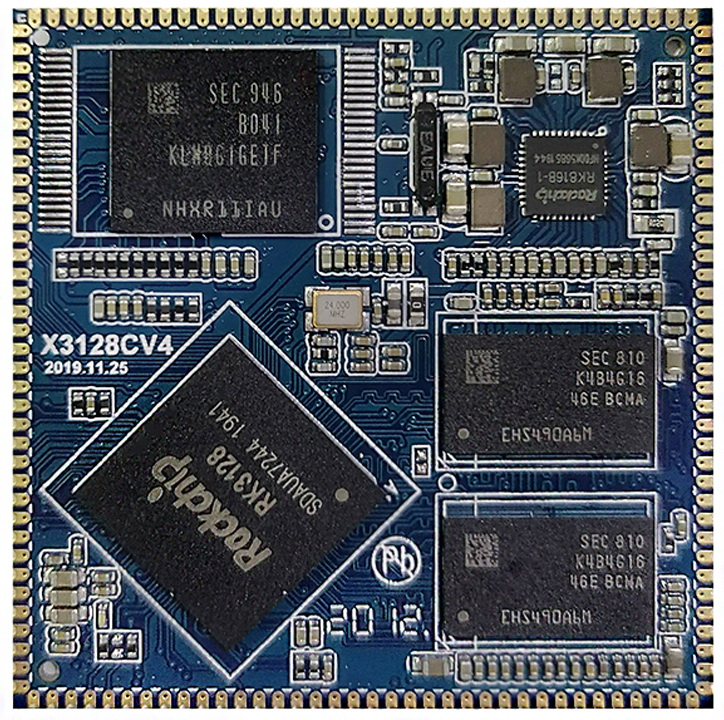
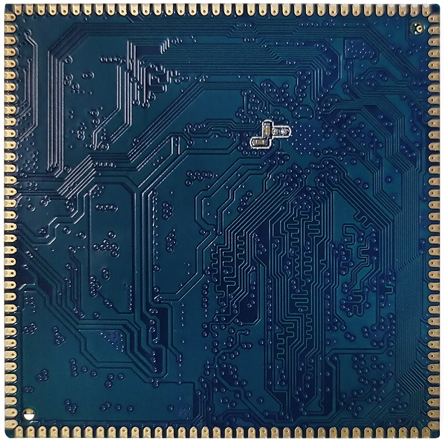
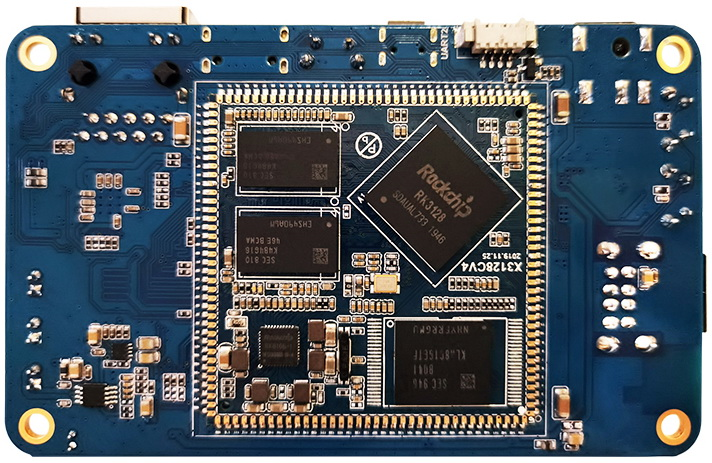

# Dimensions and Structure

## Core Board Appearance

## Core Board Mechanical Drawing

## Mechanical Parameters

| Package | Castellated-hole module |
| --- | --- |
| Core Board Size | 45mm x 45mm x 3mm |
| Pin Pitch | 1.2mm |
| Pad Size | 1.8mm x 0.7mm |
| Pin Count | 144 pins |
| PCB Layers | 6 layers |

## Baseboard Appearance

