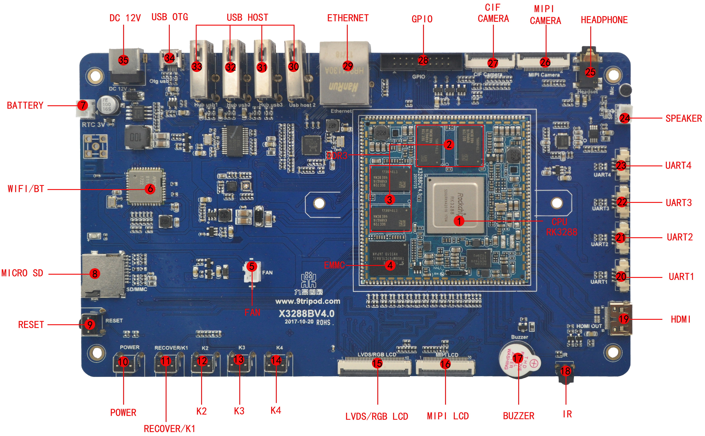

# Hardware Resources

This page keeps only the hardware overview. For detailed connector usage, see [Interface Details](./x3288-interface-details). For the 180-pin core-board definition, see [Pin Definition](./x3288-pin-definition).

## Feature Overview

- ARM Cortex-A17 quad-core CPU, up to 1.8 GHz.
- 2 GB DDR3 by default, 4 GB DDR3 optional.
- 16 GB eMMC by default; 4 GB / 8 GB / 16 GB options supported.
- 24-bit RGB LCD interface, compatible with LVDS.
- Multiple USB HOST ports and one USB OTG port.
- 4 TTL UART ports.
- TF card interface.
- Reset key, software power key, and four independent keys.
- Speaker, microphone input, and headset output.
- Backlight brightness adjustment.
- HDMI output.
- 5-point capacitive touch.
- On-board AP6255 Wi-Fi / Bluetooth module.
- G-sensor, RTC, Gigabit Ethernet, BT656/BT601/MIPI camera, GPS, GPRS, USB 3G, USB mouse/keyboard, and IR receiver support.

## Connector Location Map

## Hardware Interface Overview

| No. | Name | Description |
| --- | --- | --- |
| 1 | CPU | RK3288, ARM Cortex-A17, 4 × 1.8 GHz |
| 2 | DDR3 | 2 GB DDR3 |
| 3 | eMMC | On-board eMMC |
| 4 | PMU | RC5T620 power management |
| 5 | HDMI | Mini HDMI audio/video output |
| 6 | LCD / LVDS / MIPI | Display output interfaces |
| 7 | Camera | CIF and MIPI camera connectors |
| 8 | Ethernet | Gigabit Ethernet |
| 9 | USB HOST / OTG | USB host and device/debugging interface |
| 10 | Audio | Speaker, microphone, and headset |
| 11 | Keys | Reset, recovery, power, and user keys |
| 12 | TF card | External storage and upgrade media |

## Driver Support

The board is designed for Android and Linux development. LCD, touch, PMIC, eMMC, SD card, keys, backlight, audio, camera, Ethernet, USB, Wi-Fi/Bluetooth, and serial-port functions are supported by the provided SDK. The actual availability depends on the delivered firmware and hardware configuration.
