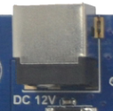
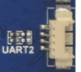
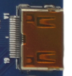
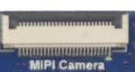
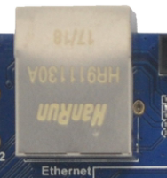
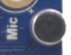
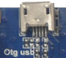
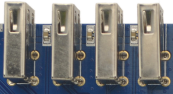
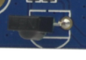

# Interface Details

This page describes the external connectors on the X3288 mainboard. It avoids repeating the full pin-definition tables and only keeps the usage notes needed when connecting peripherals.

## Power Input

The board uses a 12 V DC power input. Use a power adapter with enough current margin. Avoid hot-plugging high-current peripherals while the board is unstable during debugging.

## Debug UART

UART2 is used as the default debug serial port. Other UARTs can be used for external devices after software configuration. Use a serial converter board when the connector level needs to be converted to RS232.

## HDMI Interface

The board uses a mini HDMI connector. With a mini HDMI cable, audio and video can be output to monitors, TVs, or other HDMI receivers.

## Camera Interfaces

The 24-pin camera connector supports common OV-series camera modules. For different camera modules, adjust the output voltage and driver configuration according to the camera specification.

The board also provides a 26-pin MIPI camera connector.

## Ethernet Interface

The board supports Gigabit Ethernet through an on-board RTL8211E PHY.

## Headset, Speaker, and Microphone

The headset connector provides audio output and can also be connected to an external amplifier input. Use a three-wire headset; headsets with microphone wiring may cause distorted output.

The speaker connector supports direct speaker output.

The board supports microphone input. The microphone circuit is already on the board, so an external preamplifier is normally not required.

## TF Card Slot

The external TF card slot can be used for firmware upgrade or media-file storage.

## Keys

| Key | Function |
| --- | --- |
| Recovery / K1 | User key / recovery key |
| K2 | User key |
| K3 | User key |
| K4 | User key |

## USB Interfaces

The USB OTG connector can be used as a device port for firmware download and debugging.

The USB HOST connector can be used for USB mouse, keyboard, U disk, and other USB peripherals.

## LCD and MIPI Display

The LCD interface can be used for TTL/LVDS display expansion according to the display configuration.

The MIPI DSI interface is used for MIPI display panels.

## RTC Battery and IR Receiver

The backup battery keeps the RTC running when the main power is removed.

The IR receiver can be used for remote-control scenarios.
