# Interface Details

## Power Connector

X3399V4 uses 12V DC power input. The connector shown below is the 12V DC input connector.

## Debug UART

X3399 reserves one RS232 UART2 for debugging and one normal TTL-level UART4. UART2 is the default debug UART. Users can change the debug UART through software configuration.

## HDMI

The board uses a Mini HDMI connector. With a Mini HDMI extension cable, audio and video can be output to HDMI 2.0-capable displays such as TVs and monitors.

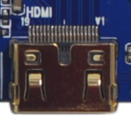

## Camera

The board provides a 24-pin parallel Camera connector, a 30-pin MIPI Camera connector, and a 50-pin CSI + DSI connector. The 50-pin connector can connect two MIPI Cameras and supports simultaneous display.

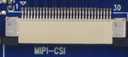

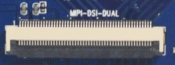

## Ethernet

X3399 supports Gigabit Ethernet through the on-board RTL8211E.

## Audio

The board supports headphone output, external 2W speaker output, recording input, and optical audio output. The headphone output can connect headphones directly or feed an amplifier. The optical output can connect to high-fidelity speakers with optical input.

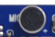

## TF Card

The external TF-card connector can be used for TF-card upgrade or storing media files.

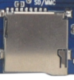

## Independent Keys

X3399 has six keys: four independent keys, one Power key, and one Reset key. The independent keys are sampled through ADC.

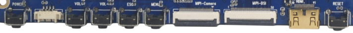

| Key | Function |
| --- | --- |
| VOL+ | Volume up |
| VOL- | Volume down |
| ESC | Back |
| MENU | Menu |
| POWER | Power |
| RESET | Reset |

## Type-C

The Type-C connector is OTG-compatible and can be used for firmware download and synchronization. It also provides higher-speed data transfer and display-related expansion capability.

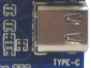

## USB HOST

RK3399 has two USB HOST 2.0 ports and two Type-C ports. One Type-C port is used as USB 3.0 on X3399. In the image, the upper connector corresponds to USB 3.0 and the lower connector corresponds to USB HOST 2.0. Another HOST 2.0 is routed to the PCIe slot for 3G / 4G modules.

## Power, Reset, and Recovery

After connecting the external power adapter, hold Power to boot. In Android, a short Power press suspends the system, another press wakes it, and a long press opens the shutdown dialog. Press Reset during runtime to hard reset. The volume-up key is used as the Recovery key during flashing.

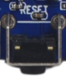

## LCD, Dual MIPI, and EDP

X3399 provides a default 30-pin DSI connector that connects MIPI signals to the LCD control board. Pin 12 of this connector is PWM for backlight control. It also routes I2C, interrupt, and wake-up signals for capacitive touch. The board also reserves a dual-MIPI connector and an EDP connector for higher-resolution panels.

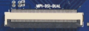

## RTC Battery, Buzzer, and IR

The backup battery keeps RTC running after power loss. The buzzer is an active buzzer controlled through PWM. The IR receiver uses HS0038B.

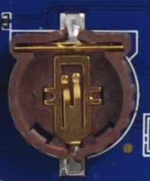

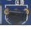

## SIM Card and Wi-Fi / Bluetooth

The PCIe slot is used for 3G / 4G modules. When using cellular modules, insert the corresponding SIM card into the SIM-card slot. The board includes a 2.4G / 5G dual-band SDIO Wi-Fi / BT module.

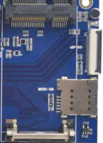

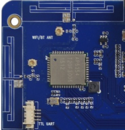
