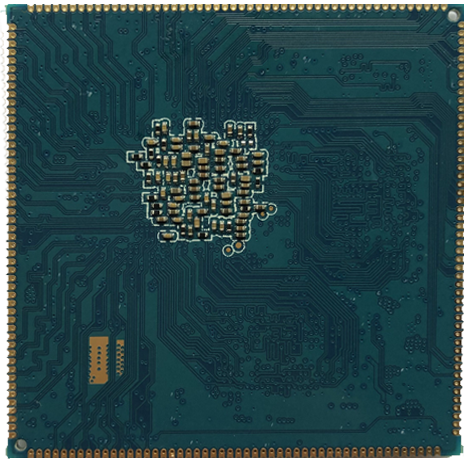

# Product Introduction

The X3399V4 development board is based on the Rockchip RK3399 platform and consists of a stamp-hole core board, baseboard, and LCD board. RK3399 uses a dual Cortex-A72 big-core + quad Cortex-A53 little-core architecture, with a quad-core ARM Mali-T860 GPU. It supports Type-C, PCIe, dual Cameras, LPDDR4, and other features. It is suitable for industrial control, advertising players / all-in-one machines, financial POS, vehicle terminals, thin clients, video conferencing, security monitoring, and IoT terminals.

## Feature Highlights

- CPU cores: quad-core ARM Cortex-A53 + dual-core Cortex-A72.
- Clock: 1.4GHz x 4 + 2GHz x 2.
- Memory: 2GB / 4GB LPDDR3 / LPDDR4.
- Flash: 4GB / 8GB / 16GB / 32GB / 64GB eMMC options, 16GB standard.
- One USB HOST 2.0, one USB HOST 3.0, and one Type-C connector with OTG compatibility.
- One RS232 port, one TTL UART, and one TF-card interface.
- Four independent keys, Power key, Reset key, software power control, and suspend / wake-up.
- External dual-channel speaker, MIC input, headphone output, and optical audio output.
- HDMI, MIPI, EDP, dual MIPI Cameras, parallel Camera, Gigabit Ethernet, and PCIe module support.
- On-board AP6354 / AP6356S Wi-Fi / BT, G-sensor, gyroscope, IR receiver, and RTC support.

## Specification Summary

| Item | Parameter |
| --- | --- |
| SoC | Rockchip RK3399 |
| CPU | Quad Cortex-A53 1.4GHz + dual Cortex-A72 2GHz |
| GPU | Mali-T860, 2D / 3D graphics acceleration |
| Memory | 2GB / 4GB LPDDR3 / LPDDR4 |
| Storage | 4GB / 8GB / 16GB / 32GB / 64GB eMMC options, 16GB standard |
| Display | MIPI, EDP, HDMI; default 7-inch MIPI panel; optional 7.9-inch 2K panel |
| Camera | BT656 / BT601 parallel Camera and MIPI CSI Camera |
| Network | RTL8211E Gigabit Ethernet, AP6354 / AP6356S Wi-Fi / BT |
| Power | 12V DC input on development board; core-board main 3.3V/4.3A, auxiliary 3.3V/300mA, RTC 2.5V to 3V |
| Core board size | 55mm x 55mm x 3mm, 200-pin stamp-hole package |

## Core-board Characteristics

Compared with X3399CV3, X3399CV4 changes the memory from LPDDR3 to LPDDR4 while keeping pin compatibility. For Android 7.0 and later, the code is compatible. The manual notes that Android 6.0 does not support LPDDR4, so pay attention to the OS version when using X3399CV4.

### System Configuration

| CPU | RK3399 |
| --- | --- |
| Main frequency | Quad-core A53(1.4GHz) + dual-core A72(2GHz) |
| Memory | Standard 2GB, customizable 4GB |
| memory | 4GB/8GB/16GB eMMC optional, 16GB standard |
| Power IC | Using RT808, supports dynamic frequency modulation, etc. |

### Interface Parameters

| LCD interface | Supports MIPI, EDP, and HDMI interface output at the same time |
| --- | --- |
| Touch interface | Capacitive touch, resistive touch can be extended using USB or UART |
| audio interface | AC97/IIS interface, supports recording and playback |
| SD card interface | 2 SDIO output channels |
| eMMC interface | Onboard eMMC interface, no pins are lead out separately |
| Ethernet interface | Support Gigabit Ethernet |
| USB HOST 2.0 connector | 2-way HOST 2.0 |
| USB HOST 3.0 connector | 2-way TYPE3.0 |
| UART interface | 5-channel UART, supports UART with flow control |
| PWM interface | 4 channels of PWM output |
| IIC interface | 7 channels of IIC output |
| SPI interface | 1 SPI output |
| ADC interface | 1 ADC output |
| Camera interface | 1 channel BT656/BT601, 1 channel MIPI output |
| HDMI interface | High-definition audio and video output interface, simultaneous audio and video output |

### Electrical Characteristics

| Main 3.3V input voltage | 3.3V/4.3A(Recommended3.3V/5Aenter) |
| --- | --- |
| Secondary 3.3V input voltage | 3.3V/300mA(Can't be with the Lord3.3VMix) |
| RTC input voltage | 2.5 to 3V/5uA |
| Output voltage | 1.8V(Can be used to power the baseboard and after hibernation0V) |
| working temperature | -40~80 degrees |
| storage temperature | -10~50 degrees |

### Mechanical Parameters

| Appearance | stamp hole method |
| --- | --- |
| Core board size | 55mm*55mm*3mm |
| Pin spacing | 1.0mm |
| Pin Pad Dimensions | 0.5mm*1.8mm, package is symmetrical to the center |
| Number of pins | 200PIN |
| Ply | X339CV3: 10 layers X339CV4: 8 layers |
| Window area | The red part in the above picture is the recommended window area for the base plate package. |

## Core-board Appearance

## Software Resources

| system / driver | Linux4.4+ / Android6.0 | Linux 4.4.52 + Android 7.1 | Linux4.4+ / Qt5.6 | Linux 4.4.5 + Debian 9 |
| --- | --- | --- | --- | --- |
| Four programmable LEDs | ✓ | ✓ | ✓ | ✓ |
| 7-inch MIPI panel (1024 x 600) | ✓ | ✓ | ✓ | ✓ |
| MIPI panel (2048 x 1536) | ✓ | ✓ | ✓ | ✓ |
| EDP panel (2048 x 1536) | ✓ | ✓ | ✓ | ✓ |
| Backlight driver | ✓ | ✓ | ✓ | ✓ |
| PMIC driver (RK808) | ✓ | ✓ | ✓ | ✓ |
| Capacitive touch | ✓ | ✓ | ✓ | ✓ |
| eMMC driver | ✓ | ✓ | ✓ | ✓ |
| SD-card driver | ✓ | ✓ | ✓ | ✓ |
| Independent keys | ✓ | ✓ | ✓ | ✓ |
| ADC driver | ✓ | ✓ | ✓ | ✓ |
| G-sensor | ✓ | ✓ | No need | No need |
| Gyroscope | ✓ | ✓ | No need | No need |
| Compass | ✓ | ✓ | No need | No need |
| Light sensor | ✓ | ✓ | No need | No need |
| Buzzer driver | ✓ | ✓ | ✓ | ✓ |
| IR remote control | ✓ | ✓ | ✓ | ✓ |
| Power on/off | ✓ | ✓ | ✓ | ✓ |
| Suspend / wake-up | ✓ | ✓ | ✓ | No need |
| USB HOST 2.0 driver | ✓ | ✓ | ✓ | ✓ |
| USB HOST 3.0 driver | ✓ | ✓ | ✓ | ✓ |
| Type-C (OTG) driver | ✓ | ✓ | ✓ | ✓ |
| Audio (RTL5651) | ✓ | ✓ | ✓ | ✓ |
| Recording (RTL5651) | ✓ | ✓ | No need | ✓ |
| Optical audio output | ✓ | ✓ | ✓ | No need |
| Dual-band Wi-Fi / BT 4.0 | ✓ | ✓ | ✓ | ✓ |
| Parallel Camera driver | ✓ | ✓ | No need | No need |
| CSI Camera driver | ✓ | ✓ | Coming soon | No need |
| USB Camera driver | ✓ | ✓ | ✓ | ✓ |
| UART | ✓ | ✓ | ✓ | ✓ |
| HDMI 2.0 | ✓ | ✓ | Coming soon | ✓ |
| 3G module (3G dongle) | ✓ | ✓ | No need | No need |
| 4G module (PCIe) | ✓ | ✓ | No need | No need |
| GPS module | ✓ | ✓ | ✓ | ✓ |
| Gigabit Ethernet | ✓ | ✓ | ✓ | ✓ |
| USB mouse / keyboard | ✓ | ✓ | ✓ | ✓ |
| U-Boot | ✓ | ✓ | ✓ | ✓ |
| Offline image update by SD card | ✓ | ✓ | ✓ | ✓ |

## Version Information

| Version | Date | Author | Description |
| --- | --- | --- | --- |
| Rev.01 | 2017-1-22 | lqm | Initial version |
| Rev.02 | 2017-4-19 | lqm | Merged core board and hardware manuals |
| Rev.03 | 2017-11-2 | lqm | Updated to V4; power adapter input changed from 5V to 12V |
| Rev.04 | 2018-11-9 | lqm | Core board updated to LPDDR4 |
| Rev.04 | 2022-4-18 | Jiuding Chuangzhan | Errata |

