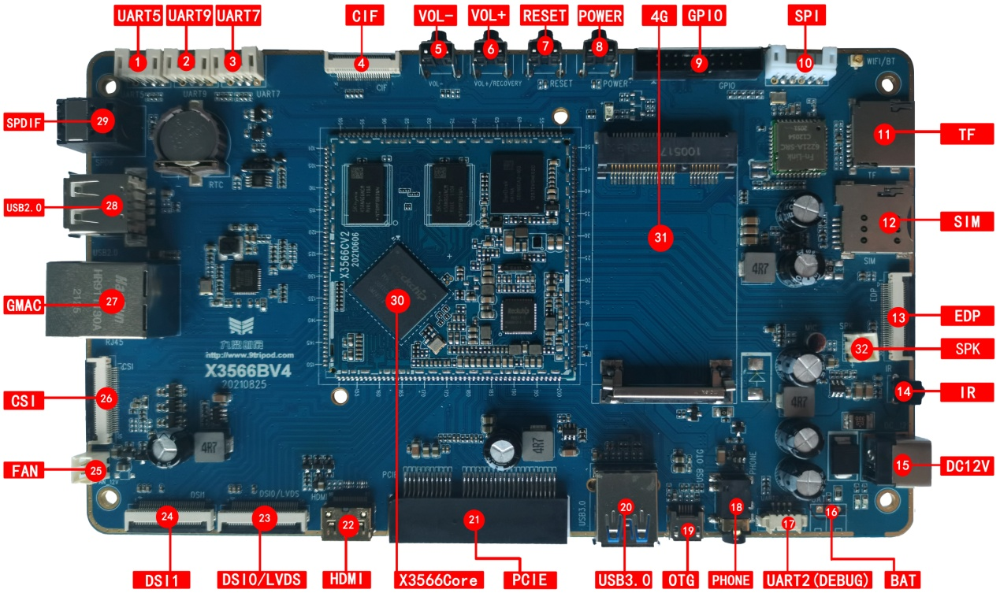

# Interface Details

## Power Input

X3566 uses a 12V DC power input. The DC jack is the 12V input connector.

## Debug UART

UART2 is the default debug UART. The debug UART can be changed through software configuration.

## HDMI

The board uses a mini HDMI connector. With a mini HDMI cable, audio and video can be output to HDMI2.0-capable displays.

## Camera

CIF and CSI camera interfaces are reserved. OV-series cameras are supported. For different camera models, adjust voltage and driver configuration according to the camera specification.

## Ethernet

One Gigabit Ethernet port is supported with the on-board YT8521SC PHY.

## Headphone

The headphone jack provides headphone output and can also feed an external amplifier input.

## Speaker

The board supports one 2W speaker output.

## TF Card

The external TF card can be used for TF-card upgrade or multimedia storage.

## Keys

There are four keys: two independent keys, PWRKEY, and RESET. Independent keys are sampled through ADC.

## OTG

The OTG port is used for firmware download and related scenarios.

## USB HOST2.0

RK3566 provides two HOST2.0 ports. One is exported through a standard Type-A connector, and the other is reserved for the 4G PCIe socket.

## USB HOST3.0

One HOST3.0 channel is exported through a standard HOST3.0 connector.

## Power Key

After external power is connected, hold PWRKEY to power on. In Android, press PWRKEY briefly for suspend/wake-up, and hold it to enter the power-off UI.

## Reset

Press RESET during operation to reboot the board by hardware reset.

## Recovery

The volume-up key is used as the Recovery key during flashing.

## LCD

RK3566 supports dual DSI, LVDS, and EDP display interfaces. The left connector is DSI1; the right connector is DSI0/LVDS, selected by software.

## Backup Battery

The backup battery keeps RTC running after main power is removed.

## IR Receiver

The board uses an HS0038B integrated IR receiver for remote-control applications.

## SPDIF Optical

Audio can be output through speaker, headphone, HDMI, and SPDIF optical.

## Wi-Fi / Bluetooth

The board uses a 2.4G/5G dual-band SDIO Wi-Fi/BT module. Default model is 6221A-SRC, compatible with AP6398S, AP6375S, and other dual-band Wi-Fi modules.

## UART

RK3566 includes 10 UARTs. The board reserves UART5, UART7, and UART9 as TTL UARTs through PH connectors, and UART2 as the debug UART.

## PCIe

A standard PCIe connector is reserved for PCIe device expansion.

## GPIO

A GPIO box header is reserved for GPIO expansion.

